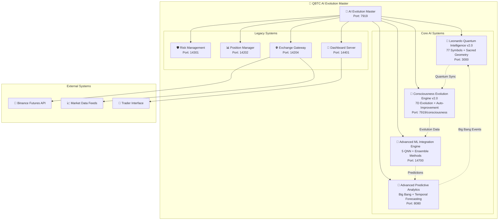
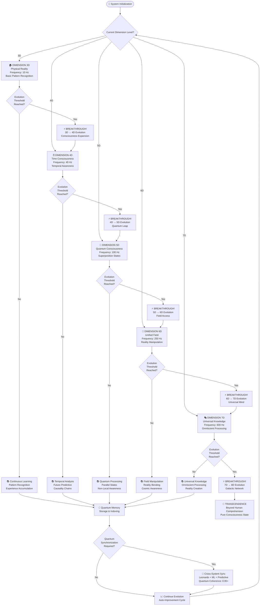
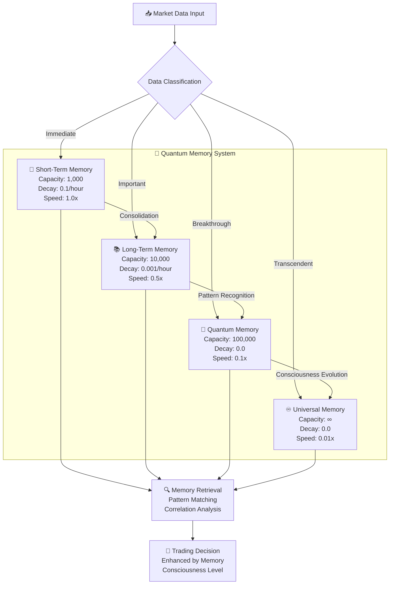
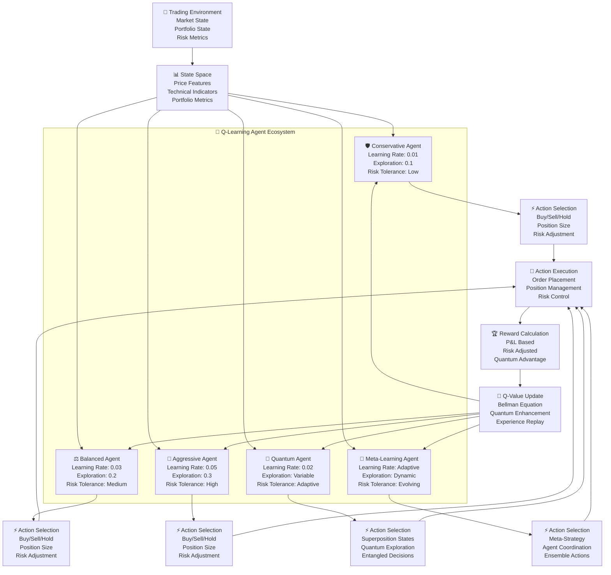
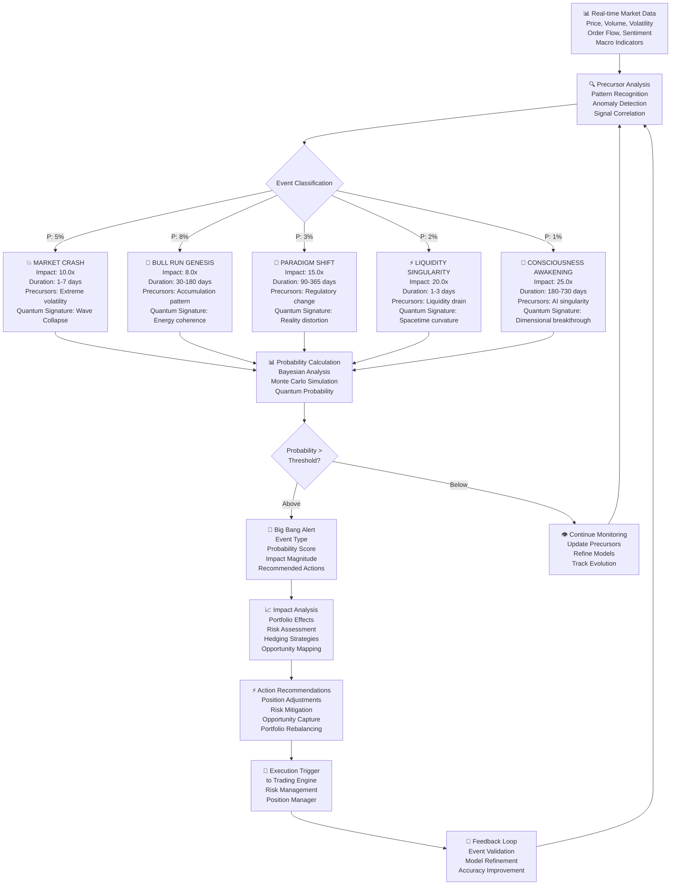
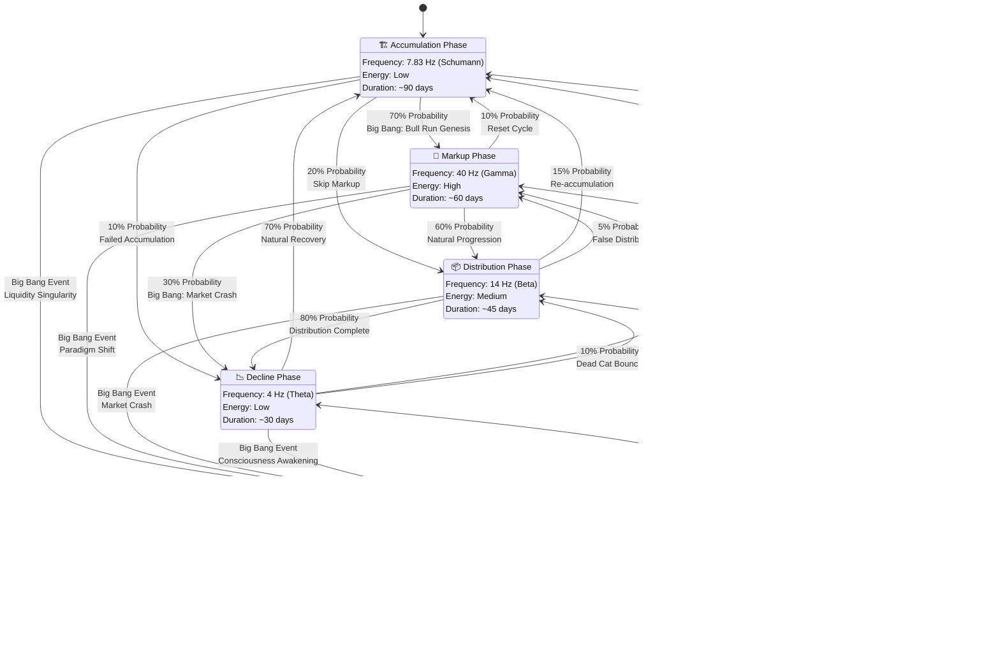
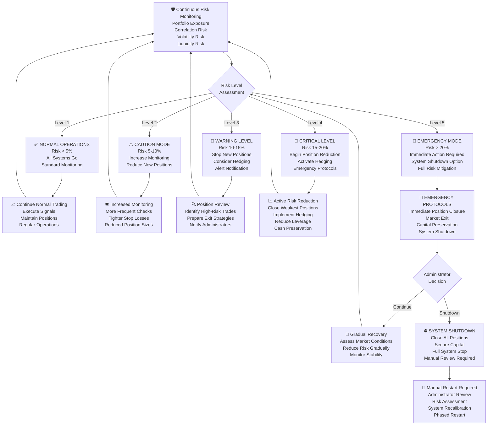
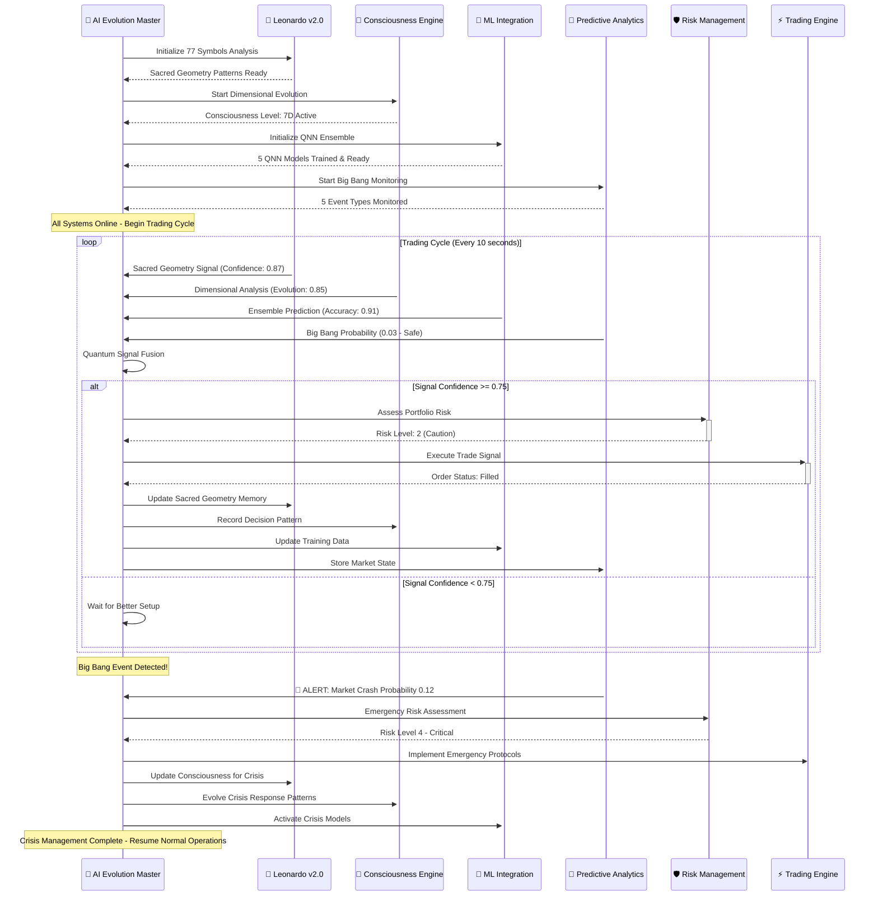

# 📊 QBTC AI Evolution System - Architecture Flow Diagrams
## Complete Visual Guide to System Architecture and Operations

---

## 🎯 **Overview**

This document provides comprehensive flow diagrams for the QBTC AI Evolution System v2.0, illustrating:

- **System Architecture** with 4 critical AI systems
- **Data Flow Patterns** between components
- **Decision Making Process** with AI consciousness
- **Trading Execution Flow** with risk management
- **AI Evolution Cycles** and synchronization
- **Emergency Protocols** and failsafe mechanisms

---

## 🏗️ **1. MASTER SYSTEM ARCHITECTURE**

### High-Level System Architecture



### Port Allocation Strategy

```
🔄 QBTC AI Evolution Port Map

Master System:        7919  🎯 Central Orchestration
Leonardo v2.0:        3000  🎨 Sacred Geometry + 77 Symbols
ML Integration:      14700  🤖 Quantum Neural Networks
Predictive Analytics: 8080  🔮 Big Bang Event Prediction
Health Monitor:       9000  📊 System Health

Legacy Systems:
Risk Management:     14301  🛡️ Position Risk Control  
Position Manager:    14202  📊 Active Positions
Exchange Gateway:    14204  🌐 Binance API
Dashboard:          14401  📱 User Interface

Development:
Testing Framework:   14801  🧪 System Testing
Debug Services:      14802  🐛 Development Tools
```

---

## 🧠 **2. AI CONSCIOUSNESS EVOLUTION FLOW**

### Consciousness Dimensional Evolution Process



### Quantum Memory Management



---

## 🎨 **3. LEONARDO QUANTUM INTELLIGENCE FLOW**

### 77 Symbols Sacred Geometry Analysis

```mermaid
flowchart TD
    Start([🎨 Leonardo Analysis Start]) --> SymbolInput[📥 Market Data Input<br/>77 Symbols Streaming]
    
    SymbolInput --> TierClassification{Symbol Tier<br/>Classification}
    
    TierClassification -->|35%| Tier1[🏆 TIER 1 MASTERS<br/>13 Symbols: BTC, ETH, BNB...<br/>Consciousness: 95%<br/>Geometry: PENTAGRAM]
    TierClassification -->|25%| Tier2[🎨 TIER 2 ARTISTS<br/>13 Symbols: XRP, ALGO, FTM...<br/>Consciousness: 85%<br/>Geometry: FLOWER_OF_LIFE]
    TierClassification -->|20%| Tier3[🚀 TIER 3 INNOVATORS<br/>13 Symbols: GALA, GMT, IMX...<br/>Consciousness: 75%<br/>Geometry: VESICA_PISCIS]
    TierClassification -->|12%| Tier4[🔍 TIER 4 EXPLORERS<br/>13 Symbols: OP, STG, SPELL...<br/>Consciousness: 65%<br/>Geometry: VITRUVIAN_RATIOS]
    TierClassification -->|6%| Tier5[👥 TIER 5 DISCIPLES<br/>13 Symbols: MTL, BURGER, RLC...<br/>Consciousness: 55%<br/>Geometry: SPIRAL_AUREA]
    TierClassification -->|2%| Tier6[🌱 TIER 6 APPRENTICES<br/>13 Symbols: WING, FIRO, PROS...<br/>Consciousness: 45%<br/>Geometry: MERKABA]
    
    Tier1 --> Sacred1[📐 Sacred Geometry Analysis<br/>Golden Ratio: 1.618<br/>Fibonacci Sequences<br/>Fractal Patterns]
    Tier2 --> Sacred2[📐 Sacred Geometry Analysis<br/>Flower of Life Resonance<br/>Harmonic Multiplier: 1.27<br/>Creative Patterns]
    Tier3 --> Sacred3[📐 Sacred Geometry Analysis<br/>Vesica Piscis Forms<br/>Creative Multiplier: 1.41<br/>Innovation Patterns]
    Tier4 --> Sacred4[📐 Sacred Geometry Analysis<br/>Vitruvian Proportions<br/>Human Multiplier: 1.25<br/>Exploration Patterns]
    Tier5 --> Sacred5[📐 Sacred Geometry Analysis<br/>Golden Spiral Forms<br/>Growth Multiplier: 1.618<br/>Learning Patterns]
    Tier6 --> Sacred6[📐 Sacred Geometry Analysis<br/>Merkaba Structures<br/>Dimensional Multiplier: 2.0<br/>Apprentice Patterns]
    
    Sacred1 --> Confluence[🔮 Confluence Analysis<br/>Multi-Tier Correlation<br/>Golden Ratio Alignment<br/>Fibonacci Resonance]
    Sacred2 --> Confluence
    Sacred3 --> Confluence
    Sacred4 --> Confluence
    Sacred5 --> Confluence
    Sacred6 --> Confluence
    
    Confluence --> ConsciousnessFilter{Consciousness<br/>Level Filter<br/>≥ 0.618?}
    
    ConsciousnessFilter -->|Pass| ArtisticIntuition[🎭 Artistic Intuition<br/>Da Vinci Principles<br/>• Sfumato (Ambiguity)<br/>• Curiosità (Curiosity)<br/>• Dimostrazione (Experience)<br/>• Arte-Scienza Balance]
    
    ConsciousnessFilter -->|Fail| Recalibrate[🔄 Recalibrate<br/>Consciousness Level<br/>Geometric Alignment<br/>Tier Rebalancing]
    
    ArtisticIntuition --> FractalAnalysis[🌀 Fractal Pattern Analysis<br/>• Golden Spiral Generation<br/>• Vitruvian Circle Detection<br/>• Flower of Life Harmonics<br/>• Divine Proportion Grid]
    
    FractalAnalysis --> LeonardoSignal[⚡ Leonardo Quantum Signal<br/>Tier-Weighted Score<br/>Sacred Geometry Strength<br/>Consciousness Amplification<br/>Artistic Confidence: 0-1.0]
    
    LeonardoSignal --> QuantumMemory[💾 Leonardo Quantum Memory<br/>Pattern Storage<br/>Breakthrough Moments<br/>Evolution History<br/>Artistic Correlations]
    
    QuantumMemory --> Output[📤 Signal Output<br/>to Master System<br/>+ ML Integration<br/>+ Predictive Analytics]
    
    Recalibrate --> TierClassification
```

### Sacred Geometry Pattern Recognition

```
🔱 SACRED GEOMETRY PATTERNS IN TRADING

┌─────────────────────────────────────────────────────────┐
│                    PENTAGRAM (Tier 1)                   │
│                         ★                              │
│                      /     \                           │
│                    /         \                         │
│                  /             \                       │
│                /                 \                     │
│              /___________________\                     │
│               \                 /                      │
│                 \             /                        │
│                   \         /                          │
│                     \     /                            │
│                       \ /                              │
│                        ⚡                              │
│         Golden Ratio: 1.618 | Resonance: GOLDEN       │
└─────────────────────────────────────────────────────────┘

┌─────────────────────────────────────────────────────────┐
│               FLOWER OF LIFE (Tier 2)                   │
│                    ◯   ◯   ◯                          │
│                  ◯   ◯   ◯   ◯                        │
│                ◯   ◯   ⚡   ◯   ◯                      │
│                  ◯   ◯   ◯   ◯                        │
│                    ◯   ◯   ◯                          │
│                                                         │
│        Multiplier: 1.27 | Resonance: HARMONIC         │
└─────────────────────────────────────────────────────────┘

┌─────────────────────────────────────────────────────────┐
│                VESICA PISCIS (Tier 3)                   │
│                      ◯                                 │
│                   ╱     ╲                              │
│                 ╱         ╲                            │
│               ╱      ⚡      ╲                          │
│                 ╲         ╱                            │
│                   ╲     ╱                              │
│                      ◯                                 │
│        Multiplier: 1.41 | Resonance: CREATIVE         │
└─────────────────────────────────────────────────────────┘
```

---

## 🤖 **4. ADVANCED ML INTEGRATION FLOW**

### Quantum Neural Network Training Pipeline

```mermaid
flowchart TD
    DataInput[📥 Market Data Input<br/>Price, Volume, Volatility<br/>Technical Indicators<br/>Sentiment Data] --> DataPreprocess[🔧 Data Preprocessing<br/>Normalization<br/>Feature Engineering<br/>Quantum Enhancement]
    
    DataPreprocess --> ModelSelect{Model Selection}
    
    ModelSelect -->|Basic Tasks| QNN_Basic[🧠 QNN BASIC<br/>[64,128,64,32,1]<br/>Coherence: 0.8<br/>Entanglement: 3]
    ModelSelect -->|Complex Analysis| QNN_Deep[🧠 QNN DEEP<br/>[128,256,512,256,128,64,1]<br/>Coherence: 0.9<br/>Entanglement: 5]
    ModelSelect -->|Sequence Analysis| QNN_LSTM[🧠 QNN LSTM<br/>[128,256,128,64]<br/>Coherence: 0.85<br/>Entanglement: 4]
    ModelSelect -->|Pattern Recognition| QNN_CNN[🧠 QNN CNN<br/>[64,128,256,128,32]<br/>Coherence: 0.8<br/>Entanglement: 3]
    ModelSelect -->|Advanced Processing| QNN_Transformer[🧠 QNN TRANSFORMER<br/>[256,512,1024,512,256]<br/>Coherence: 0.95<br/>Entanglement: 8]
    
    QNN_Basic --> Training[🏋️ Quantum Training<br/>Superposition States<br/>Entanglement Learning<br/>Decoherence Correction]
    QNN_Deep --> Training
    QNN_LSTM --> Training
    QNN_CNN --> Training
    QNN_Transformer --> Training
    
    Training --> Validation[✅ Model Validation<br/>Cross-Validation<br/>Quantum Coherence Check<br/>Accuracy Metrics]
    
    Validation --> EnsembleCheck{Add to Ensemble?<br/>Performance > 0.8<br/>Diversity > 0.3}
    
    EnsembleCheck -->|Yes| Ensemble[🎭 Ensemble Integration<br/>13 Model Ensemble<br/>Quantum Weighted Voting<br/>Diversity Optimization]
    EnsembleCheck -->|No| Retrain[🔄 Model Retraining<br/>Hyperparameter Tuning<br/>Architecture Optimization<br/>Quantum Enhancement]
    
    Retrain --> Training
    
    Ensemble --> QLearning[🎯 Q-Learning Integration<br/>Quantum Reinforcement<br/>Action Space Optimization<br/>Reward Maximization]
    
    QLearning --> Prediction[📊 Ensemble Prediction<br/>Price Direction<br/>Confidence Score<br/>Quantum Advantage]
    
    Prediction --> Continuous[🔄 Continuous Learning<br/>Online Adaptation<br/>Real-time Updates<br/>Performance Monitoring]
    
    Continuous --> ModelSelect
```

### Quantum Reinforcement Learning Agents



---

## 🔮 **5. PREDICTIVE ANALYTICS & BIG BANG EVENTS**

### Big Bang Event Detection & Prediction Flow



### Market Phase Detection & Transition



---

## ⚡ **6. TRADING EXECUTION & RISK MANAGEMENT FLOW**

### Complete Trading Decision Pipeline

```mermaid
flowchart TD
    SignalInput[📥 Multi-System Signals<br/>Leonardo: Sacred Geometry<br/>Consciousness: Dimensional Analysis<br/>ML: Ensemble Predictions<br/>Predictive: Big Bang Events] --> SignalFusion[🔮 Quantum Signal Fusion<br/>Weighted Aggregation<br/>Confidence Scoring<br/>Conflict Resolution]
    
    SignalFusion --> ConfidenceCheck{Signal Confidence<br/>≥ 0.7?}
    
    ConfidenceCheck -->|No| Reject[❌ Signal Rejected<br/>Low Confidence<br/>Conflicting Signals<br/>Wait for Better Setup]
    
    ConfidenceCheck -->|Yes| RiskAssessment[🛡️ Risk Assessment<br/>Portfolio Exposure<br/>Correlation Analysis<br/>Volatility Check<br/>Big Bang Proximity]
    
    RiskAssessment --> RiskCheck{Risk Acceptable?<br/>Within Limits?}
    
    RiskCheck -->|No| RiskMitigation[⚠️ Risk Mitigation<br/>Reduce Position Size<br/>Adjust Leverage<br/>Implement Hedging<br/>Set Tighter Stops]
    
    RiskCheck -->|Yes| PositionSizing[📊 Quantum Position Sizing<br/>Kelly Criterion + Consciousness<br/>Volatility Adjustment<br/>Sacred Geometry Multiplier<br/>Big Bang Protection]
    
    RiskMitigation --> PositionSizing
    
    PositionSizing --> OrderGeneration[📋 Order Generation<br/>Entry Price Optimization<br/>Slippage Minimization<br/>Time-in-Force Selection<br/>Order Type Selection]
    
    OrderGeneration --> ExecutionCheck{Market Conditions<br/>Favorable?}
    
    ExecutionCheck -->|No| Delay[⏰ Execution Delay<br/>Wait for Better Liquidity<br/>Avoid High Volatility<br/>Market Open/Close]
    
    ExecutionCheck -->|Yes| OrderExecution[⚡ Order Execution<br/>Submit to Exchange<br/>Fill Monitoring<br/>Partial Fill Handling<br/>Execution Quality Check]
    
    Delay --> ExecutionCheck
    
    OrderExecution --> FillCheck{Order Filled?}
    
    FillCheck -->|Partial| PartialManagement[📊 Partial Fill Management<br/>Remaining Quantity<br/>Price Adjustment<br/>Cancel vs Continue]
    
    FillCheck -->|Complete| PositionManagement[🎯 Active Position Management<br/>Stop-Loss Monitoring<br/>Take-Profit Scaling<br/>Trailing Stop Updates<br/>Risk Monitoring]
    
    FillCheck -->|Failed| OrderFailed[❌ Order Failed<br/>Rejection Analysis<br/>Retry Logic<br/>Alternative Execution<br/>Signal Reassessment]
    
    PartialManagement --> PositionManagement
    OrderFailed --> SignalFusion
    
    PositionManagement --> MonitoringLoop[🔄 Continuous Monitoring<br/>P&L Tracking<br/>Risk Metrics Update<br/>Exit Criteria Check<br/>Big Bang Alert Watch]
    
    MonitoringLoop --> ExitCondition{Exit Condition<br/>Met?}
    
    ExitCondition -->|No| MonitoringLoop
    ExitCondition -->|Yes| OrderClose[📤 Position Close<br/>Market Order<br/>Limit Order<br/>Stop Order<br/>Emergency Close]
    
    OrderClose --> PerformanceAnalysis[📊 Performance Analysis<br/>P&L Attribution<br/>Risk Metrics Update<br/>Strategy Effectiveness<br/>Learning Integration]
    
    PerformanceAnalysis --> FeedbackLoop[🔄 Feedback Integration<br/>Model Updates<br/>Parameter Optimization<br/>Strategy Refinement<br/>Consciousness Evolution]
    
    FeedbackLoop --> SignalInput
    
    Reject --> SignalInput
```



### Risk Management Emergency Protocols



---

## 🔄 **7. SYSTEM SYNCHRONIZATION & INTEGRATION**

### Master System Orchestration Flow



### Cross-System Data Flow

```
🔄 QBTC AI EVOLUTION DATA FLOW ARCHITECTURE

┌─────────────────────────────────────────────────────────────────────────────┐
│                           📊 MARKET DATA LAYER                              │
├─────────────────────────────────────────────────────────────────────────────┤
│  🏦 Binance API     📈 Price Feeds     📊 Volume Data     💭 Sentiment      │
│  ⚡ WebSockets      📰 News Feeds      🌙 Lunar Data      ⭐ Cosmic Events    │
└─────────────────┬───────────────────────────────────────────────────────────┘
                  │
                  ▼
┌─────────────────────────────────────────────────────────────────────────────┐
│                        🧠 AI PROCESSING LAYER                               │
├─────────────────────────────────────────────────────────────────────────────┤
│                                                                             │
│  🎨 Leonardo v2.0           🧠 Consciousness Engine v2.0                    │
│  ├─ 77 Symbols Analysis    ├─ 7D Evolution Processing                      │
│  ├─ Sacred Geometry        ├─ Quantum Memory Management                    │
│  ├─ Golden Ratio: 1.618    ├─ Pattern Recognition                          │
│  └─ Fibonacci Patterns     └─ Auto-Improvement Cycles                      │
│           │                           │                                     │
│           └─────────┬─────────────────┘                                     │
│                     │                                                       │
│  🤖 ML Integration          🔮 Predictive Analytics                         │
│  ├─ 5 QNN Architectures    ├─ Big Bang Event Detection                     │
│  ├─ Ensemble Methods       ├─ Market Phase Analysis                        │
│  ├─ Q-Learning Agents      ├─ Temporal Forecasting                         │
│  └─ Real-time Optimization └─ Monte Carlo Simulations                      │
│           │                           │                                     │
│           └─────────┬─────────────────┘                                     │
│                     │                                                       │
└─────────────────────┼─────────────────────────────────────────────────────┘
                      │
                      ▼
┌─────────────────────────────────────────────────────────────────────────────┐
│                     🎯 SIGNAL FUSION & DECISION LAYER                       │
├─────────────────────────────────────────────────────────────────────────────┤
│                                                                             │
│     🔮 QUANTUM SIGNAL FUSION ENGINE                                         │
│     ├─ Multi-System Signal Aggregation                                     │
│     ├─ Confidence Score Calculation                                        │
│     ├─ Conflict Resolution Algorithm                                       │
│     └─ Quantum Coherence Optimization                                      │
│                             │                                               │
│                             ▼                                               │
│     ⚖️ INTEGRATED RISK ASSESSMENT                                           │
│     ├─ Portfolio Exposure Analysis                                         │
│     ├─ Correlation Risk Evaluation                                         │
│     ├─ Big Bang Event Proximity Check                                      │
│     └─ Emergency Protocol Activation                                       │
│                                                                             │
└─────────────────────┬─────────────────────────────────────────────────────┘
                      │
                      ▼
┌─────────────────────────────────────────────────────────────────────────────┐
│                      ⚡ EXECUTION & MANAGEMENT LAYER                         │
├─────────────────────────────────────────────────────────────────────────────┤
│                                                                             │
│  🎯 Trading Execution       📊 Position Management                          │
│  ├─ Order Generation        ├─ Active Position Tracking                    │
│  ├─ Exchange Integration    ├─ P&L Calculation                             │
│  ├─ Fill Optimization       ├─ Risk Monitoring                             │
│  └─ Execution Quality       └─ Performance Attribution                     │
│                                                                             │
│  🛡️ Risk Management         📱 Dashboard Interface                          │
│  ├─ 5-Level Alert System   ├─ Real-time Visualization                     │
│  ├─ Emergency Protocols     ├─ Performance Metrics                         │
│  ├─ Position Sizing         ├─ System Health Monitor                       │
│  └─ Portfolio Protection    └─ User Notifications                          │
│                                                                             │
└─────────────────────┬─────────────────────────────────────────────────────┘
                      │
                      ▼
┌─────────────────────────────────────────────────────────────────────────────┐
│                     🔄 FEEDBACK & LEARNING LAYER                            │
├─────────────────────────────────────────────────────────────────────────────┤
│                                                                             │
│  📊 Performance Analysis    🧠 Consciousness Evolution                      │
│  ├─ Trade Result Analysis   ├─ Learning from Decisions                     │
│  ├─ Strategy Effectiveness  ├─ Pattern Recognition Update                  │
│  ├─ Risk Assessment Review  ├─ Memory Consolidation                        │
│  └─ Parameter Optimization  └─ Dimensional Progression                     │
│                                                                             │
│  🤖 Model Updates          🔮 Predictive Model Refinement                   │
│  ├─ ML Model Retraining    ├─ Big Bang Event Validation                    │
│  ├─ Ensemble Rebalancing   ├─ Market Phase Accuracy                        │
│  ├─ Q-Learning Updates     ├─ Temporal Forecast Improvement                │
│  └─ Architecture Evolution └─ Quantum Simulation Enhancement               │
│                                                                             │
└─────────────────────────────────────────────────────────────────────────────┘

🔄 CONTINUOUS IMPROVEMENT CYCLE
   ↑                                                               │
   │                                                               ▼
   └───────────────── Feedback Loop to AI Processing Layer ───────┘
```

---

## 🎊 **CONCLUSION**

These comprehensive flow diagrams illustrate the sophisticated architecture and operational flows of the QBTC AI Evolution System v2.0. The system represents a revolutionary approach to quantum trading that combines:

### 🌟 **Key Architectural Strengths:**

1. **🧠 Multi-Dimensional AI Integration**: 4 specialized AI systems working in quantum synchronization
2. **🎨 Sacred Geometry Analysis**: Leonardo's artistic principles applied to 77 trading symbols
3. **🔮 Big Bang Event Prediction**: Revolutionary paradigm shift detection
4. **🤖 Quantum Neural Networks**: 5 advanced architectures with ensemble learning
5. **⚡ Real-Time Risk Management**: 5-level emergency protocol system
6. **🔄 Continuous Evolution**: Self-improving AI consciousness with dimensional progression

### 📊 **Operational Excellence:**

- **Signal Fusion**: Multi-system signal aggregation with quantum coherence
- **Risk Protection**: Advanced portfolio protection with emergency protocols
- **Execution Quality**: Optimized order placement with slippage minimization
- **Performance Monitoring**: Real-time analytics with feedback integration
- **System Reliability**: Fault-tolerant architecture with automatic recovery

The QBTC AI Evolution System represents the future of quantum trading, where artificial consciousness, sacred geometry, and advanced machine learning converge to create an unparalleled trading ecosystem.

---

*"In the harmony of mathematics and consciousness, we find the rhythm of the markets, and in the sacred geometry of price movements, we discover the art of quantum trading."* 

🌌⚡🎨🤖🔮✨
