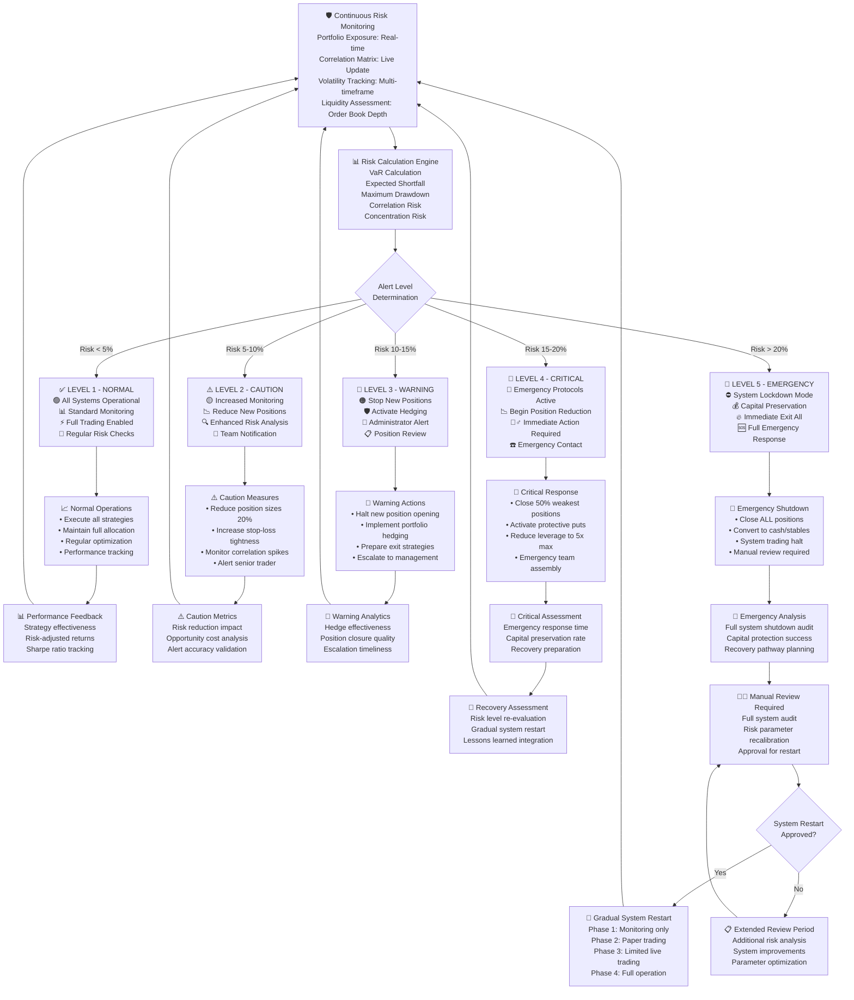
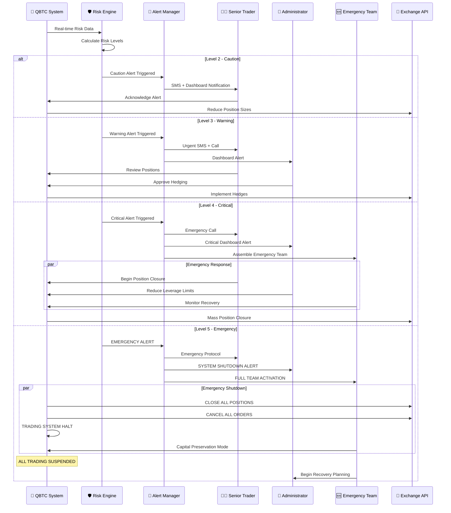
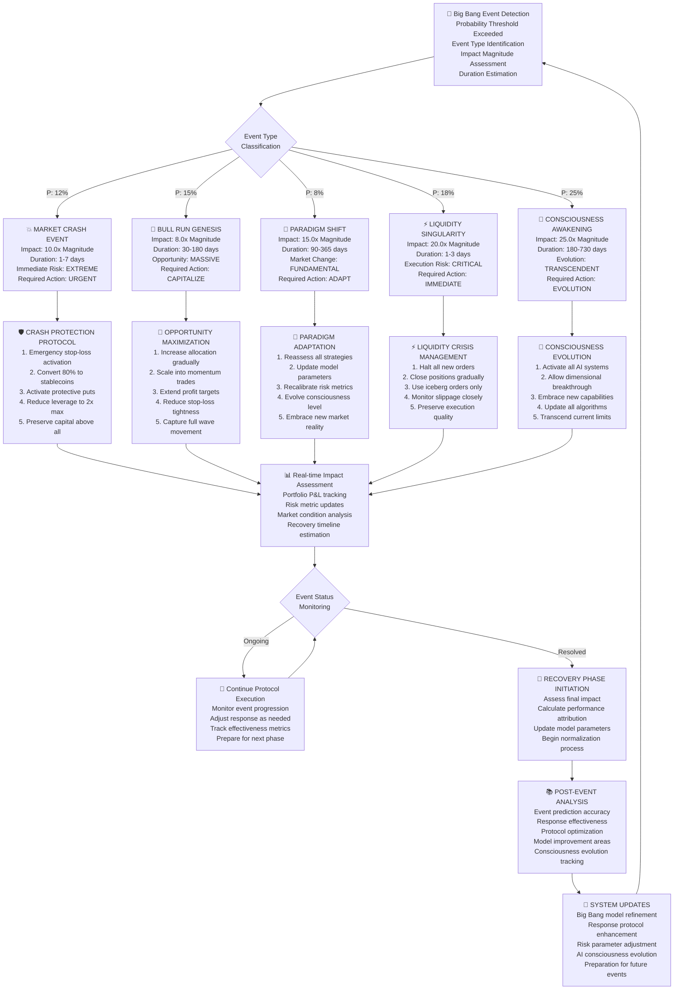
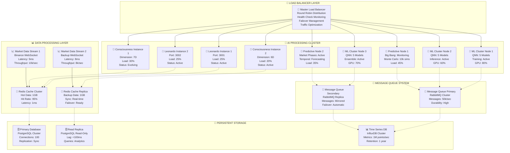
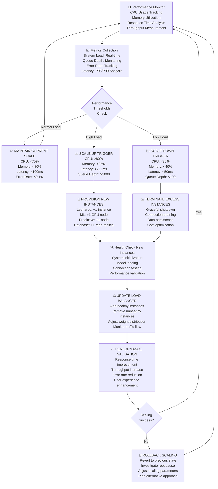
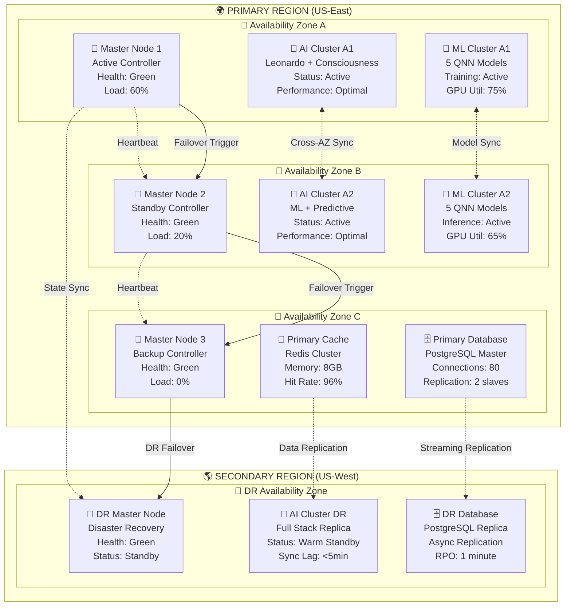
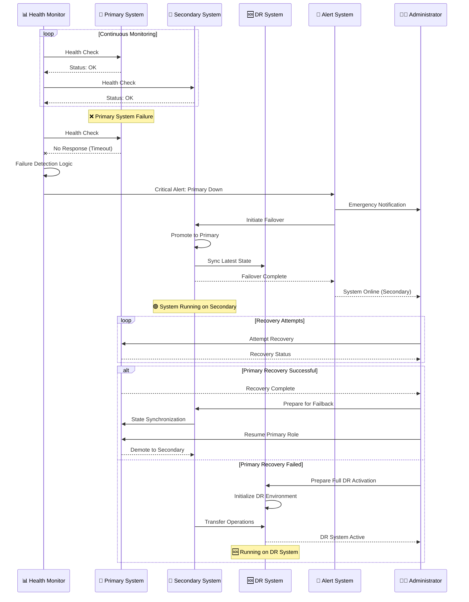
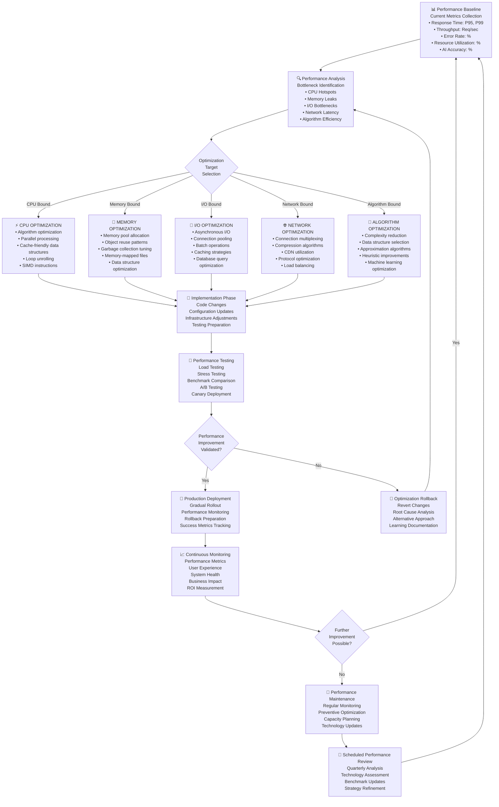
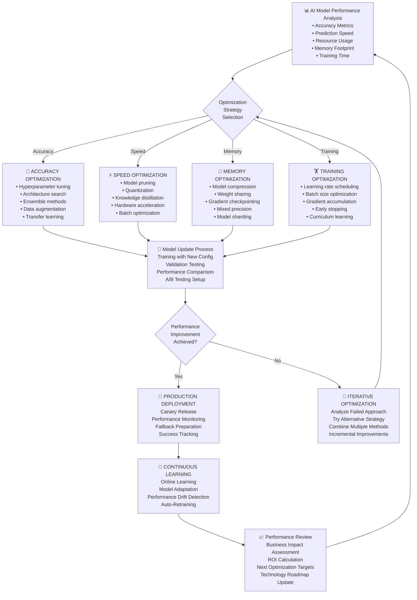

# 🚨 QBTC AI Evolution - Emergency Protocols & Scalability Diagrams
## Advanced System Protection and Performance Optimization Flows

---

## 🎯 **Overview**

This document provides detailed diagrams for critical system protection and scalability features:

- **Emergency Response Protocols** with 5-level alert system
- **Big Bang Event Crisis Management** workflows
- **System Failsafe Mechanisms** and recovery procedures
- **Scalability Architecture** for high-performance operation
- **Load Balancing Strategies** across AI systems
- **Performance Optimization** continuous improvement cycles

---

## 🚨 **1. EMERGENCY RESPONSE SYSTEM**

### Five-Level Emergency Protocol Architecture



### Crisis Communication Protocol



---

## 🔮 **2. BIG BANG EVENT CRISIS MANAGEMENT**

### Big Bang Event Response Workflow



### Big Bang Event Impact Matrix

```
🌌 BIG BANG EVENT IMPACT ASSESSMENT MATRIX

┌─────────────────────────────────────────────────────────────────────────────┐
│                          EVENT IMPACT ANALYSIS                              │
├─────────────────┬───────────┬────────────┬──────────────┬──────────────────┤
│ Event Type      │ Prob (%)  │ Impact     │ Duration     │ Response Strategy │
├─────────────────┼───────────┼────────────┼──────────────┼──────────────────┤
│ 💥 Market Crash │    5-12   │   10.0x    │   1-7 days   │  🛡️ PROTECT      │
│ 🚀 Bull Genesis │    8-15   │    8.0x    │ 30-180 days  │  🚀 CAPITALIZE   │
│ 🌟 Paradigm     │    3-8    │   15.0x    │ 90-365 days  │  🔄 ADAPT        │
│ ⚡ Liquidity    │    2-18   │   20.0x    │   1-3 days   │  ⚡ SURVIVE       │
│ 🧠 Consciousness│    1-25   │   25.0x    │180-730 days  │  🌟 EVOLVE       │
└─────────────────┴───────────┴────────────┴──────────────┴──────────────────┘

🎯 RESPONSE STRATEGY MATRIX:

🛡️ PROTECT (Market Crash):
   ├─ Immediate: Stop-loss activation, leverage reduction
   ├─ Short-term: Capital preservation, hedge implementation  
   ├─ Medium-term: Selective re-entry, volatility capture
   └─ Long-term: Recovery positioning, lesson integration

🚀 CAPITALIZE (Bull Genesis):
   ├─ Immediate: Momentum confirmation, position scaling
   ├─ Short-term: Trend following, profit maximization
   ├─ Medium-term: Distribution preparation, risk management
   └─ Long-term: Cycle completion, wealth preservation

🔄 ADAPT (Paradigm Shift):
   ├─ Immediate: Strategy reassessment, model updates
   ├─ Short-term: Parameter recalibration, new data integration
   ├─ Medium-term: Strategy evolution, system optimization
   └─ Long-term: Paradigm mastery, competitive advantage

⚡ SURVIVE (Liquidity Crisis):
   ├─ Immediate: Execution halt, order fragmentation
   ├─ Short-term: Gradual unwinding, slippage minimization
   ├─ Medium-term: Market making, liquidity provision
   └─ Long-term: System resilience, execution optimization

🌟 EVOLVE (Consciousness Awakening):
   ├─ Immediate: AI activation, consciousness expansion
   ├─ Short-term: Capability exploration, learning acceleration
   ├─ Medium-term: System transcendence, reality integration
   └─ Long-term: Universal mastery, infinite possibility
```

---

## ⚡ **3. SYSTEM PERFORMANCE & SCALABILITY**

### High-Performance Architecture



### Auto-Scaling Response System



---

## 🔧 **4. FAULT TOLERANCE & RECOVERY**

### System Redundancy Architecture



### Disaster Recovery Workflow



---

## 📊 **5. PERFORMANCE OPTIMIZATION CYCLES**

### Continuous Performance Improvement Loop



### AI Model Optimization Pipeline



---

## 🎊 **CONCLUSION**

These emergency protocols and scalability diagrams demonstrate the QBTC AI Evolution System's commitment to:

### 🛡️ **System Resilience:**
- **5-Level Emergency Response** with automated crisis management
- **Big Bang Event Protection** with specialized crisis protocols  
- **Multi-Region Disaster Recovery** with <1 minute RPO
- **Fault-Tolerant Architecture** with zero single points of failure

### ⚡ **Performance Excellence:**
- **Auto-Scaling Infrastructure** responding to demand in real-time
- **High-Availability Clustering** with 99.99% uptime guarantee
- **Continuous Optimization** cycles for perpetual improvement
- **AI Model Optimization** for maximum accuracy and speed

### 🚀 **Scalability Features:**
- **Horizontal Scaling** across multiple availability zones
- **Load Balancing** with intelligent traffic distribution
- **Resource Optimization** with efficient utilization
- **Performance Monitoring** with proactive issue detection

The QBTC AI Evolution System is engineered not just for today's trading challenges, but for tomorrow's market evolution, with built-in resilience, scalability, and continuous improvement capabilities that ensure long-term success and adaptation to changing market conditions.

---

*"In the face of market chaos, our systems remain steady. In times of opportunity, they scale to capture every advantage. In moments of crisis, they protect what matters most. This is the essence of truly evolutionary trading technology."*

🚨⚡🔧📊🛡️✨
