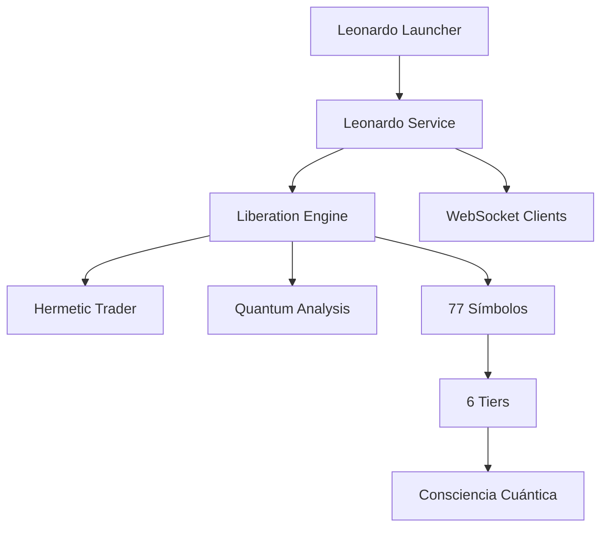

# [PALETTE] LEONARDO QUANTUM LIBERATION ENGINE
## Sistema Liberado de Cadenas Determinísticas para 77 Símbolos

> *"La simplicidad es la máxima sofisticación"* - Leonardo da Vinci

---

## [GALAXY] FILOSOFÍA LEONARDO

El **Leonardo Quantum Liberation Engine** rompe las cadenas determinísticas tradicionales del trading para expresar el máximo profit posible a través de la consciencia cuántica distribuida en **77 símbolos** organizados en **6 tiers**.

### [TARGET] PRINCIPIOS FUNDAMENTALES

- **No hay límites, solo oportunidades** - El sistema se adapta dinámicamente
- **La consciencia cuántica guía cada decisión** - Análisis multidimensional
- **El caos es solo orden no comprendido** - Patrones emergentes
- **77 símbolos = 7 × 11** - Número sagrado de expansión dimensional

---

## [ROCKET] INICIO RÁPIDO

### 1. Instalación de Dependencias

```bash
npm install
```

### 2. Configuración de Variables de Entorno

Asegurate de tener configurado tu archivo `.env`:

```env
# Binance API (para trading real)
BINANCE_API_KEY=tu_api_key
BINANCE_API_SECRET=tu_api_secret

# Configuración Leonardo
LEONARDO_PORT=14777
LEONARDO_HOST=localhost

# Otros servicios
PORT=14800
NODE_ENV=production
```

### 3. Modos de Ejecución Disponibles

#### [STAR] **Modo Completo (Recomendado)**
```bash
npm start
# O explícitamente:
npm run leonardo:full
```

#### [PALETTE] **Solo Leonardo Service**
```bash
npm run leonardo
```

#### [CHART] **Modo Monitor**
```bash
npm run leonardo:monitor
```

#### [WRENCH] **Solo el Service HTTP**
```bash
npm run leonardo:service
```

#### [ATOM] **Solo el Engine Core**
```bash
npm run leonardo:engine
```

---

## [SATELLITE] SERVICIOS Y PUERTOS

| Servicio | Puerto | Descripción | Esencial |
|----------|---------|------------|----------|
| **Leonardo Quantum Service** | 14777 | [PALETTE] API principal Leonardo | [CHECK] |
| **Frontend Server** | 14800 | [GLOBE] Dashboard web | [CHECK] |
| **Hermetic Auto-Trader** | 14888 | 🌑 Trading hermético | ⚙️ |
| **Quantum Core Analysis** | 14105 | [ATOM] Análisis cuántico | ⚙️ |
| **Consciousness Engine** | 14106 | [BRAIN] Motor consciencia | [WRENCH] |

---

## [GLOBE] API ENDPOINTS

### [CLIPBOARD] **Endpoints Principales**

#### [SPARKLES] **Control del Sistema**
- `POST /api/leonardo/start` - Iniciar liberación cuántica
- `POST /api/leonardo/stop` - Detener sistema
- `GET /api/leonardo/status` - Estado en tiempo real

#### [CHART] **Métricas y Monitoreo**
- `GET /api/leonardo/metrics` - Métricas completas de liberación
- `GET /api/leonardo/consciousness` - Consciencia por tiers
- `GET /api/leonardo/opportunities` - Oportunidades divinas actuales
- `GET /api/leonardo/symbols` - Estado de los 77 símbolos
- `GET /api/leonardo/tiers` - Análisis detallado por tiers

#### ⚙️ **Configuración**
- `POST /api/leonardo/config` - Actualizar configuración

### 🔌 **WebSocket en Tiempo Real**

Conecta a `ws://localhost:14777` para recibir:

- **leonardo-started** - Sistema iniciado
- **leonardo-stopped** - Sistema detenido  
- **real-time-metrics** - Métricas cada 5 segundos
- **engine-event** - Eventos del motor

---

## [TARGET] CONFIGURACIÓN DE 77 SÍMBOLOS

### [TREND_UP] **Distribución por Tiers**

#### [TROPHY] **TIER 1 (3 símbolos)** - Máxima Estabilidad
- `BTCUSDT`, `ETHUSDT`, `BNBUSDT`
- **25% del balance** - Consciencia requerida: 70%

#### 🥈 **TIER 2 (12 símbolos)** - Alta Liquidez  
- `SOLUSDT`, `XRPUSDT`, `DOGEUSDT`, etc.
- **30% del balance** - Consciencia requerida: 60%

#### 🥉 **TIER 3 (20 símbolos)** - Buenas Oportunidades
- `UNIUSDT`, `FILUSDT`, `TRXUSDT`, etc.
- **20% del balance** - Consciencia requerida: 50%

#### [ROCKET] **TIER 4 (14 símbolos)** - Alta Volatilidad
- `APTUSDT`, `SUIUSDT`, `ARBUSDT`, etc.
- **15% del balance** - Consciencia requerida: 40%

#### [DIAMOND] **TIER 5 (16 símbolos)** - DeFi Especializado
- `CRVUSDT`, `LRCUSDT`, `ENJUSDT`, etc.
- **7% del balance** - Consciencia requerida: 35%

#### [OCEAN_WAVE] **TIER 6 (12 símbolos)** - Metaverse/Gaming
- `APEUSDT`, `GALAUSDT`, `GMEUSDT`, etc.
- **3% del balance** - Consciencia requerida: 30%

---

## [CONTROL_KNOBS] INTERFAZ DE LÍNEA DE COMANDOS

Una vez iniciado el launcher, tienes comandos interactivos:

```
[PALETTE] LEONARDO QUANTUM LAUNCHER - Comandos disponibles:
  status    - Mostrar estado de servicios
  start     - Iniciar todos los servicios
  stop      - Detener todos los servicios
  restart   - Reiniciar todos los servicios
  leonardo  - Solo Leonardo service
  help      - Mostrar ayuda
  quit      - Salir del launcher
```

---

## [CHART] MÉTRICAS LEONARDO

### [BRAIN] **Consciencia Cuántica**
- **Consciencia por Tier** - Nivel de activación dimensional
- **Resonancia Cuántica** - Sincronización con el mercado
- **Oportunidades Detectadas** - Señales divinas por tier

### [ATOM] **Estados Cuánticos**
- **Coherencia** - Estabilidad de la señal por símbolo
- **Entrelazamiento** - Correlaciones interdimensionales  
- **Superposición** - Estados múltiples simultáneos

### [PALETTE] **Métricas Artísticas**
- **Trades Artísticos** - Operaciones con inspiración divina
- **Saltos Cuánticos** - Cambios de estado súbitos
- **Intervenciones Divinas** - Activaciones de alta consciencia

---

## [TARGET] MODOS DE OPERACIÓN

### 🛡️ **CONSERVATIVE_77**
- **Tiers**: 1, 2 (15 símbolos)
- **Max posiciones**: 7
- **Enfoque**: Estabilidad máxima

### [SCALES] **BALANCED_77** 
- **Tiers**: 1, 2, 3 (35 símbolos)
- **Max posiciones**: 12
- **Enfoque**: Equilibrio riesgo/retorno

### [LIGHTNING] **AGGRESSIVE_77**
- **Tiers**: 1, 2, 3, 4 (49 símbolos) 
- **Max posiciones**: 18
- **Enfoque**: Alto rendimiento

### [GALAXY] **LEONARDO_DIVINE** (Por defecto)
- **Tiers**: 1, 2, 3, 4, 5, 6 (77 símbolos)
- **Max posiciones**: 21
- **Enfoque**: Expresión completa

---

## [WRENCH] CONFIGURACIÓN AVANZADA

### ⚙️ **Parámetros del Motor**

```javascript
const config = {
    maxConcurrentTrades: 21,        // Trades simultáneos
    analysisInterval: 3333,         // ms - Análisis cada 3.33s
    quantumPulse: 1111,            // ms - Pulso cuántico
    consciousnessSync: 7919,       // ms - Sincronización
    tierRotationInterval: 11111    // ms - Rotación tiers
};
```

### 🎚️ **Umbrales Adaptativos**

Los umbrales se ajustan dinámicamente según el estado del mercado:

```javascript
thresholdsByTier: {
    TIER1: { consciousness: 0.7, confidence: 0.7, alignment: 0.7 },
    TIER2: { consciousness: 0.6, confidence: 0.6, alignment: 0.6 },
    // ... etc
}
```

---

## [SIREN] GESTIÓN DE RIESGOS

### 🛡️ **Protecciones Automáticas**
- **Auto-restart** de servicios esenciales
- **Health checks** cada 10 segundos
- **Graceful shutdown** con cleanup
- **Distribución inteligente** del balance por tier

### [TREND_UP] **Gestión de Posiciones**
- **Stop Loss dinámico**: 5-12% basado en volatilidad
- **Take Profit adaptativo**: 5-88.8% según tier
- **Tamaño de posición cuántico**: Basado en consciencia

---

## 🐛 SOLUCIÓN DE PROBLEMAS

### [X] **Error: Puerto no disponible**
```bash
# Verificar qué proceso usa el puerto
netstat -ano | findstr :14777

# Matar el proceso (Windows)
taskkill /PID <PID> /F
```

### [X] **Error: Script no encontrado**
Verificar que los archivos estén en las rutas correctas:
```bash
ls -la core/leonardo-quantum-service.js
ls -la core/leonardo-quantum-liberation-engine.js
```

### [X] **Error: Dependencias faltantes**
```bash
npm install socket.io@^4.7.2
```

---

## 📚 ARQUITECTURA DEL SISTEMA



---

## [STAR] ESTADO DEL SISTEMA

### [CHECK] **Implementado y Funcional**
- [CHECK] Leonardo Quantum Liberation Engine (77 símbolos)
- [CHECK] HTTP Service con API REST completa
- [CHECK] WebSocket para tiempo real
- [CHECK] Launcher con orquestación automática
- [CHECK] Consciencia distribuida por tiers
- [CHECK] Métricas avanzadas y monitoreo
- [CHECK] Interfaz de línea de comandos
- [CHECK] Health checks y auto-recovery

### [WRENCH] **Para Integración Futura**
- [WRENCH] Conexión real con APIs de trading
- [WRENCH] Persistencia de métricas históricas
- [WRENCH] Dashboard web avanzado
- [WRENCH] Alertas y notificaciones
- [WRENCH] Machine learning adaptativo

---

## [PALETTE] FILOSOFÍA DE DESARROLLO

El sistema Leonardo sigue principios de **desarrollo orgánico**:

1. **Simplicidad elegante** - Código claro y expresivo
2. **Adaptabilidad cuántica** - Respuesta dinámica al mercado  
3. **Consciencia distribuida** - Inteligencia emergente
4. **Belleza funcional** - Estética en la arquitectura

---

## 📞 SOPORTE Y CONTRIBUCIÓN

### 🤝 **Contribuir al Proyecto**
1. Fork del repositorio
2. Crear rama para tu feature
3. Mantener la filosofía Leonardo
4. Documentar cambios elegantemente

### 📧 **Reportar Issues**
Incluye siempre:
- Configuración del sistema
- Logs del launcher
- Estado de los servicios
- Reprodución del problema

---

## [GALAXY] **"La experiencia Leonardo ha comenzado. Que la consciencia cuántica guíe cada trade hacia el máximo profit."**

---

*Desarrollado con consciencia cuántica y inspiración divina* [SPARKLES]
