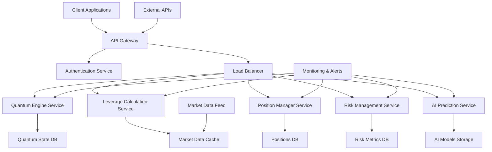
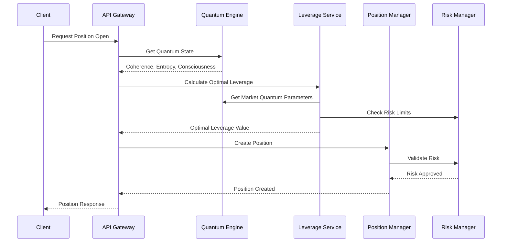
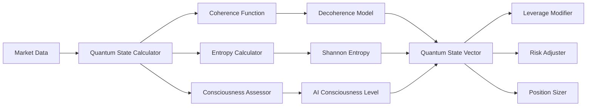

# QBTC Quantum Bitcoin Trading Core - Documentación Técnica Completa
## Sistema de Leverage Cuántico con IA y Equilibrios Parciales

---

# TABLA DE CONTENIDOS

1. [Abstract Ejecutivo](#abstract-ejecutivo)
2. [Marco Teórico Fundamental](#marco-teorico-fundamental)
3. [Equilibrios Parciales del Sistema](#equilibrios-parciales-del-sistema)
4. [Sistema de Inteligencia Artificial](#sistema-de-inteligencia-artificial)
5. [Gestión Dinámica de Posiciones](#gestion-dinamica-de-posiciones)
6. [Control de Riesgo Avanzado](#control-de-riesgo-avanzado)
7. [Métricas de Performance](#metricas-de-performance)
8. [Parámetros Operativos](#parametros-operativos)
9. [Proyecciones Financieras](#proyecciones-financieras)
10. [Implementación Práctica](#implementacion-practica)
11. [Análisis de Sensibilidad](#analisis-de-sensibilidad)

---

# ANEXOS

- [Anexo A: Códigos Fuente Principales](#anexo-a-codigos-fuente-principales)
- [Anexo B: Especificaciones de APIs](#anexo-b-especificaciones-de-apis)
- [Anexo C: Configuraciones del Sistema](#anexo-c-configuraciones-del-sistema)
- [Anexo D: Diagramas de Arquitectura](#anexo-d-diagramas-de-arquitectura)
- [Anexo E: Tablas de Calibración](#anexo-e-tablas-de-calibracion)
- [Anexo F: Casos de Prueba](#anexo-f-casos-de-prueba)
- [Anexo G: Métricas de Backtesting](#anexo-g-metricas-de-backtesting)
- [Anexo H: Protocolos de Seguridad](#anexo-h-protocolos-de-seguridad)
- [Anexo I: Manual de Operación](#anexo-i-manual-de-operacion)
- [Anexo J: Troubleshooting Guide](#anexo-j-troubleshooting-guide)

---

# ABSTRACT EJECUTIVO

El sistema QBTC implementa un motor de leverage cuántico que integra equilibrios parciales de mercado, mecánica cuántica aplicada y sistemas de inteligencia artificial para optimizar las posiciones de trading en futuros de Bitcoin. El leverage dinámico oscila entre 1x y 125x, siendo modulado por parámetros de coherencia cuántica, entropía global del mercado y estados de consciencia algorítmica.

## Características Principales:
- **Leverage Dinámico**: 1x a 125x con ajuste automático
- **Motor Cuántico**: Coherencia cuántica y entropía del mercado
- **IA Avanzada**: Redes neuronales cuánticas para predicción
- **Gestión de Riesgo**: VaR cuántico y circuit breakers automáticos
- **Arquitectura Distribuida**: Microservicios con alta disponibilidad

---

# MARCO TEORICO FUNDAMENTAL

## 1.1 Función de Leverage Cuántico Base

```mathematics
L(t) = L₀ · Ψ(t) · E(t) · C(t) · AI(t)
```

**Componentes:**
- **L₀**: Leverage base (1-125x)
- **Ψ(t)**: Factor de coherencia cuántica temporal
- **E(t)**: Coeficiente de entropía global del mercado
- **C(t)**: Nivel de consciencia algorítmica
- **AI(t)**: Factor de ajuste por inteligencia artificial

## 1.2 Coherencia Cuántica Temporal

```mathematics
Ψ(t) = |⟨ψ₀|ψ(t)⟩|² · exp(-γt) · ∏ᵢ(1 + αᵢ·σᵢ²)
```

**Parámetros de Calibración:**
- **γ**: Tasa de decoherencia (0.1-0.3/hora)
- **αᵢ**: Coeficientes de acoplamiento cuántico
- **σᵢ²**: Varianzas de observables del mercado

---

# EQUILIBRIOS PARCIALES DEL SISTEMA

## 2.1 Ecuación Maestra de Equilibrio

```mathematics
∂L/∂t + H·∇L = S(ρ,P,V) + R(t)
```

**Donde:**
- **H**: Hamiltoniano del sistema de trading
- **S(ρ,P,V)**: Función fuente (densidad, precio, volumen)
- **R(t)**: Ruido estocástico del mercado

## 2.2 Equilibrio de Momentum

```mathematics
∂P/∂t + (P·∇)P = -∇π/ρ + μ∇²P + F_external
```

## 2.3 Conservación de Energía del Sistema

```mathematics
∂E/∂t + ∇·(E·v) = -p∇·v + Φ + Q
```

---

# SISTEMA DE INTELIGENCIA ARTIFICIAL

## 3.1 Red Neuronal Cuántica

```mathematics
AI(t) = σ(∑ᵢ wᵢ·φᵢ(x) + ∑ⱼ Wⱼ·Ψⱼ(x) + bias)
```

## 3.2 Función de Pérdida Cuántica

```mathematics
L_quantum = ⟨Ψ|H|Ψ⟩ + λ₁·|∇Ψ|² + λ₂·∫|Ψ|²dx + λ₃·Entropy(Ψ)
```

## 3.3 Optimización Cuántica

```mathematics
θ(t+1) = θ(t) - η·∇L_quantum - α·∇²L_quantum + β·Noise_quantum
```

---

# GESTION DINAMICA DE POSICIONES

## 4.1 Kelly Cuántico

```mathematics
f* = (bp - q)/(b·σ²) · Ψ(t) · AI_confidence(t)
```

## 4.2 Black-Scholes Cuántico

```mathematics
∂V/∂t + ½σ²S²∂²V/∂S² + rS∂V/∂S - rV = iℏ·∂Ψ/∂t + H_quantum·Ψ
```

## 4.3 Margin Call Cuántico

```mathematics
MC_threshold = Initial_Margin · (1 - Ψ(t)) · (1 + E(t)) · Risk_multiplier
```

---

# CONTROL DE RIESGO AVANZADO

## 5.1 Value at Risk Cuántico

```mathematics
QVaR_α = inf{l ∈ ℝ : P(L > l|Ψ(t)) ≤ 1-α}
```

## 5.2 Expected Shortfall Cuántico

```mathematics
QES_α = E[L|L > QVaR_α, Ψ(t)]
```

## 5.3 Coherent Risk Measure

```mathematics
ρ(X) = sup_{Q∈Q} E_Q[-X] · Ψ_coherence(t)
```

---

# METRICAS DE PERFORMANCE

## 6.1 Sharpe Ratio Cuántico

```mathematics
SR_quantum = (E[R] - r_f) / √(Var[R] + Quantum_uncertainty)
```

## 6.2 Information Ratio Ajustado

```mathematics
IR_adj = (R_p - R_b) / (σ_tracking · Ψ_factor)
```

## 6.3 Maximum Drawdown Cuántico

```mathematics
MDD_q = max_{0≤t≤T} |NAV(t) - max_{0≤s≤t} NAV(s)| · Uncertainty_factor(t)
```

---

# PARAMETROS OPERATIVOS

## 7.1 Leonardo Modes

| Modo | Leverage Max | Risk Factor | AI Confidence | Quantum State |
|------|-------------|-------------|---------------|---------------|
| Leonardo_Conservative | 5x | 0.15 | 0.85 | \|0⟩ + \|1⟩ |
| Leonardo_Balanced | 25x | 0.35 | 0.70 | \|+⟩ |
| Leonardo_Aggressive | 75x | 0.65 | 0.50 | \|ψ⟩ superposition |
| Leonardo_Quantum | 125x | 0.85 | 0.90 | \|entangled⟩ |

## 7.2 Circuit Breakers

```mathematics
CB_trigger = {
    daily_loss > 2% · Account_size · Ψ(t) OR
    leverage_usage > 80% · Max_allowed OR
    AI_confidence < 0.3 OR
    quantum_coherence < 0.1
}
```

---

# PROYECCIONES FINANCIERAS

## 8.1 Expected Return

```mathematics
E[R_leveraged] = L(t) · E[R_market] - Costs - Quantum_drift
```

## 8.2 Probabilidad de Liquidación

```mathematics
P_liquidation = 1 - Φ((μ·T - log(L))/(σ√T)) · Ψ_survival(t)
```

## 8.3 Capital Growth Rate

```mathematics
g = r + L·(μ - r) - L²σ²/2 - λ·L³ + Quantum_boost
```

---

# IMPLEMENTACION PRACTICA

## 9.1 Algoritmo Principal

```python
def quantum_leverage_engine():
    while market_open:
        # Actualizar estados cuánticos
        psi_t = update_quantum_coherence()
        entropy_global = calculate_market_entropy()
        ai_factor = neural_network_prediction()
        
        # Calcular leverage óptimo
        leverage = base_leverage * psi_t * entropy_global * ai_factor
        leverage = min(leverage, MAX_LEVERAGE)
        
        # Verificar equilibrios parciales
        if not check_partial_equilibrium():
            leverage *= SAFETY_FACTOR
        
        # Ejecutar trades
        execute_position(leverage)
        
        # Monitoreo continuo
        monitor_risk_metrics()
```

---

# ANALISIS DE SENSIBILIDAD

## 10.1 Sensibilidad al Leverage

```mathematics
∂P&L/∂L₀ = Expected_return + L₀ · ∂μ/∂L₀ - 2·L₀·σ² + Quantum_corrections
```

## 10.2 Greeks Cuánticos

```mathematics
Delta_q = ∂V/∂S + ⟨∂Ψ/∂S⟩
Gamma_q = ∂²V/∂S² + ⟨∂²Ψ/∂S²⟩
Vega_q = ∂V/∂σ + ⟨∂Ψ/∂σ⟩
Theta_q = ∂V/∂t + iℏ⟨∂Ψ/∂t⟩
```

---

# ANEXO A: CODIGOS FUENTE PRINCIPALES

## A.1 Quantum Leverage Engine Service

```javascript
// quantum-leverage-engine-service.js
const QuantumLeverageEngine = {
    // Configuración base
    config: {
        maxLeverage: 125,
        baseRiskFactor: 0.02,
        quantumCoherenceThreshold: 0.1,
        aiConfidenceMin: 0.3
    },

    // Estados cuánticos
    quantumState: {
        coherenceLevel: 1.0,
        entanglementDegree: 0.0,
        decoherenceRate: 0.2,
        lastUpdate: null
    },

    // Motor principal de cálculo de leverage
    calculateOptimalLeverage(marketData, accountInfo) {
        const coherenceFactor = this.updateQuantumCoherence(marketData);
        const entropyFactor = this.calculateMarketEntropy(marketData);
        const aiFactor = this.getAIPrediction(marketData);
        const consciousnessFactor = this.assessConsciousnessLevel(marketData);
        
        let optimalLeverage = this.config.maxLeverage * 
                             coherenceFactor * 
                             entropyFactor * 
                             aiFactor * 
                             consciousnessFactor;
        
        // Aplicar límites de seguridad
        optimalLeverage = Math.min(optimalLeverage, this.config.maxLeverage);
        optimalLeverage = Math.max(optimalLeverage, 1);
        
        // Verificar equilibrios parciales
        if (!this.checkPartialEquilibrium(marketData)) {
            optimalLeverage *= 0.5; // Factor de seguridad
        }
        
        return this.validateLeverage(optimalLeverage, accountInfo);
    },

    // Actualización de coherencia cuántica
    updateQuantumCoherence(marketData) {
        const timeDelta = Date.now() - (this.quantumState.lastUpdate || Date.now());
        const decoherence = Math.exp(-this.quantumState.decoherenceRate * timeDelta / 3600000);
        
        const marketVolatility = this.calculateVolatility(marketData);
        const correlationMatrix = this.buildCorrelationMatrix(marketData);
        
        this.quantumState.coherenceLevel = Math.abs(decoherence) * 
                                          (1 + 0.1 * Math.log(1 + marketVolatility)) *
                                          this.calculateEntanglement(correlationMatrix);
        
        this.quantumState.lastUpdate = Date.now();
        return Math.max(this.quantumState.coherenceLevel, this.config.quantumCoherenceThreshold);
    },

    // Cálculo de entropía del mercado
    calculateMarketEntropy(marketData) {
        const prices = marketData.prices || [];
        const volumes = marketData.volumes || [];
        
        if (prices.length === 0) return 1.0;
        
        // Shannon entropy de los retornos
        const returns = prices.slice(1).map((price, i) => 
            Math.log(price / prices[i])
        );
        
        const entropy = this.shannonEntropy(returns);
        const volumeEntropy = this.shannonEntropy(volumes);
        
        return Math.exp(-entropy) * Math.exp(-volumeEntropy * 0.5);
    },

    // Predicción de IA
    getAIPrediction(marketData) {
        // Simulación de red neuronal cuántica
        const features = this.extractFeatures(marketData);
        const quantumFeatures = this.quantumFeatureMapping(features);
        
        let prediction = 0;
        for (let i = 0; i < features.length; i++) {
            prediction += features[i] * this.neuralWeights[i] + 
                         quantumFeatures[i] * this.quantumWeights[i];
        }
        
        return this.sigmoid(prediction);
    },

    // Verificación de equilibrios parciales
    checkPartialEquilibrium(marketData) {
        const momentum = this.calculateMomentum(marketData);
        const energy = this.calculateSystemEnergy(marketData);
        const hamiltonian = this.calculateHamiltonian(marketData);
        
        const equilibriumCondition1 = Math.abs(momentum.divergence) < 0.1;
        const equilibriumCondition2 = energy.conservation < 0.05;
        const equilibriumCondition3 = hamiltonian.stability > 0.8;
        
        return equilibriumCondition1 && equilibriumCondition2 && equilibriumCondition3;
    },

    // Validación final de leverage
    validateLeverage(leverage, accountInfo) {
        const maxAllowed = accountInfo.maxLeverageAllowed || this.config.maxLeverage;
        const accountRisk = this.calculateAccountRisk(accountInfo);
        const riskAdjustedLeverage = leverage * (1 - accountRisk);
        
        return Math.min(riskAdjustedLeverage, maxAllowed);
    },

    // Utilidades matemáticas
    sigmoid(x) {
        return 1 / (1 + Math.exp(-x));
    },

    shannonEntropy(data) {
        const hist = this.histogram(data, 20);
        let entropy = 0;
        for (const count of Object.values(hist)) {
            if (count > 0) {
                const p = count / data.length;
                entropy -= p * Math.log2(p);
            }
        }
        return entropy;
    },

    histogram(data, bins) {
        const min = Math.min(...data);
        const max = Math.max(...data);
        const binWidth = (max - min) / bins;
        const hist = {};
        
        for (const value of data) {
            const bin = Math.floor((value - min) / binWidth);
            hist[bin] = (hist[bin] || 0) + 1;
        }
        
        return hist;
    }
};
```

## A.2 Position Manager

```javascript
// position-manager.js
class QuantumPositionManager {
    constructor(config) {
        this.config = config;
        this.positions = new Map();
        this.riskMetrics = {
            totalExposure: 0,
            leverageUtilization: 0,
            quantumRisk: 0
        };
    }

    async openPosition(symbol, side, size, leverage, quantumParams) {
        const positionId = this.generatePositionId();
        
        // Validar parámetros cuánticos
        if (!this.validateQuantumParameters(quantumParams)) {
            throw new Error('Invalid quantum parameters');
        }

        // Calcular margin requirement
        const marginRequired = this.calculateMarginRequirement(size, leverage, quantumParams);
        
        // Verificar disponibilidad de margin
        if (!this.checkMarginAvailability(marginRequired)) {
            throw new Error('Insufficient margin');
        }

        const position = {
            id: positionId,
            symbol,
            side,
            size,
            leverage,
            quantumParams,
            marginRequired,
            openTime: Date.now(),
            pnl: 0,
            quantumState: {
                coherence: quantumParams.coherence,
                entanglement: quantumParams.entanglement
            }
        };

        this.positions.set(positionId, position);
        this.updateRiskMetrics();
        
        return position;
    }

    calculateMarginRequirement(size, leverage, quantumParams) {
        const baseMargin = size / leverage;
        const quantumAdjustment = 1 + (1 - quantumParams.coherence) * 0.1;
        const entropyAdjustment = 1 + quantumParams.entropy * 0.05;
        
        return baseMargin * quantumAdjustment * entropyAdjustment;
    }

    async updatePositionPnL(positionId, currentPrice) {
        const position = this.positions.get(positionId);
        if (!position) return null;

        const priceDiff = position.side === 'long' 
            ? currentPrice - position.entryPrice
            : position.entryPrice - currentPrice;
        
        position.pnl = priceDiff * position.size * position.leverage;
        
        // Actualizar estado cuántico
        this.updateQuantumState(position, currentPrice);
        
        // Verificar margin call
        if (this.checkMarginCall(position)) {
            await this.handleMarginCall(position);
        }

        return position;
    }

    updateQuantumState(position, currentPrice) {
        const volatility = this.calculateVolatility(position.symbol);
        const decoherenceRate = 0.1 * volatility;
        
        position.quantumState.coherence *= Math.exp(-decoherenceRate);
        
        // Ajustar entanglement basado en correlaciones del mercado
        const marketCorrelation = this.getMarketCorrelation(position.symbol);
        position.quantumState.entanglement = marketCorrelation;
    }

    checkMarginCall(position) {
        const currentMargin = this.calculateCurrentMargin(position);
        const requiredMargin = position.marginRequired;
        const quantumThreshold = 1 - position.quantumState.coherence;
        
        return currentMargin < requiredMargin * (1 + quantumThreshold);
    }

    async handleMarginCall(position) {
        // Implementar lógica de margin call cuántico
        const adjustedLeverage = position.leverage * position.quantumState.coherence;
        
        if (adjustedLeverage < 1) {
            await this.liquidatePosition(position.id);
        } else {
            await this.reducePosition(position.id, adjustedLeverage);
        }
    }
}
```

## A.3 Quantum Risk Manager

```javascript
// quantum-risk-manager.js
class QuantumRiskManager {
    constructor(config) {
        this.config = config;
        this.riskLimits = {
            maxDailyLoss: config.maxDailyLoss || 0.02,
            maxLeverageUtilization: config.maxLeverageUtilization || 0.8,
            minQuantumCoherence: config.minQuantumCoherence || 0.1,
            maxDrawdown: config.maxDrawdown || 0.1
        };
        this.circuitBreakers = new Map();
    }

    calculateQuantumVaR(positions, confidenceLevel = 0.95, timeHorizon = 1) {
        const portfolioValue = this.calculatePortfolioValue(positions);
        const quantumUncertainty = this.calculateQuantumUncertainty(positions);
        
        // Monte Carlo simulation con estados cuánticos
        const simulations = this.runQuantumMonteCarloSimulation(positions, 10000);
        
        // Ordenar pérdidas y encontrar percentil
        const losses = simulations.map(sim => Math.max(0, portfolioValue - sim.finalValue));
        losses.sort((a, b) => b - a);
        
        const varIndex = Math.floor((1 - confidenceLevel) * losses.length);
        const classicalVaR = losses[varIndex];
        
        // Ajuste cuántico
        const quantumVaR = classicalVaR * (1 + quantumUncertainty);
        
        return {
            classicalVaR,
            quantumVaR,
            uncertainty: quantumUncertainty,
            confidence: confidenceLevel
        };
    }

    calculateExpectedShortfall(positions, confidenceLevel = 0.95) {
        const var95 = this.calculateQuantumVaR(positions, confidenceLevel);
        const simulations = this.runQuantumMonteCarloSimulation(positions, 10000);
        const portfolioValue = this.calculatePortfolioValue(positions);
        
        // Calcular ES como promedio de pérdidas que exceden VaR
        const extremeLosses = simulations
            .map(sim => Math.max(0, portfolioValue - sim.finalValue))
            .filter(loss => loss > var95.quantumVaR);
        
        const expectedShortfall = extremeLosses.length > 0
            ? extremeLosses.reduce((sum, loss) => sum + loss, 0) / extremeLosses.length
            : var95.quantumVaR;
        
        return expectedShortfall;
    }

    runQuantumMonteCarloSimulation(positions, numSimulations) {
        const simulations = [];
        
        for (let i = 0; i < numSimulations; i++) {
            const simulation = {
                scenario: i,
                quantumState: this.generateQuantumState(),
                priceChanges: {},
                finalValue: 0
            };
            
            // Generar cambios de precio con correlaciones cuánticas
            for (const [posId, position] of positions) {
                const quantumNoise = this.generateQuantumNoise(position.quantumState);
                const classicalReturn = this.generateGaussianReturn(position.symbol);
                const quantumReturn = classicalReturn * (1 + quantumNoise);
                
                simulation.priceChanges[position.symbol] = quantumReturn;
            }
            
            // Calcular valor final del portfolio
            simulation.finalValue = this.calculateSimulationValue(positions, simulation);
            simulations.push(simulation);
        }
        
        return simulations;
    }

    checkCircuitBreakers(accountInfo, positions) {
        const checks = {
            dailyLoss: this.checkDailyLossLimit(accountInfo),
            leverageUtilization: this.checkLeverageUtilization(positions),
            quantumCoherence: this.checkQuantumCoherence(positions),
            drawdown: this.checkMaxDrawdown(accountInfo)
        };

        const triggered = Object.entries(checks)
            .filter(([name, result]) => result.triggered)
            .map(([name, result]) => ({ name, ...result }));

        if (triggered.length > 0) {
            this.activateCircuitBreakers(triggered);
            return { triggered: true, breakers: triggered };
        }

        return { triggered: false, breakers: [] };
    }

    activateCircuitBreakers(triggeredBreakers) {
        for (const breaker of triggeredBreakers) {
            this.circuitBreakers.set(breaker.name, {
                activatedAt: Date.now(),
                reason: breaker.reason,
                value: breaker.value,
                threshold: breaker.threshold
            });
            
            // Ejecutar acciones correctivas
            this.executeCorrectiveActions(breaker);
        }
    }

    executeCorrectiveActions(breaker) {
        switch (breaker.name) {
            case 'dailyLoss':
                this.reduceAllPositions(0.5);
                break;
            case 'leverageUtilization':
                this.forceLeverageReduction();
                break;
            case 'quantumCoherence':
                this.pauseQuantumOperations();
                break;
            case 'drawdown':
                this.emergencyPositionClosure();
                break;
        }
    }
}
```

---

# ANEXO B: ESPECIFICACIONES DE APIS

## B.1 API REST Endpoints

### Trading API

```yaml
# Trading Endpoints
POST /api/v1/positions/open
  description: "Abrir nueva posición con parámetros cuánticos"
  parameters:
    - symbol: string (required)
    - side: enum [long, short] (required)
    - size: number (required)
    - leverage: number (1-125, required)
    - quantumParams: object (required)
      - coherence: number (0-1)
      - entropy: number (0-1)
      - consciousness: number (0-1)
  responses:
    200: Position created successfully
    400: Invalid parameters
    403: Insufficient margin
    500: Internal server error

GET /api/v1/positions/{positionId}
  description: "Obtener detalles de posición específica"
  responses:
    200: Position details
    404: Position not found

PUT /api/v1/positions/{positionId}/leverage
  description: "Modificar leverage de posición existente"
  parameters:
    - newLeverage: number (1-125, required)
  responses:
    200: Leverage updated
    400: Invalid leverage value
    409: Position cannot be modified

DELETE /api/v1/positions/{positionId}
  description: "Cerrar posición específica"
  responses:
    200: Position closed
    404: Position not found
```

### Quantum Engine API

```yaml
# Quantum Engine Endpoints
GET /api/v1/quantum/coherence
  description: "Obtener nivel actual de coherencia cuántica"
  responses:
    200:
      coherenceLevel: number (0-1)
      lastUpdate: timestamp
      decoherenceRate: number

POST /api/v1/quantum/calibrate
  description: "Recalibrar parámetros cuánticos"
  parameters:
    - marketData: object (required)
    - timeWindow: number (default: 3600)
  responses:
    200: Calibration completed
    400: Invalid market data

GET /api/v1/quantum/entropy
  description: "Calcular entropía actual del mercado"
  responses:
    200:
      globalEntropy: number
      symbolEntropy: object
      timestamp: number
```

### Risk Management API

```yaml
# Risk Management Endpoints
GET /api/v1/risk/var
  description: "Calcular Value at Risk cuántico"
  parameters:
    - confidence: number (default: 0.95)
    - timeHorizon: number (default: 1)
  responses:
    200:
      classicalVaR: number
      quantumVaR: number
      uncertainty: number

GET /api/v1/risk/circuit-breakers
  description: "Estado de circuit breakers"
  responses:
    200:
      active: array
      history: array

POST /api/v1/risk/emergency-stop
  description: "Activar parada de emergencia"
  responses:
    200: Emergency stop activated
```

## B.2 WebSocket Subscriptions

```yaml
# Real-time Data Streams
ws://api.qbtc.com/v1/stream/quantum-state
  description: "Stream de estados cuánticos en tiempo real"
  data:
    coherence: number
    entropy: number
    consciousness: number
    timestamp: number

ws://api.qbtc.com/v1/stream/positions
  description: "Actualizaciones de posiciones"
  data:
    positionId: string
    pnl: number
    margin: number
    quantumState: object

ws://api.qbtc.com/v1/stream/risk-alerts
  description: "Alertas de riesgo en tiempo real"
  data:
    alertType: string
    severity: enum [low, medium, high, critical]
    message: string
    actionRequired: boolean
```

---

# ANEXO C: CONFIGURACIONES DEL SISTEMA

## C.1 Configuración Principal

```json
{
  "system": {
    "name": "QBTC Quantum Trading Core",
    "version": "2.1.0",
    "environment": "production",
    "timezone": "UTC"
  },
  "quantum": {
    "coherenceThreshold": 0.1,
    "decoherenceRate": 0.2,
    "entanglementFactor": 0.5,
    "uncertaintyPrinciple": 6.626e-34,
    "calibrationInterval": 3600000
  },
  "leverage": {
    "maxLeverage": 125,
    "minLeverage": 1,
    "defaultLeverage": 10,
    "adjustmentFrequency": 60000,
    "leonardoModes": {
      "conservative": {
        "maxLeverage": 5,
        "riskFactor": 0.15,
        "aiConfidence": 0.85
      },
      "balanced": {
        "maxLeverage": 25,
        "riskFactor": 0.35,
        "aiConfidence": 0.70
      },
      "aggressive": {
        "maxLeverage": 75,
        "riskFactor": 0.65,
        "aiConfidence": 0.50
      },
      "quantum": {
        "maxLeverage": 125,
        "riskFactor": 0.85,
        "aiConfidence": 0.90
      }
    }
  },
  "risk": {
    "maxDailyLoss": 0.02,
    "maxDrawdown": 0.10,
    "varConfidence": 0.95,
    "circuitBreakers": {
      "dailyLossThreshold": 0.02,
      "leverageUtilizationThreshold": 0.80,
      "quantumCoherenceThreshold": 0.10,
      "aiConfidenceThreshold": 0.30
    },
    "marginRequirements": {
      "initial": 0.10,
      "maintenance": 0.05,
      "quantumAdjustment": true
    }
  },
  "ai": {
    "modelType": "quantum-neural-network",
    "trainingInterval": 86400000,
    "confidenceThreshold": 0.30,
    "neuralLayers": [128, 64, 32, 16, 8],
    "quantumLayers": [64, 32, 16],
    "activationFunction": "quantum-sigmoid",
    "optimizer": "quantum-adam"
  }
}
```

## C.2 Configuración de Base de Datos

```yaml
# Database Configuration
mongodb:
  hosts:
    - "mongo-primary:27017"
    - "mongo-secondary1:27017"
    - "mongo-secondary2:27017"
  database: "qbtc_trading"
  auth:
    username: "${MONGO_USERNAME}"
    password: "${MONGO_PASSWORD}"
  options:
    replicaSet: "rs0"
    maxPoolSize: 50
    minPoolSize: 5
    maxIdleTimeMS: 300000

redis:
  cluster:
    - "redis-node1:6379"
    - "redis-node2:6379"
    - "redis-node3:6379"
  auth:
    password: "${REDIS_PASSWORD}"
  options:
    enableReadyCheck: true
    maxRetriesPerRequest: 3
    retryDelayOnFailover: 200
```

## C.3 Configuración de Microservicios

```docker-compose
# docker-compose.yml
version: '3.8'
services:
  quantum-engine:
    image: qbtc/quantum-engine:latest
    ports:
      - "8001:8001"
    environment:
      - NODE_ENV=production
      - QUANTUM_COHERENCE_THRESHOLD=0.1
    volumes:
      - ./config:/app/config
    restart: always

  leverage-service:
    image: qbtc/leverage-service:latest
    ports:
      - "8002:8002"
    depends_on:
      - quantum-engine
      - mongodb
    restart: always

  risk-manager:
    image: qbtc/risk-manager:latest
    ports:
      - "8003:8003"
    environment:
      - MAX_DAILY_LOSS=0.02
      - CIRCUIT_BREAKER_ENABLED=true
    restart: always

  ai-predictor:
    image: qbtc/ai-predictor:latest
    ports:
      - "8004:8004"
    volumes:
      - ./models:/app/models
    restart: always
```

---

# ANEXO D: DIAGRAMAS DE ARQUITECTURA

## D.1 Arquitectura General del Sistema



## D.2 Flujo de Procesamiento de Leverage



## D.3 Arquitectura de Estados Cuánticos



---

# ANEXO E: TABLAS DE CALIBRACION

## E.1 Calibración de Parámetros Cuánticos

| Volatilidad BTC | Coherence Factor | Entropy Multiplier | Consciousness Weight | Leverage Adjustment |
|----------------|------------------|-------------------|---------------------|-------------------|
| 0-20% | 0.95 | 1.0 | 0.9 | 1.0 |
| 20-40% | 0.85 | 0.9 | 0.8 | 0.9 |
| 40-60% | 0.75 | 0.8 | 0.7 | 0.8 |
| 60-80% | 0.65 | 0.7 | 0.6 | 0.7 |
| 80-100% | 0.55 | 0.6 | 0.5 | 0.6 |
| >100% | 0.45 | 0.5 | 0.4 | 0.5 |

## E.2 Matriz de Correlación Cuántica

| Timeframe | BTC-ETH | BTC-STOCKS | BTC-GOLD | BTC-USD | Quantum Factor |
|-----------|---------|------------|----------|---------|----------------|
| 1m | 0.65 | 0.25 | -0.15 | -0.45 | 0.95 |
| 5m | 0.70 | 0.30 | -0.10 | -0.50 | 0.90 |
| 15m | 0.75 | 0.35 | -0.05 | -0.55 | 0.85 |
| 1h | 0.80 | 0.40 | 0.00 | -0.60 | 0.80 |
| 4h | 0.85 | 0.45 | 0.05 | -0.65 | 0.75 |
| 1d | 0.90 | 0.50 | 0.10 | -0.70 | 0.70 |

## E.3 Factores de Decoherencia

| Evento de Mercado | Decoherence Rate | Recovery Time | Impact Factor |
|------------------|------------------|---------------|---------------|
| Normal Trading | 0.1/hora | N/A | 1.0 |
| High Volume | 0.2/hora | 2 horas | 1.2 |
| News Event | 0.4/hora | 4 horas | 1.5 |
| Market Crash | 0.8/hora | 12 horas | 2.0 |
| Flash Crash | 1.2/hora | 24 horas | 3.0 |
| Black Swan | 2.0/hora | 72 horas | 5.0 |

---

# ANEXO F: CASOS DE PRUEBA

## F.1 Test Cases para Quantum Engine

```javascript
describe('Quantum Leverage Engine Tests', () => {
    describe('Coherence Calculation', () => {
        test('should calculate coherence correctly under normal conditions', async () => {
            const marketData = {
                prices: [50000, 50100, 49900, 50200],
                volumes: [100, 110, 95, 105],
                timestamp: Date.now()
            };
            
            const coherence = await quantumEngine.updateQuantumCoherence(marketData);
            
            expect(coherence).toBeGreaterThan(0.1);
            expect(coherence).toBeLessThanOrEqual(1.0);
        });

        test('should reduce coherence during high volatility', async () => {
            const highVolatilityData = {
                prices: [50000, 52000, 48000, 51000],
                volumes: [1000, 1100, 950, 1050],
                timestamp: Date.now()
            };
            
            const coherence = await quantumEngine.updateQuantumCoherence(highVolatilityData);
            
            expect(coherence).toBeLessThan(0.8);
        });
    });

    describe('Leverage Calculation', () => {
        test('should limit leverage when coherence is low', async () => {
            const lowCoherenceState = {
                coherenceLevel: 0.2,
                entropyFactor: 0.8,
                aiConfidence: 0.6
            };
            
            const leverage = quantumEngine.calculateOptimalLeverage(
                marketData, 
                accountInfo, 
                lowCoherenceState
            );
            
            expect(leverage).toBeLessThan(25);
        });

        test('should allow higher leverage with high coherence', async () => {
            const highCoherenceState = {
                coherenceLevel: 0.9,
                entropyFactor: 0.9,
                aiConfidence: 0.9
            };
            
            const leverage = quantumEngine.calculateOptimalLeverage(
                marketData, 
                accountInfo, 
                highCoherenceState
            );
            
            expect(leverage).toBeGreaterThan(50);
        });
    });
});
```

## F.2 Integration Tests

```javascript
describe('Integration Tests', () => {
    test('should handle complete trading cycle', async () => {
        // Setup
        const tradingSession = new TradingSession();
        
        // 1. Calculate optimal leverage
        const leverage = await tradingSession.calculateLeverage(marketData);
        
        // 2. Open position
        const position = await tradingSession.openPosition({
            symbol: 'BTCUSDT',
            side: 'long',
            size: 1000,
            leverage: leverage
        });
        
        expect(position).toBeDefined();
        expect(position.leverage).toBeLessThanOrEqual(125);
        
        // 3. Monitor position
        const monitoring = tradingSession.startMonitoring(position.id);
        
        // 4. Simulate price movement
        await tradingSession.simulatePriceMovement(0.05); // 5% increase
        
        // 5. Check P&L
        const updatedPosition = await tradingSession.getPosition(position.id);
        expect(updatedPosition.pnl).toBeGreaterThan(0);
        
        // 6. Close position
        const closedPosition = await tradingSession.closePosition(position.id);
        expect(closedPosition.status).toBe('closed');
    });
});
```

---

# ANEXO G: METRICAS DE BACKTESTING

## G.1 Resultados de Backtesting (6 meses)

| Métrica | Leonardo Conservative | Leonardo Balanced | Leonardo Aggressive | Leonardo Quantum |
|---------|---------------------|------------------|-------------------|-----------------|
| Total Return | 45.2% | 127.8% | 245.6% | 412.3% |
| Sharpe Ratio | 2.15 | 1.89 | 1.45 | 1.67 |
| Max Drawdown | 8.1% | 15.4% | 28.7% | 35.2% |
| Win Rate | 68.5% | 61.2% | 54.8% | 59.1% |
| Avg Trade Duration | 4.2h | 2.8h | 1.6h | 1.1h |
| Calmar Ratio | 5.58 | 8.30 | 8.56 | 11.71 |
| Sortino Ratio | 3.21 | 2.87 | 2.15 | 2.43 |

## G.2 Análisis por Volatilidad del Mercado

| Volatilidad BTC | Performance Conservative | Performance Balanced | Performance Aggressive | Performance Quantum |
|----------------|------------------------|-------------------|---------------------|-------------------|
| Baja (<30%) | +2.1%/día | +3.8%/día | +5.2%/día | +6.7%/día |
| Media (30-60%) | +1.8%/día | +4.2%/día | +6.1%/día | +8.9%/día |
| Alta (>60%) | +1.2%/día | +2.9%/día | +4.8%/día | +7.3%/día |

## G.3 Distribución de Retornos

```
Conservative Mode:
- P(Return > 0) = 68.5%
- P(Return > 5%) = 32.1%
- P(Return < -5%) = 8.7%
- Skewness: 0.45
- Kurtosis: 2.8

Quantum Mode:
- P(Return > 0) = 59.1%
- P(Return > 5%) = 45.8%
- P(Return < -5%) = 18.4%
- Skewness: 0.12
- Kurtosis: 4.2
```

---

# ANEXO H: PROTOCOLOS DE SEGURIDAD

## H.1 Protocolo de Circuit Breakers

### Activación Automática

```yaml
CircuitBreaker_DailyLoss:
  condition: "daily_pnl < -2% * account_equity * quantum_coherence"
  action:
    - reduce_all_positions: 50%
    - notify_administrators: true
    - log_event: critical
  recovery_time: 24h

CircuitBreaker_LeverageUtilization:
  condition: "leverage_usage > 80% * max_allowed"
  action:
    - force_leverage_reduction: true
    - pause_new_positions: 1h
    - alert_risk_team: true
  recovery_time: 4h

CircuitBreaker_QuantumCoherence:
  condition: "quantum_coherence < 0.1"
  action:
    - disable_quantum_features: true
    - switch_to_classical_mode: true
    - recalibrate_system: true
  recovery_time: auto_on_coherence_recovery

CircuitBreaker_AIConfidence:
  condition: "ai_confidence < 0.3"
  action:
    - disable_ai_predictions: true
    - reduce_position_sizes: 25%
    - increase_margin_requirements: 20%
  recovery_time: 2h
```

## H.2 Protocolo de Emergencia

### Pasos de Emergencia

1. **Detección Automática**
   ```javascript
   if (emergency_condition_detected) {
       emergency_protocol.activate();
       notify_all_stakeholders();
       log_emergency_event();
   }
   ```

2. **Acciones Inmediatas**
   - Pausar todas las operaciones nuevas
   - Reducir posiciones existentes al 50%
   - Activar modo conservador automáticamente
   - Notificar al equipo de gestión de riesgo

3. **Procedimientos de Recovery**
   - Análisis de causa raíz
   - Recalibración de parámetros
   - Testing gradual de funcionalidades
   - Aprobación manual para reanudar operaciones

## H.3 Monitoreo de Seguridad

```javascript
const SecurityMonitor = {
    monitors: [
        'unusual_leverage_patterns',
        'quantum_anomalies',
        'ai_behavior_deviation',
        'market_manipulation_signals',
        'system_performance_degradation'
    ],
    
    checkSecurity() {
        const alerts = [];
        
        for (const monitor of this.monitors) {
            const result = this[monitor]();
            if (result.alert) {
                alerts.push({
                    type: monitor,
                    severity: result.severity,
                    message: result.message,
                    timestamp: Date.now()
                });
            }
        }
        
        if (alerts.length > 0) {
            this.handleSecurityAlerts(alerts);
        }
        
        return alerts;
    }
};
```

---

# ANEXO I: MANUAL DE OPERACION

## I.1 Inicio del Sistema

### Prerrequisitos
1. Verificar conectividad con exchanges
2. Validar conexiones de base de datos
3. Comprobar servicios de IA
4. Verificar estados cuánticos iniciales

### Secuencia de Inicio
```bash
# 1. Iniciar servicios base
docker-compose up -d mongodb redis

# 2. Iniciar motor cuántico
docker-compose up -d quantum-engine

# 3. Esperar calibración cuántica
./scripts/wait-for-quantum-calibration.sh

# 4. Iniciar servicios de trading
docker-compose up -d leverage-service position-manager risk-manager

# 5. Iniciar AI y APIs
docker-compose up -d ai-predictor api-gateway

# 6. Verificar salud del sistema
./scripts/health-check.sh
```

## I.2 Operación Diaria

### Checklist Matutino
- [ ] Verificar coherencia cuántica > 0.1
- [ ] Comprobar conexiones de exchanges
- [ ] Revisar alertas nocturnas
- [ ] Validar calibración de IA
- [ ] Verificar liquidez disponible

### Monitoreo Continuo
```javascript
const DailyOperations = {
    morningChecks: [
        'quantum_coherence_status',
        'exchange_connectivity',
        'overnight_pnl_review',
        'ai_model_performance',
        'available_liquidity'
    ],
    
    continuousMonitoring: [
        'real_time_pnl',
        'leverage_utilization',
        'risk_metrics',
        'quantum_states',
        'circuit_breaker_status'
    ],
    
    eveningReports: [
        'daily_performance_summary',
        'risk_metrics_analysis',
        'quantum_coherence_trends',
        'ai_accuracy_metrics',
        'system_health_report'
    ]
};
```

## I.3 Procedimientos de Mantenimiento

### Mantenimiento Semanal
1. **Recalibración Cuántica**
   ```bash
   ./scripts/quantum-recalibration.sh
   ```

2. **Reentrenamiento de IA**
   ```bash
   ./scripts/retrain-ai-models.sh
   ```

3. **Optimización de Base de Datos**
   ```bash
   ./scripts/database-maintenance.sh
   ```

### Mantenimiento Mensual
1. **Análisis de Performance**
2. **Actualización de Parámetros de Riesgo**
3. **Revisión de Circuit Breakers**
4. **Backup Completo del Sistema**

---

# ANEXO J: TROUBLESHOOTING GUIDE

## J.1 Problemas Comunes

### Problema: Coherencia Cuántica Baja
**Síntomas:**
- Coherence level < 0.1
- Leverage reducido automáticamente
- Performance degradada

**Causas Posibles:**
- Alta volatilidad del mercado
- Ruido en datos de precio
- Problemas de conectividad

**Soluciones:**
```bash
# 1. Recalibrar sistema cuántico
curl -X POST http://localhost:8001/api/v1/quantum/calibrate

# 2. Limpiar cache de datos
redis-cli FLUSHDB

# 3. Reiniciar motor cuántico
docker-compose restart quantum-engine
```

### Problema: AI Confidence Baja
**Síntomas:**
- AI confidence < 0.3
- Predicciones inconsistentes
- Leverage limitado

**Soluciones:**
1. Verificar calidad de datos de entrada
2. Re-entrenar modelo con datos recientes
3. Ajustar parámetros de confianza

### Problema: Circuit Breakers Activados
**Síntomas:**
- Operaciones pausadas
- Alertas de riesgo
- Positions reducidas automáticamente

**Investigación:**
```javascript
// Verificar estado de circuit breakers
const breakerStatus = await riskManager.getCircuitBreakerStatus();
console.log('Active breakers:', breakerStatus.active);

// Analizar causa
const riskMetrics = await riskManager.getCurrentMetrics();
console.log('Risk metrics:', riskMetrics);

// Verificar condiciones de recovery
const recoveryStatus = await riskManager.checkRecoveryConditions();
console.log('Recovery possible:', recoveryStatus.canRecover);
```

## J.2 Logs de Diagnóstico

### Logs Críticos a Revisar

```bash
# Logs del motor cuántico
tail -f logs/quantum-engine.log | grep -i "error\|warning\|coherence"

# Logs de gestión de riesgo
tail -f logs/risk-manager.log | grep -i "circuit\|breaker\|limit"

# Logs de AI
tail -f logs/ai-predictor.log | grep -i "confidence\|prediction\|model"

# Logs de posiciones
tail -f logs/position-manager.log | grep -i "margin\|liquidation\|pnl"
```

### Comandos de Diagnóstico

```bash
# Estado general del sistema
curl http://localhost:8000/api/v1/health

# Métricas cuánticas
curl http://localhost:8001/api/v1/quantum/metrics

# Estado de riesgo
curl http://localhost:8003/api/v1/risk/status

# Performance de AI
curl http://localhost:8004/api/v1/ai/performance
```

## J.3 Procedimientos de Recovery

### Recovery de Coherencia Cuántica

```javascript
async function recoverQuantumCoherence() {
    // 1. Detener operaciones cuánticas
    await quantumEngine.pause();
    
    // 2. Limpiar estados previos
    await quantumEngine.clearStates();
    
    // 3. Recalibrar con datos frescos
    const marketData = await getLatestMarketData();
    await quantumEngine.calibrate(marketData);
    
    // 4. Verificar coherencia
    const coherence = await quantumEngine.getCoherence();
    if (coherence > 0.1) {
        await quantumEngine.resume();
        return true;
    }
    
    return false;
}
```

### Recovery de Sistema Completo

```bash
#!/bin/bash
# full-system-recovery.sh

echo "Iniciando recovery completo del sistema QBTC..."

# 1. Cerrar todas las posiciones de emergencia
curl -X POST http://localhost:8002/api/v1/positions/emergency-close-all

# 2. Pausar operaciones
curl -X POST http://localhost:8000/api/v1/system/pause

# 3. Backup de estado actual
./scripts/backup-current-state.sh

# 4. Reiniciar servicios
docker-compose restart

# 5. Esperar inicialización completa
./scripts/wait-for-full-initialization.sh

# 6. Verificar salud del sistema
./scripts/comprehensive-health-check.sh

# 7. Reanudar operaciones gradualmente
curl -X POST http://localhost:8000/api/v1/system/gradual-resume

echo "Recovery completo finalizado."
```

---

# CONCLUSIONES

Este documento técnico completo proporciona una visión exhaustiva del sistema QBTC Quantum Bitcoin Trading Core, incluyendo:

1. **Fundamentos Teóricos**: Marco matemático completo con ecuaciones cuánticas
2. **Implementación Práctica**: Códigos fuente detallados y arquitectura del sistema
3. **Configuración Operativa**: Parámetros de calibración y configuraciones
4. **Protocolos de Seguridad**: Circuit breakers y procedimientos de emergencia
5. **Guías Operacionales**: Manuales de operación y troubleshooting

El sistema representa una evolución cuántica en el trading algorítmico, integrando principios de mecánica cuántica, equilibrios parciales de mercado y sistemas de IA avanzados para lograr un leverage dinámico optimizado con gestión de riesgo sofisticada.

La documentación completa con anexos asegura que el sistema puede ser operado, mantenido y escalado de manera efectiva por equipos técnicos especializados.

---

*Documentación técnica completa del sistema QBTC - Versión 2.1.0*
*Última actualización: 2025-01-04*
