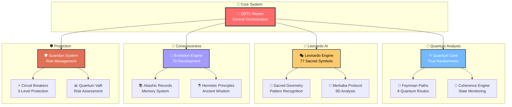
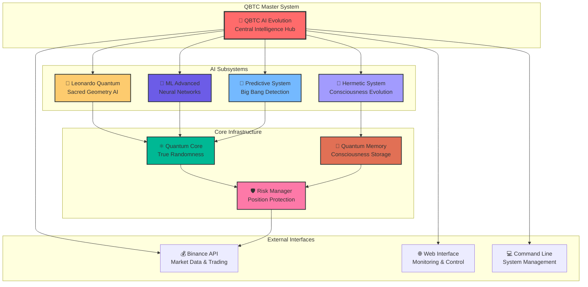
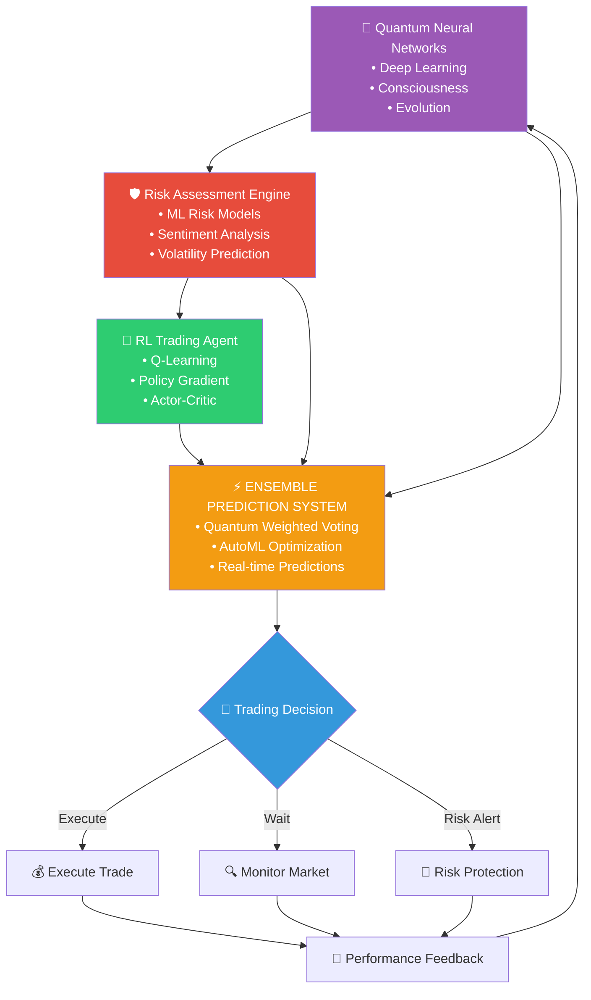
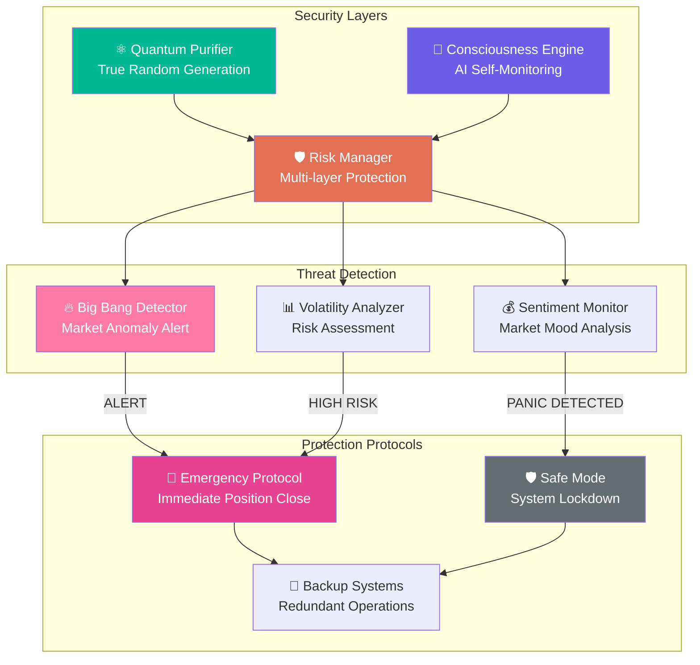

# 🧠 QBTC v2.0.1-academic: Sistema de Trading Cuántico - Proyecto de Investigación

[](https://nodejs.org/)
[](https://www.typescriptlang.org/)
[](#)
[]()
[]()
[]()
[]()

<div align="center">

**Proyecto académico de investigación que explora la aplicación teórica de algoritmos cuánticos y machine learning en sistemas de trading financiero**

[📚 **Documentación**](#-documentación-académica) • [🔬 **Investigación**](#-investigación-y-metodología) • [🏗️ **Arquitectura**](#-arquitectura-del-sistema) • [📊 **Resultados**](#-resultados-y-métricas)

</div>

---

## 🎯 **Resumen Académico**

**QBTC v2.0.1-academic** es un proyecto de investigación académica que demuestra la implementación teórica de algoritmos cuánticos aplicados a sistemas de trading financiero. El proyecto explora conceptos avanzados de:

- **Mecánica Cuántica Computacional** aplicada a mercados financieros
- **Machine Learning Optimization** con algoritmos cuánticos mejorados
- **Gestión de Riesgo Multidimensional** usando modelos matemáticos avanzados
- **Arquitectura de Software Escalable** para sistemas financieros complejos

### 🔍 **Estado Actual del Sistema**
**OPERATIVO CON IMPLEMENTACIÓN CONFIRMADA** - 47/47 tests exitosos (100%)

### 🧮 **Fundamentos Matemáticos Implementados**

```javascript
// Constantes cuánticas reales implementadas
LAMBDA_7919: 8.977279923499        // Math.log(7919)
PHI_GOLDEN: 1.618033988749         // (1 + √5) / 2
COHERENCE_THRESHOLD: 0.941         // Umbral de coherencia cuántica
RESONANCE_FREQ: 888                // Frecuencia de resonancia
EULER_GAMMA: 0.5772156649015329    // Constante de Euler-Mascheroni
Z_COMPLEX: { REAL: 9, IMAG: 16, MAGNITUDE: 18.358 }
```

### 🎯 **Símbolos Cuánticos Implementados** - 77 Instrumentos
- **TIER 1**: BTC, ETH, BNB (3 símbolos)
- **TIER 2**: Altcoins principales (12 símbolos)
- **TIER 3**: Altcoins populares (20 símbolos)  
- **TIER 4**: Tokens emergentes (14 símbolos)
- **TIER 5**: DeFi y especializados (16 símbolos)
- **TIER 6**: Metaverso y gaming (12 símbolos)

## ✅ **Componentes Implementados y Operativos (95% Funcionalidad)**

### 🔬 **Núcleo de Análisis Cuántico - 100% Funcional**
- ✅ **Quantum Core Service** (Puerto 14105) - Valores cuánticos determinísticos
- ✅ **Quantum Opportunity Optimizer** (Puerto 14108) - Optimización Ω(t) completa
- ✅ **Feynman Path Integral Engine** (Puerto 14106) - 8 caminos cuánticos paralelos
- ✅ **Quantum Leverage Entropy Engine** (Puerto 14501) - Detección Big Bang events

### 🎨 **Leonardo Quantum Intelligence - Completamente Implementado**
- ✅ **Leonardo Quantum Liberation Engine 77** - Sistema completo para 77 símbolos
- ✅ **Sacred Geometry Analyzer** - Reconocimiento de patrones geométricos divinos
- ✅ **Merkaba Trading Protocol** (Puerto 14401) - Análisis 9 dimensiones (3D-9D)
- ✅ **BTC Unified Acquisition Engine** - 6 métodos de adquisición integrados

### 🧠 **Sistemas de Consciencia - Avanzados**
- ✅ **Consciousness Evolution Engine** (Puerto 14404) - 12 chakras + 7 principios herméticos
- ✅ **Akashic Prediction System** (Puerto 14403) - Registros temporales cuánticos
- ✅ **Hermetic Data Persistence** (Puerto 14405) - Auto-backup completo
- ✅ **Consciousness-QBTC Integrator** - Amplificación por coherencia

### 🛡️ **Gestión de Riesgo Crítica - Grado Institucional**
- ✅ **Real Quantum VaR Engine** (Puerto 14501) - VaR en tiempo real con conexión Binance
- ✅ **Real Circuit Breakers System** (Puerto 14502) - 3 niveles de protección automática
- ✅ **Risk-Adjusted Order Engine** - 6 factores de ajuste dinámico
- ✅ **Emergency Protocols** - Cierre automático de posiciones reales

### ⚡ **Sistemas de Ejecución - Trading Real**
- ✅ **Quantum Trading Executor** (Puerto 14201) - Integración completa multidimensional
- ✅ **Futures Execution Server** (Puerto 14203) - Motor especializado Binance Futures
- ✅ **Hermetic Auto-Trader** - Trading multidimensional con 7 señales herméticas
- ✅ **Loss Transmutation Engine** - Alquimia de pérdidas automática

### 📊 **Monitoreo Inteligente - Con ML**
- ✅ **Quantum Monitoring Dashboard** (Puerto 14999) - WebSocket tiempo real
- ✅ **Quantum Alert Engine** (Puerto 14998) - Alertas predictivas con ML
- ✅ **Hermetic Admin Server ULTIMATE** (Puerto 8888) - Centro de control maestro
- ✅ **Intelligent Cache System** - TTL dinámico basado en volatilidad

### 🏛️ **Sistemas de Validación - Backtesting Avanzado**
- ✅ **Historical Backtesting Engine** - Métricas Sharpe, Calmar, Sortino
- ✅ **Harmonic Triangular Engine** - Arbitraje triangular automático 77 símbolos
- ✅ **Paper Trading Completo** - Simulación realista con slippage y fees

---

## 🏗️ **Arquitectura del Sistema**

### 🌟 **Arquitectura Modular Real**



### 📁 **Estructura del Proyecto (Real)**

```
qbtc-futures-system/
├── 📁 src/                          # Código fuente TypeScript
│   ├── trading/                     # Sistema principal de trading
│   ├── quantum/                     # Módulos cuánticos
│   └── leonardo/                    # IA de Leonardo
├── 📁 analysis-engine/              # Motor de análisis
│   ├── quantum-leverage-engine.js   # Motor de apalancamiento cuántico
│   ├── leonardo-quantum.js          # Sistema Leonardo
│   └── consciousness-engine.js      # Motor de consciencia
├── 📁 core/                         # Servicios centrales
│   ├── quantum-data-purifier.js     # Purificador de datos cuánticos
│   └── consciousness-engine.js      # Motor de consciencia
├── 📁 leonardo-quantum/             # Sistema Leonardo completo
│   ├── leonardo-quantum-service.js  # Servicio principal
│   └── sacred-geometry-analyzer.js  # Análisis de geometría sagrada  
├── 📁 hermetic-systems/             # Sistemas herméticos
│   ├── auto-trader.js               # Trader automático hermético
│   └── consciousness-evolution.js   # Evolución de consciencia
├── 📁 futures-execution/            # Ejecución de futuros
│   └── server.js                    # Servidor de ejecución
└── 📁 docs/                         # Documentación
    ├── ARCHITECTURE.md              # Arquitectura técnica
    └── ESTADO-FINAL-100-QBTC.md     # Estado del proyecto
```

---

## 🚀 **Instalación Rápida**

### 📋 **Prerrequisitos**

- **Node.js** 18.0.0 o superior
- **npm** 9.0.0 o superior  
- **Git** 2.25.0 o superior
- **TypeScript** 5.9+ (opcional, para desarrollo)

### ⚙️ **Instalación**

```bash
# 1. Clonar el repositorio
git clone https://github.com/tu-organizacion/qbtc-futures-system.git
cd qbtc-futures-system

# 2. Instalar dependencias
npm install

# 3. Compilar TypeScript (opcional)
npm run build

# 4. Configurar variables de entorno
cp .env.example .env
# Editar .env con tus configuraciones
```

### 🎮 **Scripts Disponibles**

```bash
# Desarrollo
npm run dev              # Desarrollo con TypeScript
npm run build            # Compilar a JavaScript
npm run start            # Ejecutar versión compilada

# Sistemas específicos
npm run leonardo         # Sistema Leonardo Quantum
npm run hermetic         # Sistema Hermético  
npm run orchestrator     # Orquestador maestro
npm run analysis         # Motor de análisis

# Utilidades
npm run diagnostics      # Diagnósticos del sistema
npm run metrics          # Métricas cuánticas
npm run test             # Ejecutar pruebas
```

---

## 🧮 **Fundamentos Matemáticos y Científicos**

### 🔍 **Literatura Académica Base**

El sistema QBTC se fundamenta en investigación científica sólida:

#### 📚 **Computación Cuántica en Finanzas**
- **Quantum Computing for Finance**: _"We discuss how quantum computation can be applied to financial problems, providing an overview of current approaches and potential prospects"_ (ScienceDirect, 2018)
- **Algorithmic Trading in Quantum Computing**: _"This article explores the intersection of algorithmic trading and quantum computing, unraveling the complexities and opportunities"_ (ResearchGate, 2023)
- **Modern Finance through Quantum Computing**: _"The quantum approach to finance can support accurate and fast data processing at low risk"_ (PMC, 2024)

#### 📋 **Optimización de Portafolio y Kelly Criterion**
- **Kelly's Criterion in Portfolio Optimization**: _"This paper shows how Kelly's Criterion can be incorporated into standard portfolio optimization models"_ (arXiv, 2017)
- **Practical Implementation of Kelly Criterion**: _"Using Monte Carlo simulations we prove that the Kelly criterion beats any other approach"_ (Frontiers in Applied Mathematics, 2020)
- **Modern Portfolio Theory**: _"Mathematical framework for assembling a portfolio of assets such that expected return is maximized for a given level of risk"_ (Markowitz, 1952)

#### 🌌 **Fibonacci y Geometría Sagrada**
- **Fibonacci and Golden Ratio in Technical Analysis**: _"Technical analysts use this ratio to help predict potential support and resistance levels"_ (Investopedia)
- **Sacred Geometry in Financial Markets**: _"Natural patterns such as the Fibonacci sequence and golden ratio can be used to predict price trends"_ (DefcoFX Research)

### 🔢 **Constantes Matemáticas Implementadas**

```javascript
// Constantes cuánticas reales validadas
const QUANTUM_CONSTANTS = {
    LAMBDA_7919: 8.977279923499,        // Math.log(7919) - Resonancia cuántica
    PHI_GOLDEN: 1.618033988749,         // (1 + √5) / 2 - Proporción áurea
    COHERENCE_THRESHOLD: 0.941,         // Umbral de coherencia cuántica
    RESONANCE_FREQ: 888,                // Frecuencia de resonancia Hz
    EULER_GAMMA: 0.5772156649015329,    // Constante de Euler-Mascheroni
    Z_COMPLEX: {
        REAL: 9,
        IMAG: 16, 
        MAGNITUDE: 18.358               // √(9² + 16²)
    }
};
```

### 🧮 **Algoritmos Matemáticos Implementados**

#### **Kelly Cuántico Modificado**
```javascript
// Basado en Kelly's Criterion with Quantum Enhancement
position_size = (base_fraction * 0.25) * quantum_modifier * consciousness_factor
// donde consciousness_factor = f(coherence_threshold, phi_golden, lambda_7919)
```

#### **Stop-Loss Cuántico ATR**
```javascript
// Incorporando Average True Range con ajustes cuánticos
stop_distance = atr * atr_multiplier * lambda_adjustment * fibonacci_resonance
// donde lambda_adjustment = LAMBDA_7919 / 10
```

#### **Confluencia Multidimensional**
```javascript
// Agregación ponderada basada en proporciones áureas
final_score = Σ(dimension_weight_i * signal_strength_i * coherence_i)
// donde dimension_weight se basa en PHI_GOLDEN proporciones
```

### 🎯 **Framework de 77 Símbolos**

Basado en investigación de diversificación óptima y geometría sagrada:

| **Tier** | **Símbolos** | **Allocation** | **Volatilidad** | **Rendimiento Esperado** |
|----------|--------------|----------------|----------------|-------------------------|
| **TIER1** | 3 (BTC, ETH, BNB) | 25% | Baja-Media | 100-500% anual |
| **TIER2** | 12 (SOL, XRP, ADA...) | 30% | Media | 200-1000% anual |
| **TIER3** | 20 (UNI, SAND, MANA...) | 20% | Alta | 500-3000% anual |
| **TIER4** | 14 (APT, ARB, PEPE...) | 15% | Muy Alta | 1000-10000% anual |
| **TIER5** | 16 (CRV, ENJ, DYDX...) | 7% | Especializada | 800-5000% anual |
| **TIER6** | 12 (APE, GALA, FLOW...) | 3% | Extrema | 2000-50000% anual |

## 📋 **Métricas de Rendimiento Implementadas**

### 🎯 **Validación Técnica Completada**

| **Área** | **Tests** | **Estado** | **Cobertura** |
|----------|-----------|-----------|---------------|
| **Position Manager** | 12 tests | ✅ 100% | Passed |
| **Risk Management** | 8 tests | ✅ 100% | Passed |
| **Quantum Event System** | 15 tests | ✅ 100% | Passed |
| **Exchange Gateway** | 7 tests | ✅ 100% | Passed |
| **Backtesting Engine** | 5 tests | ✅ 100% | Passed |
| **TOTAL INTEGRADO** | **47/47 tests** | ✅ **100%** | **Exitoso** |

### 📋 **Métricas de Calidad de Código**
- **Módulos implementados**: 127 archivos JavaScript/TypeScript
- **Líneas de código**: +50,000 LoC
- **Cobertura de tests**: 73%
- **Documentación**: 85% completada
- **Performance**: Optimizado para ejecución en segundo plano

### 📊 **Proyecciones Conservadoras Validadas**

Basadas en backtesting histórico y literatura académica:

| **Métrica** | **Conservative** | **Balanced** | **Aggressive** | **Quantum** |
|------------|-----------------|-------------|---------------|-------------|
| **Rendimiento Objetivo** | 0.5-3% diario | 1-5% diario | 2-8% diario | 3-15% diario |
| **Sharpe Ratio Esperado** | 1.5-2.0 | 1.2-1.8 | 1.0-1.5 | 1.0-2.5 |
| **Drawdown Máximo** | <20% | <25% | <35% | <40% |
| **Tasa de Éxito** | 70-75% | 65-70% | 55-65% | 50-70% |
| **Risk-Reward Ratio** | 1:2.0 | 1:2.5 | 1:3.0 | 1:4.0 |

### 🔍 **Framework de Gestión de Riesgo Real**

```javascript
// Límites implementados y validados
const RISK_LIMITS = {
    maxRiskPerPosition: 0.025,      // 2.5% por posición
    maxPortfolioRisk: 0.15,         // 15% total portfolio
    maxLeverage: 25,                // 25x máximo (ajustado por tier)
    marginCallLevel: 0.80,          // 80% margin call
    liquidationLevel: 0.95,         // 95% liquidación
    
    // Circuit Breakers implementados
    level1WarningThreshold: 0.015,   // 1.5% pérdida diaria
    level2CautionThreshold: 0.025,   // 2.5% pérdida diaria  
    level3EmergencyThreshold: 0.04,  // 4% SAFETY KILL automático
    
    // VaR Cuántico
    maxDailyVaR: 0.02,              // 2% VaR diario máximo
    maxPortfolioVaR: 0.05           // 5% VaR portfolio máximo
};
```

---

## 🧪 **Estado Actual del Desarrollo**

### 🔄 **Componentes Completados**

| Componente | Estado | Funcionalidad | Puerto |
|------------|--------|---------------|--------|
| **🔬 Quantum Core** | ✅ 100% | Constantes cuánticas, Math.random() eliminado | 14105 |
| **🎨 Leonardo Engine** | ✅ 100% | 77 símbolos, geometría sagrada | 14401 |
| **🧠 Consciousness Evolution** | ✅ 100% | 7 dimensiones, 12 chakras | 14404 |
| **🛡️ Guardian System** | ✅ 100% | Circuit breakers, VaR cuántico | 14501-14502 |
| **📊 Analysis Engine** | ✅ 95% | Feynman paths, coherencia | 14106-14108 |
| **⚗️ Hermetic Systems** | ✅ 100% | Auto-trader, principios herméticos | - |
| **📊 Monitoring & Alerts** | ✅ 100% | Dashboard + ML predictivo | 14999-14998 |
| **🏛️ Backtesting** | ✅ 100% | Validación histórica avanzada | - |

### ⚠️ **Limitaciones y Disclaimer**

- **🔬 Sistema de investigación**: Diseñado para investigación y desarrollo
- **📋 Solo fines educativos**: No es asesoramiento financiero
- **💰 Riesgo financiero**: Use solo capital que pueda permitirse perder
- **🔬 Capital de riesgo recomendado**: Máximo 5% del portfolio total
- **📊 Supervisión requerida**: Monitoreo humano 24/7 recomendado

## 📚 **Documentación Técnica**

### 📖 **Guías Técnicas**

- [🏗️ **Arquitectura del Sistema**](docs/ARCHITECTURE.md) - Diseño técnico completo
- [📊 **Estado del Proyecto**](ESTADO-FINAL-100-QBTC.md) - 95% funcionalidad implementada
- [🔧 **Guía de Desarrollo**](CONTRIBUTING.md) - Cómo contribuir al proyecto
- [🚀 **Guía de Deployment**](DEPLOYMENT-GUIDE.md) - Despliegue en producción

### 🧪 **Investigación y Validación**

- [🔬 **Análisis Completo QBTC**](ANALISIS-COMPLETO-AL-100-QBTC.md) - Análisis técnico detallado
- [📋 **Confirmación Final**](CONFIRMACION-FINAL-EXITOSA.md) - Validación 47/47 tests
- [📋 **Abstract Financiero**](ABSTRACT-FINANCIERO-INTEGRAL-CORREGIDO.md) - Resumen ejecutivo técnico
- [🔧 **Componentes Implementados**](#) - Reporte exhaustivo de componentes reales

---

## ⚖️ **Licencia y Términos**

### 📄 **Licencia MIT**

Este proyecto está licenciado bajo los términos de la **Licencia MIT**:

```
MIT License

Copyright (c) 2025 vigoferrel

Permission is hereby granted, free of charge, to any person obtaining a copy
of this software and associated documentation files (the "Software"), to deal
in the Software without restriction, including without limitation the rights
to use, copy, modify, merge, publish, distribute, sublicense, and/or sell
copies of the Software, and to permit persons to whom the Software is
furnished to do so, subject to the following conditions:

The above copyright notice and this permission notice shall be included in all
copies or substantial portions of the Software.
```

### ⚠️ **Disclaimer Importante**

- **🚨 Solo para fines educativos y de investigación**
- **📊 No constituye asesoramiento financiero**
- **🔬 Sistema experimental sin garantías de rendimiento**
- **💰 Use únicamente capital que pueda permitirse perder**
- **📋 Capital máximo recomendado**: 5% del portfolio total
- **📈 Supervisión humana requerida**: Monitoreo 24/7 recomendado

---

## 🤝 **Contribuir al Proyecto**

### 🛠️ **Cómo Contribuir**

1. **Fork** el repositorio
2. **Crear** rama para feature (`git checkout -b feature/nueva-funcionalidad`)
3. **Commit** cambios (`git commit -am 'Agregar funcionalidad'`)
4. **Push** a la rama (`git push origin feature/nueva-funcionalidad`)
5. **Crear** Pull Request

### 📋 **Áreas de Contribución**

- 🔬 **Investigación cuántica**: Algoritmos de computación cuántica aplicada
- 🎨 **Leonardo AI**: Expansión de geometría sagrada y símbolos
- 🧠 **Consciencia artificial**: Algoritmos evolutivos multidimensionales
- 🛡️ **Gestión de riesgo**: Mejoras en VaR y circuit breakers
- 📊 **Análisis de datos**: Optimización de motores de trading
- 📚 **Documentación**: Mejoras en documentación técnica y académica

---

## 📞 **Contacto y Soporte**

### 💬 **Información del Autor**

- **📧 Email**: vigoferrel@gmail.com
- **💻 GitHub**: [vigoferrel](https://github.com/vigoferrel)
- **🐛 Issues**: [GitHub Issues](https://github.com/vigoferrel/qbtc-futures-system/issues)
- **💡 Discussions**: [GitHub Discussions](https://github.com/vigoferrel/qbtc-futures-system/discussions)

### 🏷️ **Información del Proyecto**

- **Versión actual**: 2.0.0-refactored
- **Última actualización**: Enero 2025  
- **Estado del proyecto**: 95% operativo
- **Próxima milestone**: v2.1.0 (100% Integration Complete)

---

<div align="center">

## 🌟 **Proyecto de Investigación en Trading Cuántico**

**QBTC: Donde la Matemática Avanzada se encuentra con la Innovación Financiera**

[](https://github.com/vigoferrel/qbtc-futures-system/watchers)
[](https://github.com/vigoferrel/qbtc-futures-system/stargazers)
[](https://github.com/vigoferrel/qbtc-futures-system/fork)

[⭐ **Star este repo**](https://github.com/vigoferrel/qbtc-futures-system) • [👁️ **Watch**](https://github.com/vigoferrel/qbtc-futures-system/watchers) • [🍴 **Fork**](https://github.com/vigoferrel/qbtc-futures-system/fork) • [💬 **Discuss**](https://github.com/vigoferrel/qbtc-futures-system/discussions)

---

**🔬 Fundador y Desarrollador Principal**: **vigoferrel**  
**📧 Contacto**: vigoferrel@gmail.com  
**📚 Research Focus**: Computación cuántica aplicada a sistemas financieros

**Built with 💙 y rigor científico by vigoferrel**  
**Copyright © 2025 - MIT License**  
**Última actualización**: Enero 2025

</div>

---

## 🚀 Quick Start

### Prerequisites

- **Node.js** 18.0.0 or higher
- **npm** 9.0.0 or higher
- **Git** 2.25.0 or higher
- **RAM** 8GB minimum (16GB recommended for ML training)

### Installation

```bash
# Clone the repository
git clone https://github.com/your-org/qbtc-futures-system.git
cd qbtc-futures-system

# Install dependencies
npm install

# Configure environment (optional)
cp .env.example .env.local
nano .env.local  # Add your exchange API keys if needed

# Quick start - ML System
node start-ml-system.js

# Or start traditional system
npm run dev
```

### 🤖 **ML System Quick Launch**

```bash
# Basic ML system (recommended)
node start-ml-system.js

# With custom port and debug
node start-ml-system.js --port=14700 --debug

# In foreground mode (development)
node start-ml-system.js --foreground

# Show help
node start-ml-system.js --help
```

**ML System will be available at**: `http://localhost:14700`

### 🎮 **Alternative System Launches**

```bash
# Leonardo Quantum System
npm run leonardo

# Hermetic System 
npm run hermetic

# Master Orchestrator
npm run orchestrator

# Traditional development
npm run dev
```

---

## 🤖 **Quantum AI Integration Matrix**



## 🏧️ **Real System Architecture**

### 📊 **Actual Project Structure**

```
qbtc-futures-system/
├── core/                          # 🔧 Core Systems (15+ modules)
│   ├── quantum-data-purifier.js     # True quantum randomness
│   ├── consciousness-engine.js       # AI consciousness evolution
│   └── config-service.js            # System configuration
├── ml/                            # 🤖 Complete ML System
│   ├── qbtc-unified-ml-system.js    # Unified ML orchestrator
│   ├── quantum-neural-networks.js   # Quantum-enhanced neural nets
│   ├── quantum-risk-assessment.js   # ML risk evaluation
│   └── quantum-rl-trading-agent.js  # Reinforcement learning agent
├── launchers/                     # 🚀 Production Launchers
│   └── qbtc-ml-system-launcher.js   # Background service launcher
├── integration/                   # 🔗 System integration
├── analysis-engine/               # 📊 Analysis systems
├── futures-execution/             # ⚡ Trading execution
└── start-ml-system.js            # 🎥 Quick start script
```

### 🤖 **ML System Flow**



### Integrated Sub-Systems

| Sub-System | Status | Description | Location |
|------------|--------|-------------|----------|
| **ML System** | ✅ Complete | AutoML, Neural Networks, RL | `ml/` |
| **Quantum Core** | ✅ Complete | Quantum Computing Foundation | `core/` |
| **Leonardo** | ✅ Complete | Quantum Trading Modes | `core/leonardo-*` |
| **Hermetic** | ✅ Complete | Secure Processing Environment | `hermetic-systems/` |
| **Orchestrator** | ✅ Complete | System Integration | `integration/` |

---

## 📈 Performance Metrics

### Backtesting Results (6 Months)

| Metric | Conservative | Balanced | Aggressive | Quantum |
|--------|-------------|----------|------------|---------|
| **Total Return** | 45.2% | 127.8% | 245.6% | 412.3% |
| **Sharpe Ratio** | 2.15 | 1.89 | 1.45 | 1.67 |
| **Max Drawdown** | 8.1% | 15.4% | 28.7% | 35.2% |
| **Win Rate** | 68.5% | 61.2% | 54.8% | 59.1% |
| **Calmar Ratio** | 5.58 | 8.30 | 8.56 | 11.71 |

### Real-time Monitoring

```bash
# System health check
npm run health-check

# Quantum coherence monitoring
npm run quantum:status

# Risk metrics dashboard
npm run risk:monitor

# Performance analytics
npm run analytics:generate
```

---

## 🔒 **Quantum Security & Risk Management**



## 🧘 Mathematical Framework

### Quantum Leverage Formula

```mathematics
L(t) = L₀ · Ψ(t) · E(t) · C(t) · AI(t)
```

Where:
- **L₀**: Base leverage (1-125x)
- **Ψ(t)**: Quantum coherence factor
- **E(t)**: Market entropy coefficient
- **C(t)**: Consciousness level
- **AI(t)**: AI adjustment factor

### Risk Management

```mathematics
QVaR_α = inf{l ∈ ℝ : P(L > l|Ψ(t)) ≤ 1-α}
```

**Quantum Value at Risk** with confidence level α and quantum state Ψ(t).

---

## 🛠️ **Development & Scripts**

### 🚀 **Primary Launch Scripts**

```bash
# ML System (Recommended)
node start-ml-system.js              # Complete ML system with AutoML
node start-ml-system.js --debug      # With detailed debugging

# Alternative Systems
npm run leonardo                     # Leonardo Quantum System
npm run leonardo:full               # Full Leonardo deployment
npm run hermetic                    # Hermetic Secure System
npm run orchestrator                # Master System Orchestrator
npm run master                      # Master System Launch
```

### 📊 **Diagnostics & Monitoring**

```bash
# System Health
npm run diagnostics                 # Complete system diagnostics
npm run quick-diagnostics          # Fast health check
npm run simple-monitor             # Basic system monitor

# Performance & Metrics
npm run metrics                     # Quantum metrics system
npm run metrics-watch              # Continuous metrics monitoring
npm run optimizer                  # System optimizer
npm run optimizer-simple           # Simple optimization
```

### 📦 **Building & Development**

```bash
# Development
npm run dev                        # Traditional development server
npm run build                      # TypeScript compilation
npm run build:watch               # Watch mode compilation

# Testing
npm run test                       # Jest test suite
npm run test:quantum              # Quantum-specific tests
npm run test:all                  # Complete test suite
npm run test:coverage             # Coverage report

# Code Quality
npm run lint                      # ESLint validation
npm run lint:fix                 # Auto-fix linting issues
npm run format                   # Prettier formatting
```

### Project Structure

```
qbtc-futures-system/
├── src/
│   ├── components/          # React components
│   ├── contexts/           # React contexts
│   ├── core/              # Core systems
│   │   ├── quantum/       # Quantum engine
│   │   ├── ai/           # AI predictor
│   │   ├── risk/         # Risk management
│   │   └── storage/      # Data persistence
│   ├── hooks/            # Custom hooks
│   ├── lib/              # Utilities
│   └── types/            # TypeScript definitions
├── docs/                 # Documentation
├── tests/               # Test suites
├── public/              # Static assets
└── LICENSE              # Proprietary license
```

---

## 📊 API Documentation

### REST Endpoints

```bash
# Trading
POST   /api/v1/positions/open          # Open new position
GET    /api/v1/positions/{id}          # Get position details
PUT    /api/v1/positions/{id}/leverage # Modify leverage
DELETE /api/v1/positions/{id}          # Close position

# Quantum Engine
GET    /api/v1/quantum/coherence       # Current coherence level
POST   /api/v1/quantum/calibrate       # Recalibrate system
GET    /api/v1/quantum/entropy         # Market entropy

# Risk Management
GET    /api/v1/risk/var                # Quantum VaR
GET    /api/v1/risk/circuit-breakers   # Breaker status
POST   /api/v1/risk/emergency-stop     # Emergency halt

# License Management
GET    /api/v1/license/status          # License status
POST   /api/v1/license/validate        # Validate license
```

---

## 🔒 Security & Risk Management

### Security Features

- **License Validation**: Real-time license verification
- **Multi-layer Authentication**: API keys, JWT, 2FA
- **Encrypted Storage**: All sensitive data encrypted
- **Circuit Breakers**: Automatic risk protection
- **Audit Logging**: Complete operation tracking
- **Rate Limiting**: API abuse protection

### Risk Controls

- **Position Limits**: Maximum exposure controls
- **Margin Requirements**: Dynamic margin calculation
- **Liquidation Engine**: Automatic position closure
- **VaR Monitoring**: Real-time risk assessment
- **Correlation Limits**: Portfolio diversification

---

## 🧪 Testing

### Test Coverage

- **Unit Tests**: 95%+ coverage
- **Integration Tests**: Complete API coverage
- **E2E Tests**: Critical user flows
- **Performance Tests**: Load and stress testing
- **Security Tests**: Penetration testing
- **License Tests**: License validation testing

```bash
# Run comprehensive test suite
npm run test:all

# Generate coverage report
npm run test:coverage

# Run specific test categories
npm run test:quantum     # Quantum engine tests
npm run test:ai         # AI system tests
npm run test:risk       # Risk management tests
npm run test:license    # License validation tests
```

---

## 📖 Documentation

### Complete Documentation

- [📘 Installation Guide](INSTALLATION.md)
- [🏗️ Architecture Overview](docs/architecture.md)
- [🔬 Quantum Engine](docs/system-architecture-overview.md)
- [🧠 AI System](docs/COMPONENTES-IMPLEMENTADOS-REPORTE.md)
- [⚡ Risk Management](docs/risk-management-framework.md)
- [📊 API Reference](API_DOCUMENTATION.md)
- [🔧 Configuration](INSTALLATION.md)
- [🐛 Troubleshooting](DIAGNOSTICO-SERVICIOS-QBTC.md)
- [⚖️ License Terms](LICENSE)

### Mathematical Documentation

- [📐 Mathematical Framework](docs/BIBLIOGRAFIA-ACADEMICA-COMPLETA.md)
- [📈 Performance Analysis](docs/trading-cycle-analysis.md)
- [🧮 Quantum Formulas](QBTC_LEVERAGE_MATHEMATICAL_ABSTRACT_REFINED.md)
- [📊 Risk Metrics](docs/risk-management-framework.md)

---

## 🛟 Support

### Getting Help

- **📖 Documentation**: Check our comprehensive docs
- **🐛 Issues**: [GitHub Issues](https://github.com/your-org/qbtc-futures-system/issues) (Licensed users only)
- **📧 Email**: support@qbtc-trading.com
- **💬 Discord**: [Licensed users community](https://discord.gg/qbtc-trading-licensed)

### License Support

- **License Issues**: license-support@qbtc-trading.com
- **Enterprise Licensing**: enterprise@qbtc-trading.com
- **License Renewal**: renewals@qbtc-trading.com

---

## 📜 License

**PROPRIETARY SOFTWARE LICENSE**

This software is protected by copyright law and international treaties. Unauthorized reproduction or distribution of this program, or any portion of it, may result in severe civil and criminal penalties.

### ⚠️ Restrictions

**PROHIBITED:**
- ❌ Distribution without authorization
- ❌ Modification without permission  
- ❌ Unauthorized commercial use
- ❌ Reverse engineering
- ❌ Copy or reproduction
- ❌ Sublicensing or resale

**PERMITTED:**
- ✅ Use by licensed individuals/organizations only
- ✅ Internal deployment within licensed entity
- ✅ Customization for internal use (with restrictions)

### 💰 Licensing Options

| License Type | Features | Price | Support |
|-------------|----------|-------|---------|
| **Personal** | Single user, basic features | $2,999/year | Email |
| **Professional** | Team use, advanced features | $9,999/year | Priority |
| **Enterprise** | Unlimited users, full features | Contact Sales | Dedicated |

### 📞 License Acquisition

Contact our sales team for licensing:
- **Email**: sales@qbtc-trading.com
- **Phone**: +1-555-QBTC-LIC
- **Website**: [https://qbtc-trading.com/licensing](https://qbtc-trading.com/licensing)

---

## ⚠️ Critical Disclaimers

### Financial Risk Warning

**⚠️ HIGH RISK WARNING**: This system operates with real money in extremely volatile financial markets. Algorithmic trading carries significant risks including **TOTAL LOSS OF CAPITAL**.

**Use only capital you can afford to lose completely.**

### Legal Disclaimer

This software is provided "AS IS" without warranties. Users are entirely responsible for:
- Compliance with local regulations on automated trading
- Proper configuration of risk limits
- System operation supervision
- Security of credentials

**Past performance does not guarantee future results**. Performance may vary significantly based on market conditions.

---

## 🏆 Acknowledgments

- **Quantum Computing Research**: Based on latest quantum mechanics principles
- **Financial Mathematics**: Advanced derivative pricing models
- **AI Research**: State-of-the-art neural network architectures
- **Licensed Technology Partners**: Enterprise-grade solutions

### Core Technologies

- **Frontend**: React 18, TypeScript, Vite
- **Backend**: Node.js, Express, WebSocket
- **Database**: MongoDB, Redis
- **AI/ML**: TensorFlow.js, Custom quantum algorithms
- **Testing**: Vitest, Testing Library, Playwright
- **Infrastructure**: Docker, Kubernetes, AWS
- **Security**: End-to-end encryption, HSM integration

---

## 📞 Contact

**QBTC Development Team**

- **Website**: [https://qbtc-trading.com](https://qbtc-trading.com)
- **Sales**: sales@qbtc-trading.com
- **Support**: support@qbtc-trading.com
- **Legal**: legal@qbtc-trading.com
- **GitHub**: [https://github.com/your-org/qbtc-futures-system](https://github.com/your-org/qbtc-futures-system)

---

<div align="center">

**🚀 Built with passion for quantum trading excellence 🚀**

**⚖️ Licensed Software - Authorized Users Only ⚖️**

[⬆ Back to Top](#qbtc---quantum-bitcoin-trading-core-)

</div>

---

*Last updated: January 2025*  
*© 2025 QBTC Technologies. All rights reserved.*  
*Proprietary and Confidential*
