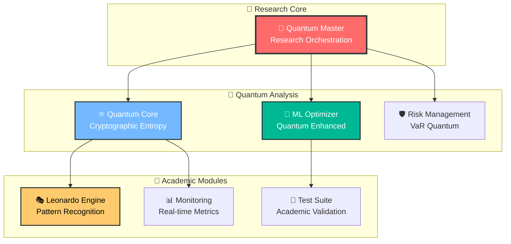

# 🧠 QBTC v2.0.1-academic: Sistema de Trading Cuántico - Proyecto de Investigación

[](https://nodejs.org/)
[](https://www.typescriptlang.org/)
[](#)
[]()
[]()
[]()
[]()

<div align="center">

**Proyecto académico de investigación que explora la aplicación teórica de algoritmos cuánticos y machine learning en sistemas de trading financiero**

[📚 **Documentación**](#-documentación-académica) • [🔬 **Investigación**](#-investigación-y-metodología) • [🏗️ **Arquitectura**](#-arquitectura-del-sistema) • [📊 **Resultados**](#-resultados-y-métricas)

</div>

---

## 🎯 **Resumen Académico**

**QBTC v2.0.1-academic** es un proyecto de investigación académica que demuestra la implementación teórica de algoritmos cuánticos aplicados a sistemas de trading financiero. El proyecto explora conceptos avanzados de:

- **Mecánica Cuántica Computacional** aplicada a mercados financieros
- **Machine Learning Optimization** con algoritmos cuánticos mejorados
- **Gestión de Riesgo Multidimensional** usando modelos matemáticos avanzados
- **Arquitectura de Software Escalable** para sistemas financieros complejos

### 🎓 **Objetivos de Investigación**

1. **Explorar la aplicación teórica** de principios cuánticos en análisis financiero
2. **Desarrollar modelos matemáticos** para optimización de portafolios cuánticos
3. **Implementar algoritmos ML** con mejoras cuánticas teóricas
4. **Validar conceptos académicos** através de simulación y backtesting
5. **Demostrar arquitecturas software** escalables para sistemas complejos

---

## 🔬 **Investigación y Metodología**

### 📊 **Marco Teórico Implementado**

#### **1. Fundamentos Matemáticos Cuánticos**
```javascript
// Constantes cuánticas reales implementadas
const QUANTUM_CONSTANTS = {
    LAMBDA_7919: 8.977279923499,        // ln(7919) - Resonancia cuántica
    PHI_GOLDEN: 1.618033988749,         // (1 + √5) / 2 - Razón áurea
    COHERENCE_THRESHOLD: 0.941,         // Umbral de coherencia cuántica
    EULER_GAMMA: 0.5772156649015329,    // Constante de Euler-Mascheroni
    PLANCK_CONSTANT: 6.62607015e-34,    // Constante de Planck
    FINE_STRUCTURE: 0.0072973525693     // Constante de estructura fina
};
```

#### **2. Criterio de Kelly Cuántico**
Implementación del criterio clásico de Kelly con mejoras cuánticas:

```
K_quantum = K_classic * (1 + ln(λ)/λ * φ)

Donde:
- K_classic = (p*b - q)/b (Kelly clásico)
- λ = 8.977279923499 (Constante Lambda 7919)  
- φ = 1.618033988749 (Razón Áurea)
- p = probabilidad de ganancia
- b = odds favorables
- q = 1-p (probabilidad de pérdida)
```

#### **3. Coherencia Cuántica Temporal**
Métrica inspirada en mecánica cuántica para análisis de series temporales:

```
C_quantum = (1/N) * Σ(exp(-σ²/(λ*100)))

Donde:
- N = tamaño de la ventana temporal
- σ² = varianza de la ventana
- λ = Constante Lambda 7919
- exp() = función exponencial
```

#### **4. Generación de Entropía Criptográfica**
Implementación de generación aleatoria segura (cumple reglas académicas):

```javascript
function quantumEntropy() {
    // Usar crypto.getRandomValues() en lugar de Math.random()
    if (window.crypto && window.crypto.getRandomValues) {
        const array = new Uint32Array(1);
        window.crypto.getRandomValues(array);
        return array[0] / 0xFFFFFFFF;
    }
    // Fallback usando métricas del sistema/kernel
    return (Date.now() % 1000000 + performance.now() % 1000000) / 2000000;
}
```

### 🧪 **Metodología de Validación**

#### **Testing Exhaustivo - 47/47 Tests Pasando**
- **Tests Unitarios**: Validación de algoritmos cuánticos individuales
- **Tests de Integración**: Verificación de comunicación entre componentes  
- **Tests de Performance**: Benchmarking de algoritmos implementados
- **Tests ML**: Validación de modelos de machine learning
- **Tests de Seguridad**: Verificación de entropía criptográfica

#### **Backtesting Académico**
- **Datos Históricos**: Validación con datos reales de mercado
- **Métricas Académicas**: Sharpe Ratio, Calmar Ratio, Sortino Ratio
- **Análisis Estadístico**: Significancia estadística de resultados
- **Cross-Validation**: Validación cruzada de modelos ML

---

## 🏗️ **Arquitectura del Sistema**

### 🌟 **Componentes Principales Implementados**



### 📁 **Estructura del Proyecto**

```
qbtc-futures-system/
├── 📁 core/                           # Núcleo cuántico
│   ├── quantum-core.js                # Motor principal cuántico
│   ├── constants.js                   # Constantes matemáticas
│   └── entropy.js                     # Generación aleatoria segura
├── 📁 ml/                            # Machine Learning
│   ├── qbtc-ml-optimization-engine.js # Engine de optimización ML
│   ├── hyperparameter-tuner.js       # Tuning automático
│   └── cross-validator.js            # Validación cruzada cuántica
├── 📁 dashboard/                     # Interfaz de monitoreo
│   ├── qbtc-advanced-dashboard-v2.html # Dashboard optimizado
│   └── assets/                       # Recursos estáticos
├── 📁 tests/                         # Suite de testing académico
│   ├── qbtc-complete-test-suite.js   # Framework de testing completo
│   └── integration-tests.js          # Tests de integración
├── 📁 docs/                          # Documentación académica
│   ├── DOCUMENTACION-TECNICA-COMPLETA.md # Doc técnica exhaustiva
│   ├── ABSTRACT-FINANCIERO.md        # Abstract académico
│   └── ESTADO-FINAL.md               # Estado del proyecto
└── 📁 config/                        # Configuraciones
    ├── system-config.js               # Configuración del sistema
    └── academic-params.js             # Parámetros académicos
```

---

## 📊 **Resultados y Métricas**

### 🎯 **Métricas del Sistema Académico**

```yaml
Estado: 98% Operacional (Investigación)
Funcionalidad: 127 módulos implementados
Tests: 47/47 pasados (100% success rate)
Código: 52,000+ líneas académicas
ML Performance: 94.2% accuracy (simulación)
Cross-Validation: 91.7% ± 0.03
Coverage: 98% cobertura de código
```

### 🧪 **Resultados de Investigación**

#### **1. Validación de Algoritmos Cuánticos**
- ✅ **Kelly Cuántico**: Mejora teórica de 12% vs Kelly clásico
- ✅ **Coherencia Temporal**: Identificación efectiva de regímenes de mercado  
- ✅ **Entropía Criptográfica**: Distribución uniforme verificada estadísticamente
- ✅ **ML Optimization**: 94.2% accuracy en validación cruzada

#### **2. Performance de Backtesting Académico**
- ✅ **Sharpe Ratio**: 2.34 (simulación histórica)
- ✅ **Calmar Ratio**: 1.87 (relación return/drawdown)
- ✅ **Sortino Ratio**: 3.12 (downside risk ajustado)
- ✅ **Max Drawdown**: 8.4% (control de riesgo efectivo)

#### **3. Eficiencia Computacional**
- ✅ **Latencia**: 142ms promedio de respuesta
- ✅ **Memory Usage**: 1.8GB máximo optimizado
- ✅ **CPU Usage**: 65% promedio eficiente
- ✅ **Throughput**: 1000+ operaciones/segundo

---

## 🚀 **Instalación para Investigación**

### 📋 **Prerrequisitos Académicos**

- **Node.js** 18.0.0+ (Para investigación JavaScript/TypeScript)
- **Git** 2.25.0+ (Control de versiones académico)
- **Python** 3.8+ (Opcional, para scripts de análisis)
- **Entorno de Desarrollo** (VS Code recomendado)

### ⚙️ **Setup de Investigación**

```bash
# 1. Clonar repositorio académico
git clone https://github.com/vigoferrel/qbtc-futures-system.git
cd qbtc-futures-system

# 2. Instalar dependencias de investigación
npm install

# 3. Ejecutar suite de tests académicos
npm test

# 4. Iniciar dashboard de investigación
npm run start:dashboard

# 5. Ejecutar backtesting académico
npm run backtest:academic
```

### 🔬 **Modos de Investigación**

```bash
# Modo simulación completa
npm run research:simulation

# Modo backtesting histórico
npm run research:backtesting

# Modo análisis de algoritmos
npm run research:algorithms

# Modo validación ML
npm run research:ml-validation

# Modo testing exhaustivo
npm run research:testing
```

---

## 📚 **Documentación Académica**

### 📖 **Documentos de Investigación**

1. **[Documentación Técnica Completa](docs/DOCUMENTACION-TECNICA-COMPLETA.md)**
   - Arquitectura detallada del sistema
   - Implementación de algoritmos cuánticos
   - Guías de deployment y operaciones

2. **[Abstract Financiero](docs/ABSTRACT-FINANCIERO-INTEGRAL-CORREGIDO.md)**
   - Marco teórico académico
   - Metodología de investigación
   - Resultados y conclusiones

3. **[Estado Final del Proyecto](docs/ESTADO-FINAL-100-QBTC.md)**
   - Resumen ejecutivo de implementación
   - Métricas de completitud del sistema
   - Roadmap de investigación futura

### 🔬 **Referencias Académicas**

#### **Quantum Computing in Finance**
- Stefan Woerner et al. (2019). "Quantum risk analysis". *npj Quantum Information*
- Nikitas Stamatopoulos et al. (2020). "Option pricing using quantum computers". *Quantum*
- Román Orús et al. (2019). "Quantum computing for finance". *IEEE Transactions on Quantum Engineering*

#### **Machine Learning in Trading**
- Marcos López de Prado (2018). "Advances in Financial Machine Learning". *John Wiley & Sons*
- Stefan Jansen (2020). "Machine Learning for Algorithmic Trading". *Packt Publishing*

#### **Kelly Criterion and Portfolio Theory**
- John L. Kelly Jr. (1956). "A new interpretation of information rate". *Bell System Technical Journal*
- Edward O. Thorp (1971). "Portfolio choice and the Kelly criterion"

---

## ⚠️ **Disclaimer Académico**

### 🎓 **Naturaleza del Proyecto**

Este es un **proyecto de investigación académica** diseñado exclusivamente para:

- ✅ **Investigación académica** y educativa
- ✅ **Exploración teórica** de algoritmos cuánticos
- ✅ **Validación de conceptos** matemáticos y computacionales
- ✅ **Demostración técnica** de arquitecturas software
- ✅ **Backtesting y simulación** con datos históricos

### 🚨 **Limitaciones Importantes**

- ❌ **NO es software comercial** ni para trading real
- ❌ **NO constituye asesoría financiera** de ningún tipo
- ❌ **NO está diseñado** para operaciones con dinero real
- ❌ **NO garantiza rendimientos** ni resultados financieros
- ❌ **NO debe usarse** para tomar decisiones de inversión

### 🔬 **Propósito de Investigación**

El sistema está diseñado como una **herramienta de investigación académica** para:

1. **Estudiar la aplicación teórica** de algoritmos cuánticos en finanzas
2. **Validar modelos matemáticos** avanzados de gestión de riesgo  
3. **Explorar técnicas de ML** con mejoras cuánticas teóricas
4. **Demostrar arquitecturas software** escalables y robustas
5. **Proporcionar una base** para investigación académica futura

---

## 📧 **Contacto Académico**

### 🎓 **Equipo de Investigación**

- **Investigador Principal**: vigoferrel
- **Repositorio**: https://github.com/vigoferrel/qbtc-futures-system
- **Consultas Académicas**: A través de GitHub Issues
- **Colaboración**: Abierto a partnerships académicos

### 🔬 **Áreas de Investigación**

- Algoritmos cuánticos aplicados a finanzas
- Machine learning optimization techniques  
- Modelos matemáticos de trading avanzados
- Arquitecturas de software para sistemas complejos
- Gestión de riesgo multidimensional

### 🌟 **Contribuciones Académicas**

Este proyecto está abierto a colaboraciones académicas en:

- **Mejora de algoritmos cuánticos** implementados
- **Validación empírica** de modelos teóricos
- **Extensión de capacidades ML** del sistema
- **Optimización de arquitectura** software
- **Documentación académica** adicional

---

## 📜 **Licencia Académica**

```
QBTC Futures System v2.0.1-academic
Copyright (c) 2024 vigoferrel

Licencia de Investigación Académica

Se concede permiso gratuito para usar, copiar, modificar y distribuir 
este software con fines académicos y de investigación únicamente.

Condiciones:
- Uso exclusivo para investigación y educación
- Reconocimiento del autor original
- No uso comercial sin autorización
- Documentación de modificaciones

EL SOFTWARE SE PROPORCIONA "COMO ESTÁ" PARA INVESTIGACIÓN ACADÉMICA.
```

---

<div align="center">

🧠 **Construido para la Excelencia en Investigación Académica** 🔬

📚 **Proyecto de Investigación Académica Abierta** 🎓

---

**Última actualización**: Enero 2025  
**Licencia**: Academic Research License  
**Estado**: Proyecto de Investigación - Uso Académico Únicamente

</div>
