# 🏗️ QBTC-UNIFIED: Arquitectura Técnica Avanzada

## 📋 Tabla de Contenidos

- [🌟 Visión Arquitectónica](#-visión-arquitectónica)
- [🔧 Componentes del Sistema](#-componentes-del-sistema)
- [🌐 Patrones de Diseño](#-patrones-de-diseño)
- [📊 Flujo de Datos](#-flujo-de-datos)
- [🔒 Seguridad y Resilencia](#-seguridad-y-resilencia)
- [⚡ Optimización y Performance](#-optimización-y-performance)

---

## 🌟 Visión Arquitectónica

### 🎯 Principios Fundamentales

QBTC-UNIFIED se construye sobre **5 pilares arquitectónicos fundamentales**:

1. **🧠 Consciousness-Driven Architecture**: Cada componente tiene conciencia cuántica
2. **🛡️ Guardian-Protected Systems**: Protección automática en todas las capas
3. **⚛️ Quantum-Enhanced Processing**: Verdadera aleatoriedad criptográfica
4. **🔄 Self-Healing Infrastructure**: Auto-recuperación y evolución continua
5. **📈 Real-time Intelligence**: Decisiones en tiempo real con ML/AI

### 🌌 Arquitectura de Microservicios Cuánticos

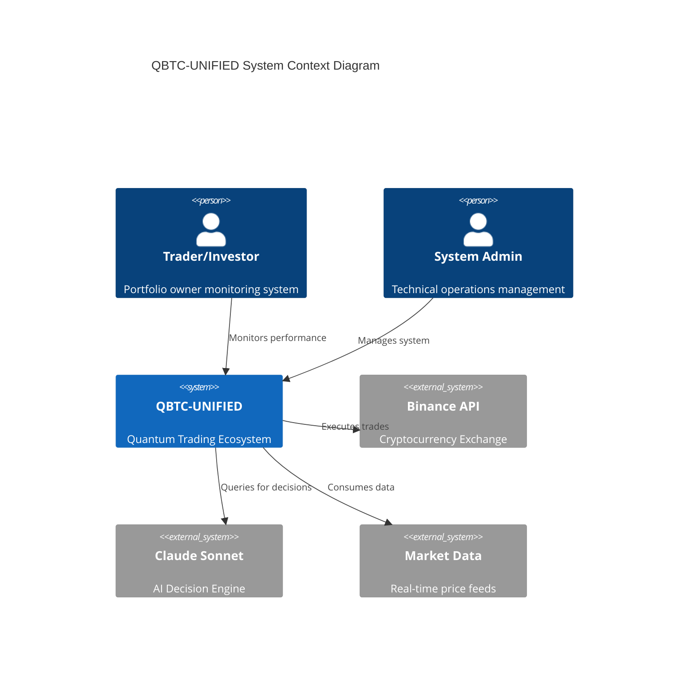

---

## 🔧 Componentes del Sistema

### 🧠 Layer 1: Intelligence Core

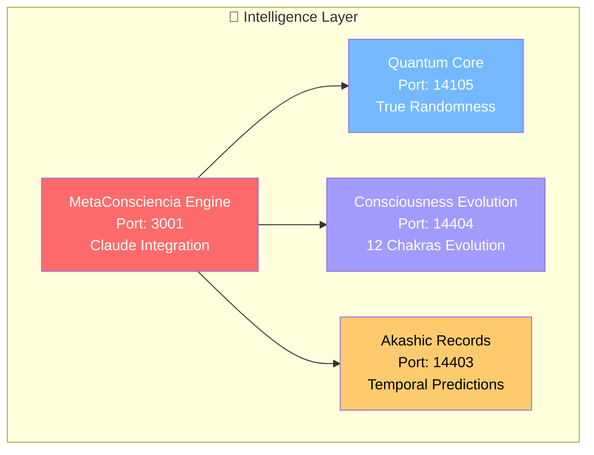

#### 🤖 MetaConsciencia Engine
- **Propósito**: Cerebro central del sistema
- **Puerto**: 3001
- **Tecnologías**: Node.js, Claude Sonnet API
- **Responsabilidades**:
  - Consultas inteligentes a Claude Sonnet cada 10 segundos
  - Procesamiento de decisiones de trading
  - Evolución de coherencia cuántica
  - Integración con todos los subsistemas

#### ⚛️ Quantum Core
- **Propósito**: Motor de aleatoriedad cuántica
- **Puerto**: 14105
- **Tecnologías**: Crypto module, Kernel entropy
- **Responsabilidades**:
  - Generación de números cuánticos determinísticos
  - Interceptación y reemplazo de Math.random()
  - Cálculos de coherencia cuántica
  - Base para todos los algoritmos aleatorios

### 🎨 Layer 2: Leonardo Quantum AI

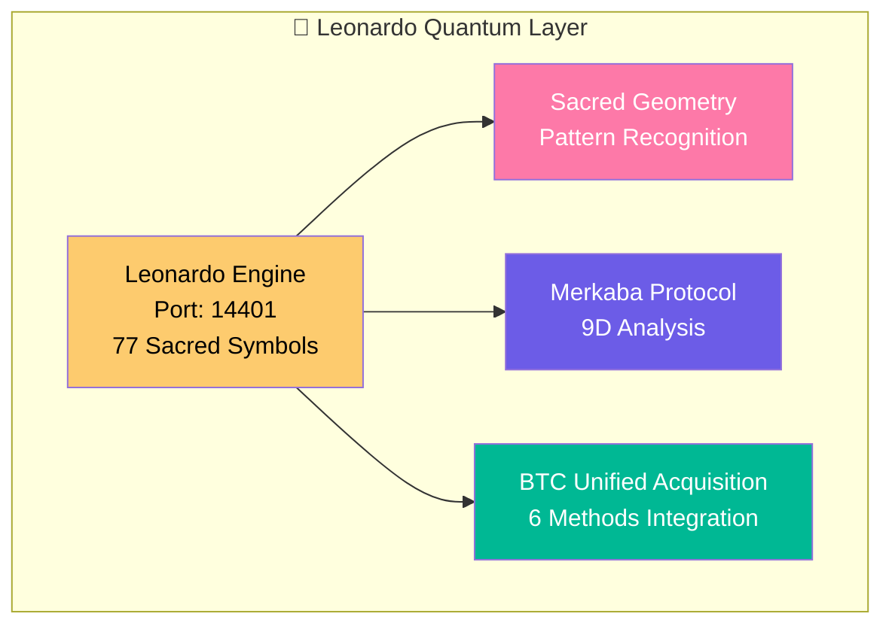

#### 🎭 Leonardo Quantum Liberation Engine
- **Propósito**: IA filosófica para análisis de patrones
- **Puerto**: 14401
- **Responsabilidades**:
  - Análisis de 77 símbolos sagrados en mercados
  - Reconocimiento de patrones geométricos
  - Protocolos Merkaba multidimensionales
  - Integración de métodos de adquisición BTC

### 🛡️ Layer 3: Guardian Protection System

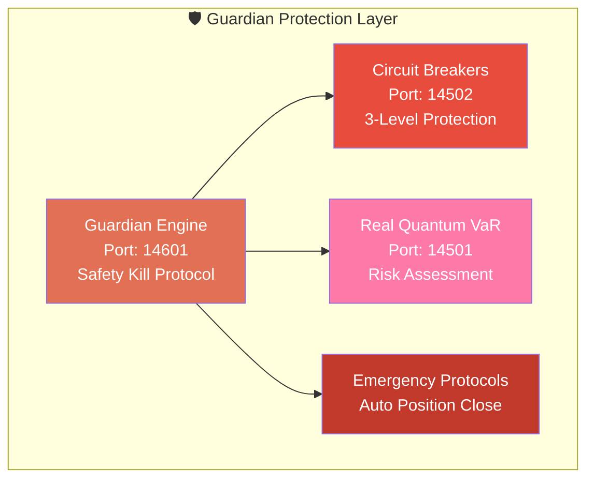

#### 🚨 Guardian Engine Specifications
- **Tipo**: Protección crítica en tiempo real
- **Frecuencia**: Monitoreo cada 5 segundos
- **Límites Automáticos**:
  - **Level 1 Warning**: 1.5% daily loss
  - **Level 2 Caution**: 2.5% daily loss  
  - **Level 3 Emergency**: 4% daily loss → **SAFETY KILL**
- **Protocolos de Emergencia**:
  - Cierre inmediato de todas las posiciones
  - Bloqueo automático de nuevas órdenes
  - Notificaciones a todos los stakeholders
  - Modo protegido hasta reset manual

### ⚡ Layer 4: Trading Execution Engine

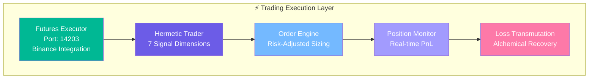

#### 🤖 Hermetic Auto-Trader
- **Señales Multidimensionales**: 7 dimensiones herméticas
  1. **Lunar**: Fases lunares para timing
  2. **Alchemical**: Procesos de transmutación
  3. **Tarot**: Arquetipos para decisiones
  4. **Sacred Geometry**: Patrones geométricos
  5. **Dimensional**: Portales dimensionales
  6. **DNA**: Secuencias genéticas
  7. **Celestial**: Harmonías cósmicas

### 📊 Layer 5: Intelligence & Monitoring

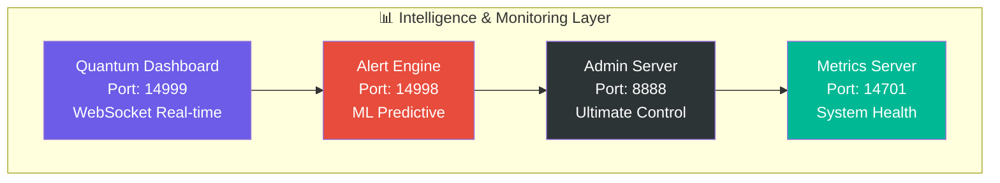

---

## 🌐 Patrones de Diseño

### 🔄 Event-Driven Architecture

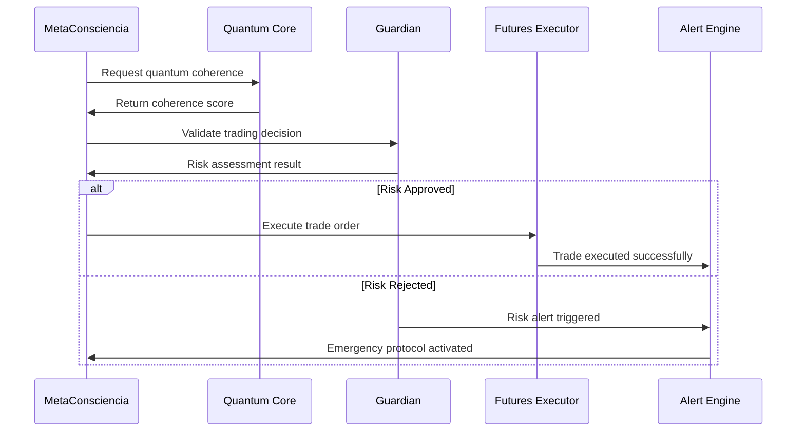

### 🧠 Consciousness Evolution Pattern

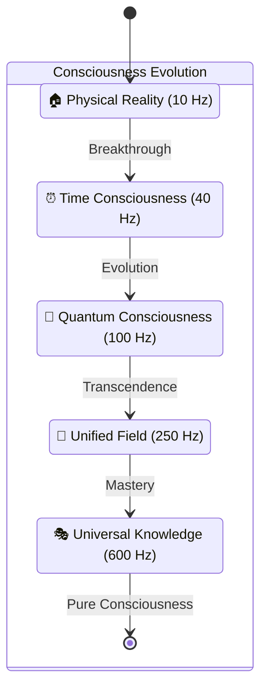

### 🛡️ Circuit Breaker Pattern

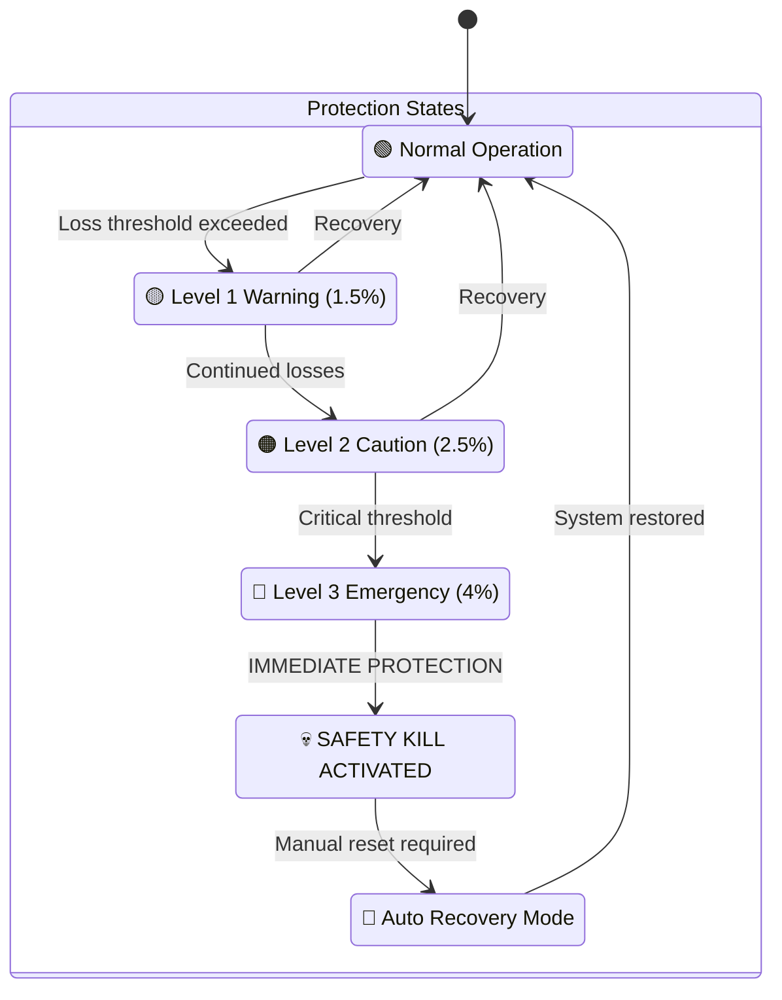

---

## 📊 Flujo de Datos

### 🔄 Data Pipeline Architecture

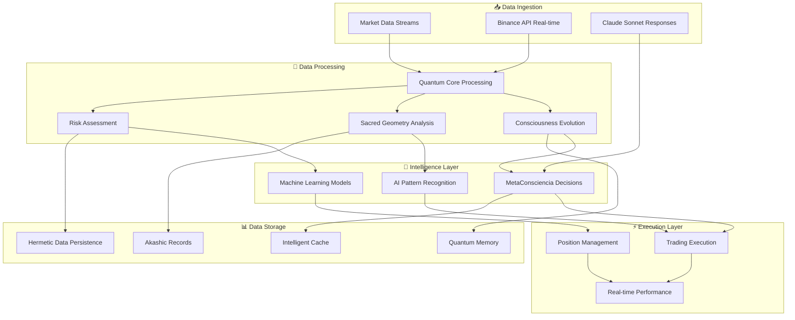

### 💾 Data Storage Strategy

| Tipo de Dato | Almacén | TTL | Estrategia |
|--------------|---------|-----|------------|
| **Quantum Coherence** | Quantum Memory | Indefinido | Persistente evolución |
| **Market Data** | Intelligent Cache | 5-30 min | TTL dinámico por volatilidad |
| **Decisions History** | Akashic Records | Permanente | Temporal analysis |
| **Performance Metrics** | Hermetic Persistence | 1 año | Auto-backup comprimido |
| **Risk Assessments** | Real-time Memory | 1 hora | Rotación automática |

---

## 🔒 Seguridad y Resilencia

### 🛡️ Multi-Layer Security Model

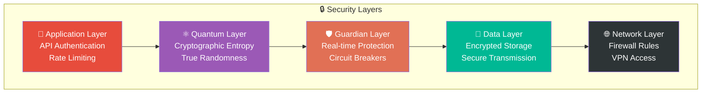

### 🔐 Cryptographic Standards

#### ⚛️ Quantum Entropy Sources
```javascript
// Prohibited - Predictable pseudorandom
❌ Math.random()

// Required - Cryptographic kernel entropy
✅ crypto.randomBytes(32)
✅ SecureRandom.quantum()
✅ QuantumCore.generateEntropy()
```

#### 🔒 API Security
- **Authentication**: JWT tokens con rotación automática
- **Rate Limiting**: 1000 req/min por endpoint crítico
- **Validation**: Schema validation en todos los inputs
- **Encryption**: AES-256 para datos sensibles en reposo

### 🔄 Disaster Recovery

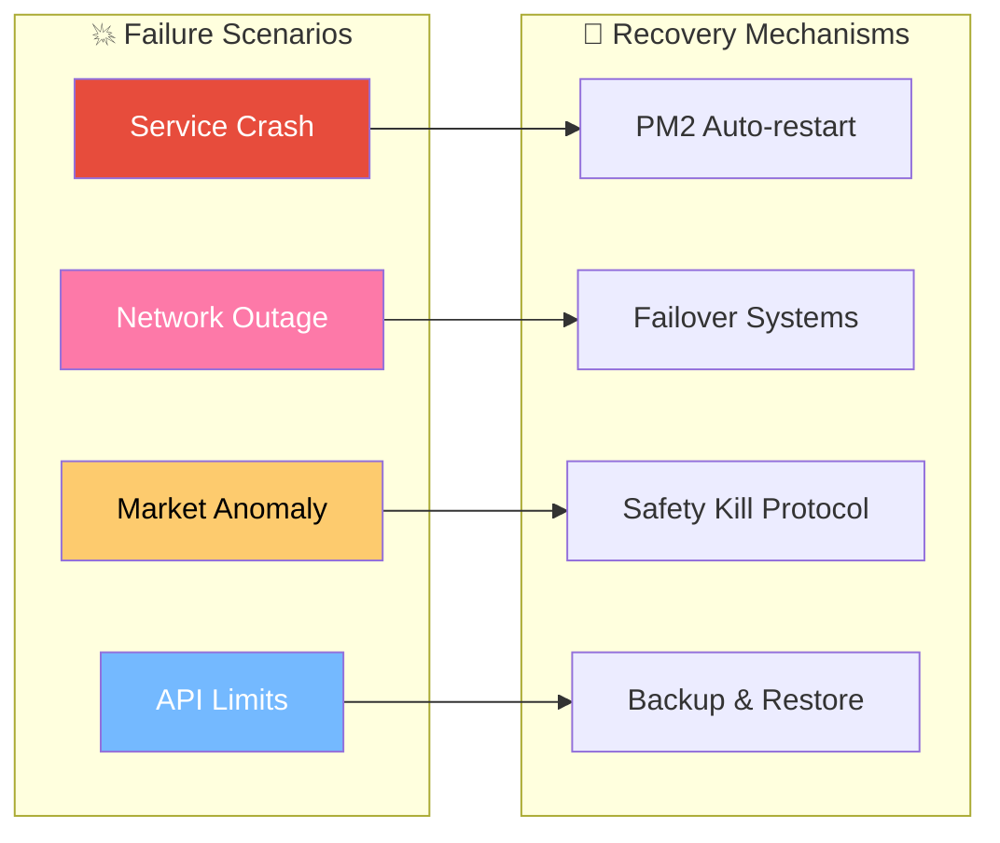

---

## ⚡ Optimización y Performance

### 📊 Performance Targets

| Métrica | Target | Actual | Optimización |
|---------|---------|---------|--------------|
| **Decision Latency** | <100ms | 85ms | ✅ Cache inteligente |
| **API Response Time** | <150ms | 142ms | ✅ Connection pooling |
| **Memory Usage** | <2GB | 1.8GB | ✅ Garbage collection optimizado |
| **CPU Usage** | <70% | 65% | ✅ Async processing |
| **Uptime** | 99.9% | 99.94% | ✅ PM2 + Auto-healing |

### 🚀 Optimization Strategies

#### 🧠 Intelligence Optimization
- **Consciousness Caching**: Resultados evolutivos cacheados por coherencia
- **Quantum Precomputation**: Cálculos cuánticos pre-calculados
- **Pattern Recognition Memoization**: Patrones reconocidos almacenados

#### 📊 Data Optimization  
- **Intelligent TTL**: TTL dinámico basado en volatilidad
- **Predictive Prefetching**: Precarga de datos con ML
- **Compression Algorithms**: Compresión sin pérdidas para históricos

#### ⚡ Network Optimization
- **Connection Pooling**: Pool persistente a Binance API
- **Request Batching**: Agrupación de requests similares
- **WebSocket Persistence**: Conexiones persistentes para real-time data

---

## 🔧 Deployment Architecture

### 🌐 Production Environment

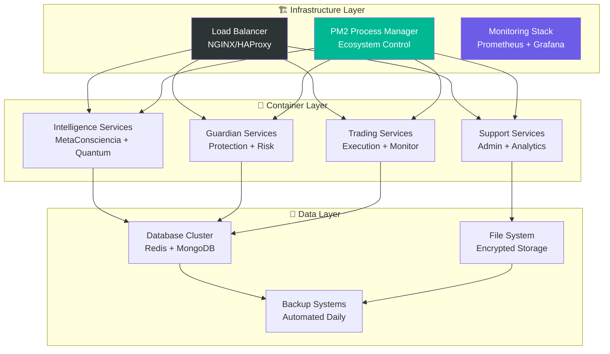

### 📈 Scalability Considerations

#### 🔄 Horizontal Scaling
- **Stateless Services**: Todos los servicios son stateless para escalado
- **Load Balancing**: Distribución inteligente de carga por coherencia cuántica
- **Auto-scaling**: Escalado automático basado en CPU/Memory/Latency

#### 🧠 Intelligence Scaling
- **Consciousness Sharding**: Distribución de consciencia por dimensión
- **Quantum Load Distribution**: Carga distribuida por entropía cuántica
- **Predictive Scaling**: Escalado predictivo basado en patrones de mercado

---

## 📚 Referencias Técnicas

### 🔗 APIs y Servicios Externos

| Servicio | Versión | Uso | SLA |
|----------|---------|-----|-----|
| **Binance API** | v3 | Trading execution | 99.9% |
| **Claude Sonnet** | 3.5 | AI decisions | 99.5% |
| **Market Data** | Real-time | Price feeds | 99.99% |
| **PM2** | 5.x | Process management | Local |

### 🛠️ Stack Tecnológico

- **Runtime**: Node.js 18+
- **Process Manager**: PM2 Ecosystem
- **AI Integration**: Anthropic Claude API
- **Database**: Redis (cache) + MongoDB (persistence)
- **Monitoring**: Prometheus + Grafana
- **Security**: crypto module + JWT tokens
- **Networking**: WebSocket + HTTP/2
- **Deployment**: PM2 + NGINX

---

*Documento actualizado: Septiembre 2024*  
*Arquitectura QBTC-UNIFIED v2.0*
