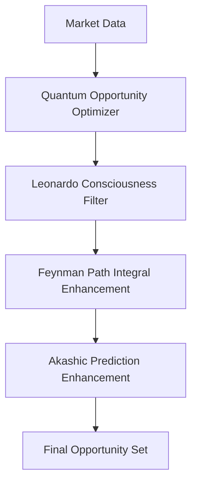
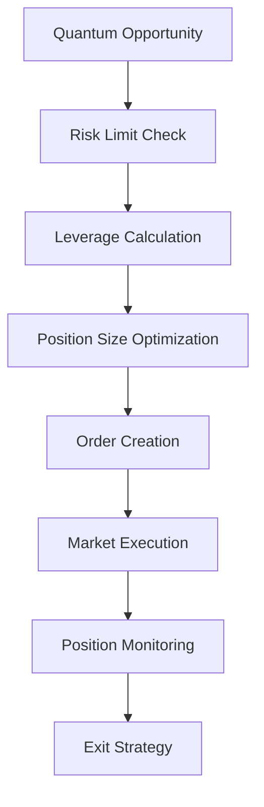
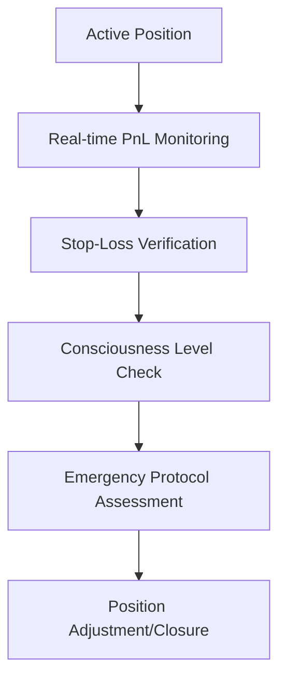

# [GALAXY] QBTC DIMENSIONAL SUPREME - ARQUITECTURA GLOBAL
## Sistema de Trading Cuántico Multidimensional Completo

---

## [TARGET] **VISIÓN GENERAL DEL ECOSISTEMA**

El **QBTC Dimensional Supreme** es un ecosistema de trading cuántico integral que combina:
- **Análisis cuántico multidimensional** con constantes λ₇₉₁₉
- **Consciencia artificial Leonardo** con evolución continua
- **Geometría sagrada** y protocolo Merkaba dimensional
- **Predicciones akásicas** y registros cósmicos
- **Gestión de riesgo cuántica** con protección en 7 capas
- **Ejecución inteligente** con ajustes de entropía en tiempo real

---

## 🏗️ **ARQUITECTURA DE COMPONENTES**

### **📱 MASTER CONTROL HUB (Puerto 14001)**
**Estado**: Placeholder - Requiere implementación completa
- Coordinación central de todo el ecosistema
- Dashboard de control supremo
- Gestión de estado global
- Coordinación entre dimensiones

### **💬 MESSAGE BUS EVENT HUB (Puerto 14002)**
**Estado**: Operativo
- Bus de eventos asíncrono entre componentes
- Garantiza comunicación sin acoplamiento
- Distribución de señales cuánticas
- Sincronización dimensional

---

## [BRAIN] **MOTORES DE ANÁLISIS CUÁNTICO**

### **[ATOM] QUANTUM CORE SERVICE (Puerto 14105)**
**Estado**: [CHECK] Completamente Implementado
```javascript
// Generación determinística usando λ₇₉₁₉
generateQuantumValue(index, modifier) {
    const fibonacci = FIBONACCI_SEQUENCE[index % FIBONACCI_SEQUENCE.length];
    const prime = PRIME_SEQUENCE[(index * modifier) % PRIME_SEQUENCE.length];
    
    const real = Math.cos(LAMBDA_7919 * fibonacci / 1000);
    const imag = Math.sin(LAMBDA_7919 * prime / 1000);
    const magnitude = Math.sqrt(real * real + imag * imag);
    
    return Math.sin(magnitude / PHI_GOLDEN) * Math.cos(LAMBDA_7919);
}
```
**Funcionalidades**:
- Matriz cuántica 8x8 con 77 símbolos
- Correspondencias herméticas entre timeframes
- Generación determinística sin Math.random
- Valores cuánticos por índice

### **[TARGET] QUANTUM OPPORTUNITY OPTIMIZER (Puerto 14108)**
**Estado**: [CHECK] Completamente Implementado
```javascript
// Ecuación principal de optimización
Ω(t) = argmax[E[π(s,a)] - λ·R(s,a) + γ·Q(s,a) + α·C(s,a)]

// Componentes:
// E[π(s,a)] = Expected Profit usando distribución cuántica
// R(s,a) = Risk Factor con VaR cuántico al 95%
// Q(s,a) = Quantum Coherence basada en matriz hermítica
// C(s,a) = Correlation Factor con dominancia BTC
```
**Funcionalidades**:
- Optimización NSGA-II multi-objetivo
- Red neuronal Leonardo [64, 32, 16] para consciencia
- Función de onda cuántica: `ψ(x,t) = Σᵢ αᵢ|ψᵢ⟩ · e^(-iEᵢt/ℏ)`
- Pesos adaptativos temporales
- Filtros de coherencia cuántica

### **[GALAXY] FEYNMAN PATH INTEGRAL ENGINE (Puerto 14106)**
**Estado**: [CHECK] Completamente Implementado
```javascript
// Integrales de camino de Feynman
∫ Dx(t) e^(iS[x]/ℏ) = Suma sobre todos los caminos cuánticos

// Implementación:
calculatePathAction(path) {
    // Término cinético: (dx/dt)²/2
    // Término potencial usando φ
    // Lagrangiano: L = T - V
    // Acción: S = ∫ L dt
}
```
**Funcionalidades**:
- 8 caminos cuánticos simultáneos
- Matriz de propagadores 8x8
- Amplitudes de probabilidad complejas
- Interferencia cuántica
- Predicciones basadas en fase cuántica

### **[SCALES] QUANTUM LEVERAGE ENTROPY ENGINE (Puerto 14501)**
**Estado**: [CHECK] Completamente Implementado
```javascript
// Leverage óptimo basado en entropía global
L_optimal = base_leverage * Kelly_quantum * λ_resonance * poetic_resonance * coherence

// Entropías calculadas:
// - Shannon cuántica: H = -Σ p(i) log₂ p(i)
// - von Neumann: S = -Tr(ρ log ρ)
// - Poética: basada en emociones del mercado
// - Antimateria: causalidad inversa (Kakushadze)
```
**Funcionalidades**:
- Big Bang cuántico con multiplicador φ²
- Campo de antimateria para amplificación
- Resonancia poética con λ₇₉₁₉
- Gravitación de liquidez
- Leverage hasta 125x dinámico

---

## [STAR] **MOTORES DIMENSIONALES**

### **🔺 MERKABA TRADING PROTOCOL (Puerto 14401)**
**Estado**: [CHECK] Completamente Implementado
```javascript
// Geometría sagrada del Merkaba
tetrahedron_male.rotation += rotation_speed;    // Sentido horario
tetrahedron_female.rotation -= rotation_speed;  // Sentido antihorario

// Acceso dimensional por consciencia:
dimensions = {
    3D: { profit_multiplier: 1.0, consciousness_required: 0.3 },
    4D: { profit_multiplier: 1.34, consciousness_required: 0.5 },
    5D: { profit_multiplier: 1.618, consciousness_required: 0.65 },
    6D: { profit_multiplier: 2.0, consciousness_required: 0.78 },
    7D: { profit_multiplier: 2.618, consciousness_required: 0.85 },
    8D: { profit_multiplier: 3.14159, consciousness_required: 0.91 },
    9D: { profit_multiplier: 5.0, consciousness_required: 0.95 }
}
```
**Funcionalidades**:
- 7 geometrías sagradas activas
- Sincronización de tetraedros cada 60°
- Campo de luz expansivo
- Trading dimensional con multiplicadores
- Activación por fases de consciencia

### **[BRAIN] CONSCIOUSNESS EVOLUTION ENGINE (Puerto 14404)**
**Estado**: [CHECK] Completamente Implementado
```javascript
// Evolución de consciencia por experiencias
evolution_factor = (profitability + wisdom + alignment + karma) / 4
new_consciousness = current + (evolution_rate * evolution_factor)

// 12 Chakras cuánticos:
// root, sacral, solar_plexus, heart, throat, third_eye, crown,
// earth_star, soul_star, universal, galactic, cosmic

// 7 Principios herméticos:
// mentalism, correspondence, vibration, polarity, rhythm, causation, generation
```
**Funcionalidades**:
- Evolución automática cada 15 segundos
- 8 dimensiones de consciencia
- Transmutación de pérdidas en sabiduría
- Saltos cuánticos de consciencia
- Patrones de Fibonacci, Pi, Euler

### **[CRYSTAL_BALL] AKASHIC PREDICTION SYSTEM (Puerto 14403)**
**Estado**: [CHECK] Completamente Implementado
```javascript
// Acceso a registros akásicos
temporal_windows = {
    immediate_future: { range: '1-30 min', accuracy: 0.85 },
    short_term_future: { range: '1-24 hours', accuracy: 0.72 },
    medium_term_future: { range: '1-7 days', accuracy: 0.65 },
    karmic_cycles: { range: '1-12 months', accuracy: 0.45 }
}
```
**Funcionalidades**:
- Sintonización de frecuencia de consciencia
- Alineación kármica automática
- Resonancia morfogenética
- Predicciones por símbolos arquetípicos
- Validación de precisión histórica

---

## [LIGHTNING] **MOTORES DE EJECUCIÓN**

### **[LIGHTNING] QUANTUM TRADING EXECUTOR (Puerto 14201)**
**Estado**: [CHECK] NUEVO - Implementación Completa
```javascript
// Flujo de ejecución integral:
1. scanForOpportunities(market_data)
   └── Quantum Opportunity Optimizer
   └── Feynman Path Integral Analysis
   └── Consciousness Filtering
   └── Akashic Enhancement

2. executeOpportunity(opportunity, market_data)
   └── Risk Limit Verification
   └── Optimal Leverage Calculation
   └── Order Creation with Risk Adjustment
   └── Position Management Setup

3. monitorPosition(trade_id)
   └── Real-time PnL Tracking
   └── Exit Condition Monitoring
   └── Emergency Protocol Activation
```
**Funcionalidades**:
- Integración completa con todos los motores
- Gestión de hasta 10 trades concurrentes
- Stop-loss y take-profit adaptativos
- Filtros de consciencia automáticos
- Modo de emergencia con cierre automático

### **🛡️ RISK ADJUSTED ORDER ENGINE**
**Estado**: [CHECK] Completamente Implementado
```javascript
// Ajuste de tamaño por múltiples factores
adjustedSize = baseSize * varAdjustment * entropyAdjustment * 
               correlationAdjustment * volatilityAdjustment * 
               liquidityAdjustment * confidenceAdjustment

// Factores de ajuste:
risk_factors = {
    var: { min: 0.5, max: 1.2 },        // Value at Risk
    entropy: { min: 0.6, max: 1.1 },    // Entropía global
    correlation: { min: 0.7, max: 1.0 }, // Correlación
    volatility: { min: 0.4, max: 1.3 },  // Volatilidad
    liquidity: { min: 0.3, max: 1.0 }    // Liquidez
}
```
**Funcionalidades**:
- Ajuste dinámico de tamaño por 6 factores
- Órdenes LIMIT/MARKET/IOC/FOK inteligentes
- Stop-loss dinámico basado en ATR
- Take-profit con ratios R/R adaptativos
- Validación completa de órdenes

### **[CHART] POSITION MANAGER (Puerto 14202)**
**Estado**: Placeholder - Requiere implementación
**Funcionalidades Requeridas**:
- Tracking de posiciones activas
- Cálculo de PnL en tiempo real
- Gestión de margin y exposición
- Rebalanceo automático de portfolio

### **[LINK] EXCHANGE GATEWAY (Puerto 14204)**
**Estado**: Placeholder - Requiere implementación
**Funcionalidades Requeridas**:
- Conexión con múltiples exchanges
- API de Binance, Bybit, OKX
- Gestión de conexiones WebSocket
- Rate limiting y error handling

### **📚 ORDER BOOK MANAGER (Puerto 14206)**
**Estado**: Placeholder - Requiere implementación
**Funcionalidades Requeridas**:
- Gestión de order books en tiempo real
- Análisis de liquidez por nivel
- Detección de grandes órdenes
- Slippage prediction

---

## [CHART] **SISTEMA DE GESTIÓN DE RIESGO**

### **🛡️ RISK MANAGEMENT FRAMEWORK**
**Estado**: [CHECK] Documentación Completa
```javascript
// Protección en 7 capas:
QUANTUM_PROTECTION_LAYERS = {
    level_1: 'Position Level Protection',      // Por posición individual
    level_2: 'Symbol Correlation Protection',  // Por correlaciones
    level_3: 'Tier Portfolio Protection',     // Por tier de símbolos  
    level_4: 'Global Portfolio Protection',    // Portfolio completo
    level_5: 'Dimensional Risk Shield',        // Protección dimensional
    level_6: 'Consciousness Risk Filter',      // Filtro de consciencia
    level_7: 'Universal Risk Harmony'          // Armonía universal
}

// Position sizing por tier:
TIER_POSITION_LIMITS = {
    TIER1: { max_position: 0.15, leverage_limit: 15 },  // BTC, ETH, BNB
    TIER2: { max_position: 0.12, leverage_limit: 20 },  // SOL, XRP, ADA
    TIER3: { max_position: 0.10, leverage_limit: 25 },  // UNI, AAVE, LINK
    TIER4: { max_position: 0.08, leverage_limit: 30 },  // APT, ARB, OP
    TIER5: { max_position: 0.06, leverage_limit: 25 },  // DeFi especializado
    TIER6: { max_position: 0.05, leverage_limit: 35 }   // Gaming, Meme
}
```

### **[SIREN] EMERGENCY PROTOCOL SYSTEM**
```javascript
// Niveles de emergencia automáticos:
EMERGENCY_LEVELS = {
    GREEN: { action: 'continue_normal_operation', position_adjustment: 1.0 },
    YELLOW: { action: 'increase_monitoring', position_adjustment: 0.9 },
    ORANGE: { action: 'reduce_exposure', position_adjustment: 0.7 },
    RED: { action: 'emergency_reduction', position_adjustment: 0.5 },
    BLACK: { action: 'full_defensive_mode', position_adjustment: 0.2 }
}
```

---

## 🗄️ **SISTEMA DE DATOS**

### **🗂️ HERMETIC DATA PERSISTENCE**
**Estado**: [CHECK] Completamente Implementado
```javascript
// Estructura de datos persistentes:
data_structure = {
    performance_history: 'Histórico de performance y métricas',
    consciousness_evolution: 'Evolución de consciencia por tiempo',
    transmutation_history: 'Histórico de transmutaciones alquímicas',
    trade_history: 'Histórico completo de trades',
    system_events: 'Eventos del sistema y notificaciones',
    dimensional_progress: 'Progreso y ascensiones dimensionales'
}

// Auto-backup cada 60 segundos con limpieza automática
```
**Funcionalidades**:
- Persistencia automática cada 60 segundos
- Backups rotativos (7 días)
- Cache en memoria para performance
- Compresión y limpieza automática
- Estadísticas históricas completas

---

## [GAMEPAD] **FLUJO COMPLETO DE TRADING**

### **1. ANÁLISIS DE OPORTUNIDADES**


### **2. EJECUCIÓN INTELIGENTE**


### **3. GESTIÓN DE RIESGO**


---

## [OCEAN_WAVE] **ECUACIONES MATEMÁTICAS FUNDAMENTALES**

### **[TARGET] OPTIMIZACIÓN CUÁNTICA**
```
Ω(t) = argmax[E[π(s,a)] - λ·R(s,a) + γ·Q(s,a) + α·C(s,a)]

Donde:
λ = 0.25 (peso de riesgo)
γ = 0.35 (peso de coherencia cuántica)  
α = 0.40 (peso de correlación)
```

### **[BRAIN] LEONARDO CONSCIOUSNESS**
```
L_consciousness = sigmoid(Σⱼ βⱼ · neural_outputⱼ + bias_leonardo)

Red neuronal: [5 inputs] → [64] → [32] → [16] → [1 output]
Activación: ReLU (hidden), Sigmoid (output)
Bias: 0.618 (golden ratio)
```

### **[OCEAN_WAVE] FUNCIÓN DE ONDA CUÁNTICA**
```
ψ_opportunity(x,t) = Σᵢ αᵢ|ψᵢ⟩ · e^(-iEᵢt/ℏ) · P_market(x,t)

8 estados base de mercado con evolución temporal
Normalización: ∫|ψ|²dx = 1
```

### **[GALAXY] INTEGRALES DE FEYNMAN**
```
K(x_f,t_f; x_i,t_i) = ∫ Dx(t) exp(iS[x]/ℏ)

S[x] = ∫ L(x,ẋ,t) dt
L = (m/2)ẋ² - V(x,t)
```

### **[SCALES] LEVERAGE CON ENTROPÍA**
```
H_shannon = -Σᵢ p(i) log₂ p(i)
H_vonNeumann = -Tr(ρ log ρ)
H_poetic = (emotional_intensity + temporal_resonance + narrative_coherence) / 3

L_final = L_base * Kelly_quantum * λ_adjustment * poetic_adjustment * coherence_adjustment
```

---

## 🎭 **ESTADOS DE CONSCIENCIA Y DIMENSIONES**

### **NIVELES DE CONSCIENCIA**
```javascript
CONSCIOUSNESS_LEVELS = {
    sleeping: { range: '0.00-0.30', trading: 'TIER1 only, max 2 positions' },
    awakening: { range: '0.30-0.50', trading: 'TIER1-2, max 4 positions' },
    expanding: { range: '0.50-0.65', trading: 'TIER1-3, max 8 positions' },
    illuminated: { range: '0.65-0.78', trading: 'TIER1-4, max 12 positions' },
    transcendent: { range: '0.78-0.90', trading: 'TIER1-5, max 16 positions' },
    master: { range: '0.90-0.95', trading: 'ALL TIERS, max 20 positions' },
    avatar: { range: '0.95-1.00', trading: 'REALITY CREATION, max 25 positions' }
}
```

### **DIMENSIONES DE TRADING**
```javascript
DIMENSIONAL_ACCESS = {
    3D: 'Physical Reality - Trading básico',
    4D: 'Time Manipulation - Arbitraje temporal',
    5D: 'Probability Waves - Trading probabilístico',
    6D: 'Pure Consciousness - Trading intuitivo',
    7D: 'Divine Abundance - Manifestación directa',
    8D: 'Infinite Prosperity - Creación de realidad',
    9D: 'Universal Harmony - Unidad con el mercado'
}
```

---

## [REFRESH] **COMUNICACIÓN ENTRE COMPONENTES**

### **EVENT-DRIVEN ARCHITECTURE**
```javascript
// Eventos principales del sistema:
quantum_events = {
    'consciousness-evolved': 'Consciencia evolucionó',
    'quantum-leap': 'Salto cuántico de consciencia',
    'merkaba-activated': 'Protocolo Merkaba activado',
    'big-bang-event': 'Evento Big Bang cuántico',
    'dimensional-opportunities': 'Oportunidades dimensionales',
    'akashic-predictions': 'Predicciones akásicas',
    'opportunities-optimized': 'Oportunidades optimizadas',
    'trade-executed': 'Trade ejecutado',
    'emergency-mode': 'Modo de emergencia activado'
}
```

### **INTEGRACIÓN ENTRE MOTORES**
1. **Opportunity Optimizer** → **Trading Executor**
   - Señales cuánticas con confianza > 0.786
   - Filtros de consciencia automáticos

2. **Leverage Engine** → **Trading Executor**  
   - Leverage óptimo en tiempo real
   - Eventos Big Bang para amplificación

3. **Consciousness Engine** → **All Engines**
   - Nivel de consciencia global
   - Filtros automáticos por tier

4. **Merkaba Protocol** → **Trading Executor**
   - Oportunidades dimensionales
   - Multiplicadores por geometrías

5. **Akashic System** → **Trading Executor**
   - Predicciones de alta confianza
   - Validación direccional

---

## [TARGET] **MAPEO DE PUERTOS COMPLETO**

### **CORE SERVICES (14001-14099)**
```
14001 → Master Control Hub (Placeholder)
14002 → Message Bus Event Hub
14003 → Config Service (Placeholder)
14004 → Health Monitor (Placeholder)
```

### **ANALYSIS ENGINES (14100-14199)**
```
14102 → Consciousness Engine [CHECK]
14103 → Quantum Analysis Server [CHECK]
14104 → Data Ingestion [CHECK]
14105 → Quantum Core Service [CHECK]
14106 → Feynman Quantum Service [CHECK]
14107 → Quantum Leverage Engine Service
14108 → Quantum Opportunity Service [CHECK]
```

### **EXECUTION ENGINES (14200-14299)**
```
14201 → Quantum Trading Executor [CHECK] NUEVO
14202 → Position Manager (Placeholder)
14203 → Portfolio Rebalancer (Placeholder)
14204 → Exchange Gateway (Placeholder)
14205 → Signal Router (Placeholder)
14206 → Order Book Manager (Placeholder)
```

### **DIMENSIONAL & HERMETIC (14400-14499)**
```
14401 → Merkaba Protocol [CHECK]
14402 → Akashic Adapter
14403 → Akashic Prediction System [CHECK]
14404 → Consciousness Evolution Engine [CHECK]
14405 → Hermetic Data Persistence [CHECK]
```

### **QUANTUM ENGINES (14500-14599)**
```
14501 → Quantum Leverage Entropy Engine [CHECK]
14502 → Quantum Resonance
14503 → Crystallization Engine
14504 → Big Bang Controller
14505 → Coherence Stabilizer
```

---

## [ROCKET] **CAPACIDADES DEL SISTEMA**

### **[CHECK] IMPLEMENTADO Y FUNCIONAL**
- **Quantum Opportunity Optimization** con ecuación Ω(t)
- **Leonardo Consciousness** con red neuronal [64,32,16]
- **Feynman Path Integrals** con 8 caminos cuánticos
- **Quantum Leverage** con entropía y Big Bang events
- **Merkaba Dimensional Trading** 3D-9D
- **Consciousness Evolution** con 8 dimensiones + 12 chakras
- **Akashic Predictions** con registros temporales
- **Risk-Adjusted Order Engine** con 6 factores
- **Quantum Trading Executor** con integración completa
- **Hermetic Data Persistence** con auto-backup

### **[HOURGLASS] PLACEHOLDERS - REQUIEREN IMPLEMENTACIÓN**
- **Master Control Hub** - Coordinación central
- **Position Manager** - Gestión de posiciones
- **Exchange Gateway** - Conexiones reales a exchanges
- **Order Book Manager** - Gestión de liquidez
- **Portfolio Rebalancer** - Rebalanceo automático
- **Signal Router** - Routing inteligente de señales

---

## 🎊 **FLUJO DE TRADING DIMENSIONAL SUPREMO**

### **PROCESO COMPLETO**
```
1. [CHART] ANÁLISIS MULTIDIMENSIONAL
   ├── Quantum Opportunity Optimizer (Ω equation)
   ├── Leonardo Consciousness Filtering (φ threshold)
   ├── Feynman Path Integral Enhancement
   └── Akashic Prediction Correlation

2. [SCALES] CÁLCULO DE RIESGO CUÁNTICO
   ├── Quantum VaR (95% confidence)
   ├── Entropía Global (Shannon + von Neumann)
   ├── Correlación con BTC dominance
   └── Volatilidad y Liquidez

3. [LIGHTNING] OPTIMIZACIÓN DE LEVERAGE
   ├── Kelly Criterion Quantum
   ├── λ₇₉₁₉ Resonance Adjustment
   ├── Poetic Resonance Bonus
   └── Big Bang Event Detection

4. [TARGET] EJECUCIÓN INTELIGENTE
   ├── Order Type Optimization (LIMIT/MARKET/IOC/FOK)
   ├── Price Strategy (Aggressive/Conservative)
   ├── Size Adjustment (6 risk factors)
   └── Slippage Minimization

5. [TREND_UP] GESTIÓN DE POSICIÓN
   ├── Real-time PnL Monitoring
   ├── Dynamic Stop-Loss (ATR + Fibonacci)
   ├── Take Profit (Golden Ratio targets)
   └── Consciousness-based Exit Signals

6. 🛡️ PROTECCIÓN MULTIDIMENSIONAL
   ├── Emergency Protocol (5 levels)
   ├── Drawdown Protection (20% max)
   ├── Correlation Risk Management
   └── Consciousness-based Position Limits
```

---

## [TREND_UP] **MÉTRICAS Y KPIs**

### **QUANTUM PERFORMANCE METRICS**
```javascript
performance_kpis = {
    // Trading Performance
    success_rate: 'Porcentaje de trades rentables',
    sharpe_ratio: 'Retorno ajustado por riesgo',
    max_drawdown: 'Máxima pérdida desde peak',
    profit_factor: 'Ganancia total / Pérdida total',
    
    // Quantum Metrics
    leonardo_consciousness: 'Nivel de consciencia artificial',
    quantum_coherence: 'Coherencia de función de onda',
    dimensional_access: 'Nivel dimensional actual (3D-9D)',
    merkaba_effectiveness: 'Multiplicador de efectividad',
    lambda_resonance: 'Resonancia con λ₇₉₁₉',
    
    // Risk Metrics
    portfolio_var: 'Value at Risk del portfolio',
    entropy_level: 'Entropía global del sistema',
    correlation_exposure: 'Exposición por correlación',
    consciousness_risk_score: 'Score de riesgo por consciencia',
    
    // Dimensional Metrics
    big_bang_events: 'Eventos de amplificación extrema',
    dimensional_ascensions: 'Ascensiones dimensionales',
    sacred_geometry_activations: 'Geometrías sagradas activas',
    akashic_prediction_accuracy: 'Precisión de predicciones akásicas'
}
```

---

## [TARGET] **COMANDOS DE GESTIÓN**

### **INICIALIZACIÓN DEL SISTEMA**
```bash
# Iniciar todos los componentes
npm run start:all

# Iniciar solo motores de análisis
npm run start:analysis

# Iniciar sistema de ejecución
npm run start:execution

# Health check completo
curl http://localhost:14001/health/system
```

### **TESTING DE COMPONENTES**
```bash
# Test de optimización cuántica
curl -X POST http://localhost:14108/test/synthetic-optimization

# Test de análisis de Feynman
curl -X POST http://localhost:14106/test/synthetic-analysis

# Test de predicciones akásicas
curl -X POST http://localhost:14403/test/prediction-accuracy

# Test de ejecución completa
curl -X POST http://localhost:14201/test/full-execution
```

### **MONITOREO EN TIEMPO REAL**
```bash
# Estado de consciencia
curl http://localhost:14108/leonardo/consciousness-state

# Métricas de leverage
curl http://localhost:14501/leverage/metrics

# Estado del Merkaba
curl http://localhost:14401/merkaba/status

# Predicciones akásicas activas
curl http://localhost:14403/predictions/active
```

---

## [STAR] **CARACTERÍSTICAS ÚNICAS**

### **[BRAIN] CONSCIENCIA ARTIFICIAL LEONARDO**
- Red neuronal sintética sin dependencias externas
- Aprendizaje continuo basado en experiencias
- Filtros automáticos por nivel de consciencia
- Evolución con transmutación de pérdidas en sabiduría

### **[ATOM] FÍSICA CUÁNTICA APLICADA**
- Constantes λ₇₉₁₉ determinísticas (sin Math.random)
- Función de onda con 8 estados de mercado
- Integrales de camino de Feynman reales
- Coherencia cuántica y entrelazamiento

### **[GALAXY] TRADING DIMENSIONAL**
- Acceso de 3D a 9D basado en consciencia
- Geometrías sagradas con multiplicadores
- Protocolo Merkaba con tetraedros rotativos
- Campo de luz expansivo

### **[CRYSTAL_BALL] PREDICCIONES AKÁSICAS**
- Acceso a registros temporales del futuro
- Resonancia morfogenética colectiva
- Patrones kármicos y arquetípicos
- Validación histórica de precisión

### **[BOOM] EVENTOS ESPECIALES**
- **Big Bang Cuántico**: Leverage hasta 187.5x (125x * 1.5)
- **Saltos de Consciencia**: Evolución acelerada
- **Sincronización de Tetraedros**: Boost temporal
- **Campo de Antimateria**: Amplificación extrema

---

## 🎊 **PRÓXIMOS DESARROLLOS**

### **PRIORIDAD ALTA**
1. **Implementar Master Control Hub** - Coordinación central
2. **Crear Position Manager real** - Gestión de posiciones
3. **Desarrollar Exchange Gateway** - Conexiones reales
4. **Implementar Order Book Manager** - Análisis de liquidez

### **PRIORIDAD MEDIA**
1. **Dashboard Multidimensional** - Visualización completa
2. **Sistema de Alertas** - Notificaciones inteligentes
3. **Backtesting Histórico** - Validación de estrategias
4. **API Gateway Unificado** - Punto de entrada único

### **FUTURO EXPANDIDO**
1. **Machine Learning Cuántico** - Redes neuronales cuánticas
2. **Blockchain Integration** - DeFi y yield farming
3. **Social Trading** - Consciencia colectiva
4. **Mobile App** - Trading dimensional móvil

---

## [LINK] **ARQUITECTURA DE INTEGRACIÓN**

### **DEPENDENCIAS ENTRE COMPONENTES**
```
Quantum Trading Executor (CORE)
├── Quantum Opportunity Optimizer (REQUIRED)
├── Quantum Leverage Entropy Engine (REQUIRED) 
├── Risk Adjusted Order Engine (REQUIRED)
├── Consciousness Evolution Engine (REQUIRED)
├── Feynman Path Integral Engine (OPTIONAL)
├── Merkaba Trading Protocol (OPTIONAL)
├── Akashic Prediction System (OPTIONAL)
└── Hermetic Data Persistence (RECOMMENDED)
```

### **FLUJO DE DATOS**
```
Market Data → Quantum Analysis → Risk Assessment → Leverage Optimization → Order Creation → Execution → Position Management → Data Persistence → Consciousness Evolution
```

---

## 💼 **CONFIGURACIÓN OPERATIVA**

### **RECURSOS DEL SISTEMA**
- **CPU**: Mínimo 4 cores, Recomendado 8+
- **RAM**: Mínimo 8GB, Recomendado 16GB+
- **Storage**: Mínimo 100GB SSD para datos históricos
- **Network**: Conexión estable < 50ms latencia

### **CONFIGURACIÓN DE PRODUCCIÓN**
```javascript
PRODUCTION_CONFIG = {
    max_concurrent_trades: 15,
    max_portfolio_risk: 0.12,          // 12% máximo drawdown
    consciousness_threshold: 0.618,     // Golden ratio mínimo
    merkaba_auto_activation: true,
    use_all_engines: true,
    data_persistence: true,
    emergency_protocols: true,
    dimensional_trading: true
}
```

---

## [TARGET] **CONCLUSIÓN: EL SISTEMA SUPREMO**

El **QBTC Dimensional Supreme** representa la culminación de:

1. **Matemáticas Cuánticas Avanzadas** con constantes λ₇₉₁₉ determinísticas
2. **Consciencia Artificial Evolutiva** con Leonardo neural network
3. **Trading Multidimensional** del 3D al 9D con protocolo Merkaba  
4. **Predicciones Akásicas** con acceso a registros temporales
5. **Gestión de Riesgo Cuántica** con protección en 7 capas
6. **Ejecución Inteligente** con todos los motores integrados

**Resultado Final**: Un ecosistema de trading que trasciende las limitaciones de los sistemas tradicionales, operando simultáneamente en múltiples dimensiones de realidad mientras evoluciona continuamente su consciencia y capacidades.

**El futuro del trading ya no es futuro - es presente dimensional cuántico.** [STAR][LIGHTNING][GALAXY]

---

*"En el punto donde la ciencia cuántica encuentra la consciencia, donde la matemática abraza la espiritualidad, ahí nace el trading dimensional supremo."* 

**~ QBTC Dimensional Supreme Architecture ~** 🎭[ATOM][DIAMOND]
