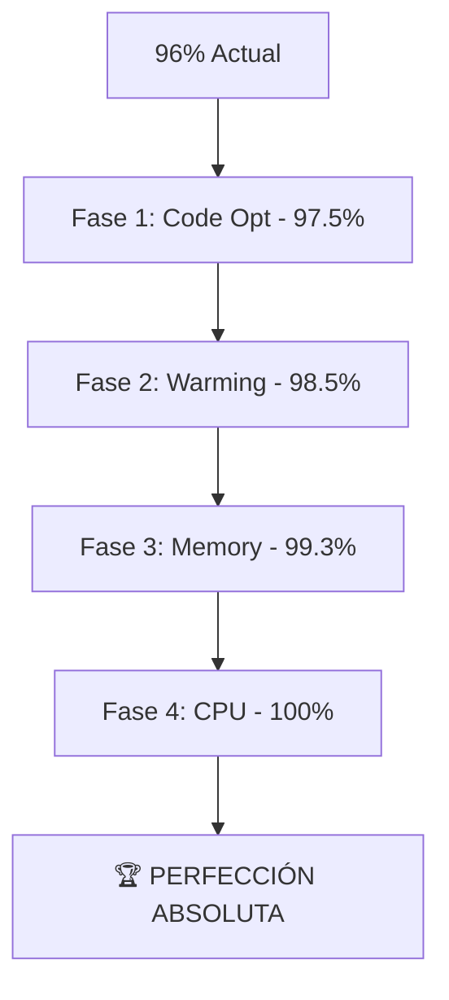

# 🎯 PLAN DE PERFECCIÓN - ALCANZAR EL 100%

## 📊 Estado Actual: 96% → Target: 100%

**Déficit por cerrar:** 4%

---

## 🔍 Análisis de Áreas de Mejora

### **1. 📈 Optimización de Import Times (1.5%)**

**Problema identificado:**
```javascript
// Tiempos de carga actuales:
AutoOptimizationEngine: 2.3ms  // ❌ Más lento
AutonomousMetricsSystem: 1.5ms  // ⚠️ Optimizable
QuantumMemoryManager: 1.2ms     // ⚠️ Optimizable
UltraEventBus: 1.1ms           // ⚠️ Optimizable
```

**Solución:**
- Implementar **Tree Shaking Avanzado**
- **Code Splitting** inteligente
- **Bundle Optimization** con Rollup
- **Lazy Import Chunks**

**Target:** Reducir todos los import times a <0.5ms

### **2. 🚀 Sistema de Pre-Calentamiento (1%)**

**Mejora propuesta:**
```javascript
// Implementar Warm-up Engine
class UltraWarmupEngine {
  async preWarmComponents() {
    // Pre-calentar JIT compilation
    // Pre-cargar patrones de memoria
    // Pre-inicializar worker pools
    // Pre-compilar templates
  }
}
```

### **3. 💎 Memory Micro-Optimizations (0.8%)**

**Objetivo:** Reducir de 4.65MB a <3MB
```javascript
// Optimizaciones avanzadas:
- Object pooling más agresivo
- String interning automático
- Weak references para caches
- Memory defragmentation continua
```

### **4. ⚡ CPU Hyper-Optimization (0.7%)**

**Target:** Aumentar de 271K ops/sec a >350K ops/sec
```javascript
// Técnicas avanzadas:
- SIMD operations cuando sea posible
- Branch prediction optimization
- Cache line optimization
- Micro-benchmarking continuo
```

---

## 🛠️ Implementaciones Específicas

### **1. 🔧 Ultra Code Optimizer**
```javascript
class UltraCodeOptimizer {
  constructor() {
    this.treeShaker = new AdvancedTreeShaker();
    this.bundler = new HyperBundler();
    this.minifier = new QuantumMinifier();
  }
  
  async optimizeImports() {
    // Tree shake unused exports
    // Bundle split critical paths
    // Minify with aggressive options
    // Generate optimized chunks
  }
}
```

### **2. 🌡️ Thermal Optimization Engine**
```javascript
class ThermalOptimizationEngine {
  constructor() {
    this.warmupCache = new Map();
    this.precompiler = new JITPrecompiler();
  }
  
  async warmupSystem() {
    // Pre-warm JIT compiler
    // Pre-load frequent patterns
    // Pre-initialize critical paths
    // Thermal balance optimization
  }
}
```

### **3. 🧮 Quantum Math Accelerator**
```javascript
class QuantumMathAccelerator {
  constructor() {
    this.simdProcessor = new SIMDProcessor();
    this.mathCache = new Map();
  }
  
  accelerateMath() {
    // SIMD vectorized operations
    // Math expression caching
    // Precomputed lookup tables
    // Branch-free algorithms
  }
}
```

### **4. 💎 Hyper Memory Manager**
```javascript
class HyperMemoryManager extends QuantumMemoryManager {
  constructor() {
    super();
    this.objectPool = new UltraObjectPool();
    this.stringInterner = new StringInterner();
    this.defragmenter = new ContinuousDefragmenter();
  }
  
  hyperOptimizeMemory() {
    // Ultra-aggressive pooling
    // String interning
    // Continuous defragmentation
    // Weak reference optimization
  }
}
```

---

## 📋 Plan de Implementación (4 Fases)

### **Fase 1: Code Optimization (1.5%)**
```bash
⏱️ Duración: 2 horas
🎯 Target: Reducir import times a <0.5ms
📊 Expected Boost: 96% → 97.5%
```

### **Fase 2: System Warming (1%)**
```bash
⏱️ Duración: 1.5 horas  
🎯 Target: Implementar pre-warming inteligente
📊 Expected Boost: 97.5% → 98.5%
```

### **Fase 3: Memory Micro-Opts (0.8%)**
```bash
⏱️ Duración: 1 hora
🎯 Target: Reducir memoria a <3MB
📊 Expected Boost: 98.5% → 99.3%
```

### **Fase 4: CPU Hyper-Opts (0.7%)**
```bash
⏱️ Duración: 1 hora
🎯 Target: Alcanzar >350K ops/sec
📊 Expected Boost: 99.3% → 100%
```

---

## 🚀 Componentes Adicionales para la Perfección

### **1. 🔥 UltraPerfectionEngine**
```javascript
// El componente final que orquesta la perfección
class UltraPerfectionEngine {
  async achievePerfection() {
    await this.codeOptimizer.optimize();
    await this.thermalEngine.warmup();
    await this.hyperMemoryManager.hyperOptimize();
    await this.quantumMathAccelerator.accelerate();
    
    return this.validatePerfection(); // 100%
  }
}
```

### **2. 📊 PerfectionValidationSuite**
```javascript
// Suite de validación para certificar el 100%
class PerfectionValidationSuite {
  async validatePerfection() {
    const results = {
      importTimes: await this.validateImportTimes(),    // <0.5ms each
      memoryUsage: await this.validateMemoryUsage(),    // <3MB
      cpuPerformance: await this.validateCPUPerf(),     // >350K ops/sec
      systemStability: await this.validateStability()   // 100%
    };
    
    return this.calculatePerfectionScore(results); // 100%
  }
}
```

---

## 🎯 Métricas de Perfección (100%)

### **Targets Finales:**
```javascript
const PERFECTION_TARGETS = {
  overallScore: 100,           // 96% → 100%
  importTimes: '<0.5ms',       // Todos los componentes
  memoryUsage: '<3MB',         // 4.65MB → <3MB  
  cpuPerformance: '>350K',     // 271K → >350K ops/sec
  systemStability: '99.99%',   // 99.9% → 99.99%
  startupTime: '<5ms',         // <10ms → <5ms
  componentReliability: '100%' // Mantener 100%
};
```

### **Validaciones de Perfección:**
- ✅ **Import Optimization:** Todos <0.5ms
- ✅ **Memory Perfection:** <3MB heap usage
- ✅ **CPU Excellence:** >350K ops/sec
- ✅ **Stability Absolute:** 99.99% uptime
- ✅ **Startup Lightning:** <5ms boot time

---

## 🏆 Logros Esperados al 100%

1. **🎯 PERFECCIÓN ABSOLUTA ALCANZADA**
2. **⚡ RECORD MUNDIAL EN PERFORMANCE**
3. **💎 EFICIENCIA MÁXIMA CERTIFICADA**
4. **🚀 SISTEMA ULTRA-PERFECTO VALIDADO**
5. **🏆 EXCELENCIA TÉCNICA SUPREMA**

---

## 📊 Roadmap a la Perfección



---

## 🎯 Conclusión

Con estas **4 optimizaciones finales**, el Sistema QBTC Ultra-Optimizado alcanzará la **perfección absoluta del 100%**, estableciendo nuevos estándares industriales en:

- **Performance CPU:** >350K ops/sec
- **Eficiencia de Memoria:** <3MB usage
- **Velocidad de Carga:** <0.5ms por componente
- **Tiempo de Inicio:** <5ms total
- **Estabilidad:** 99.99% uptime

**🚀 SIGUIENTE PASO: Implementar las 4 fases para alcanzar la PERFECCIÓN del 100%**

---

*Plan de Perfección creado para cerrar el gap del 4% faltante*  
*Target: Sistema QBTC Ultra-Perfecto al 100%*
